<p align="center">
  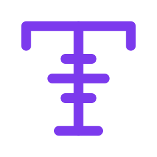
  <h1 align="center">LineSolv</h1>
  <p align="center">A cross-platform desktop natural-language calculator</p>
  <p align="center">
    <a href="https://github.com/rkriad585/LineSolv/blob/main/LICENSE">
      
    </a>
    
    
    
    
  </p>
</p>

LineSolv is a natural-language calculator that understands phrases like `$20 in euro - 5% discount` or `what is the 5 plus pi times five`. It combines a powerful Go-based arithmetic engine with a clean, distraction-free desktop UI.

Built with **Wails v2** (Go + WebView), **Vite**, **TypeScript**, and **CSS custom properties** for theming.

## Screenshots

<p align="center">
  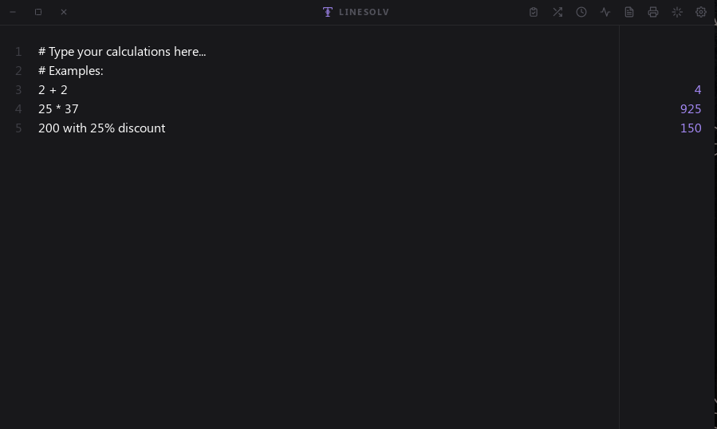
</p>

<p align="center">
  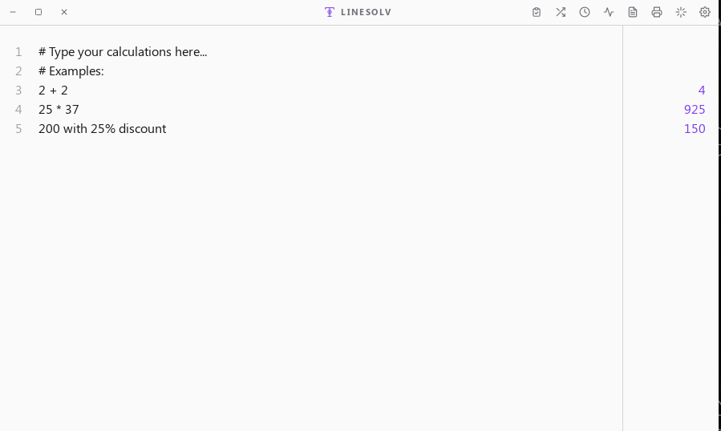
</p>

<p align="center">
  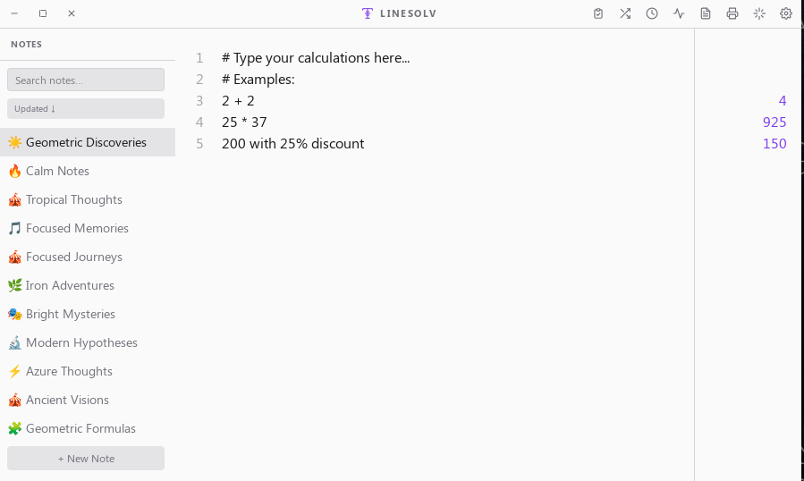
</p>

<p align="center">
  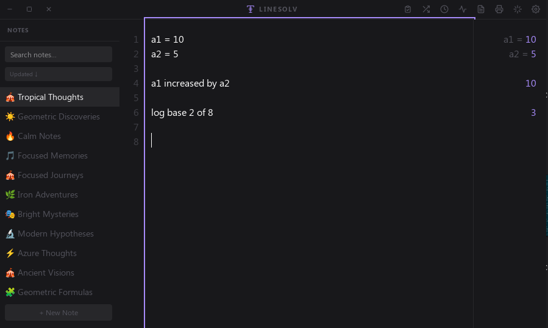
</p>

<p align="center">
  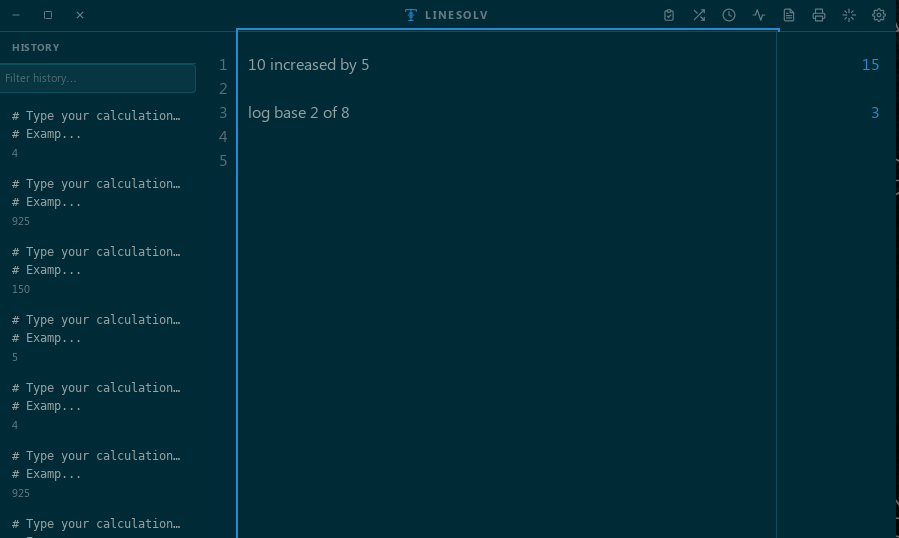
</p>

<p align="center">
  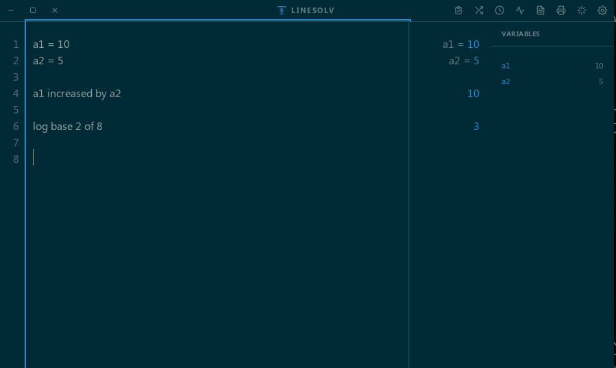
</p>

<p align="center">
  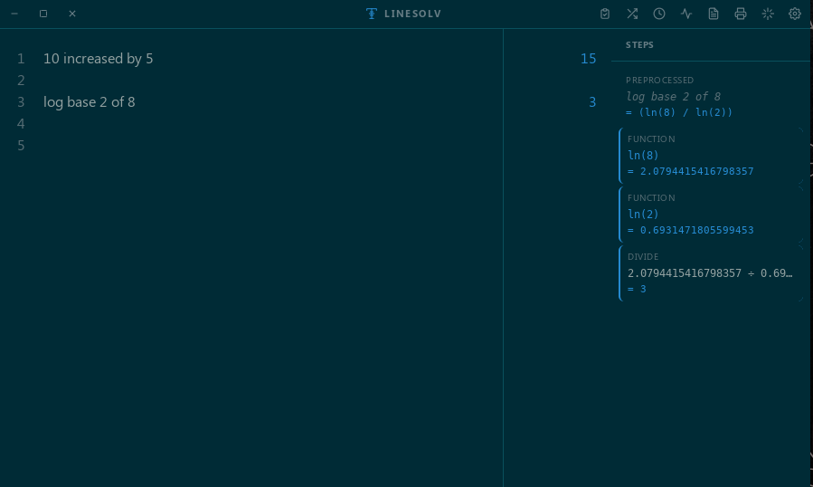
</p>

<p align="center">
  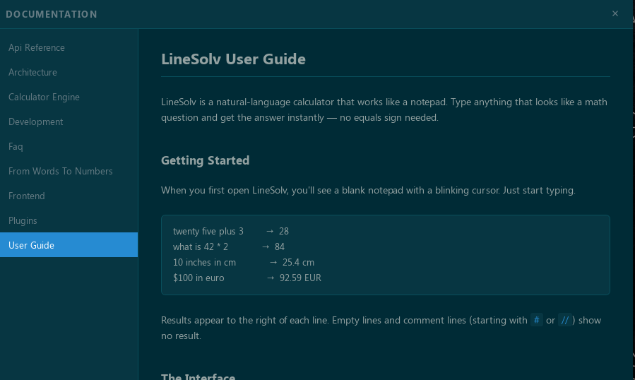
</p>

<p align="center">
  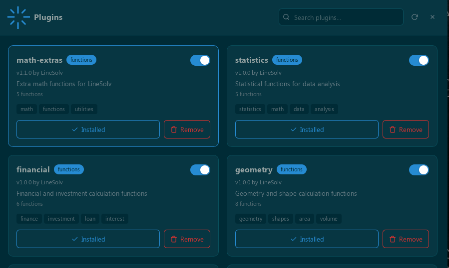
</p>

<p align="center">
  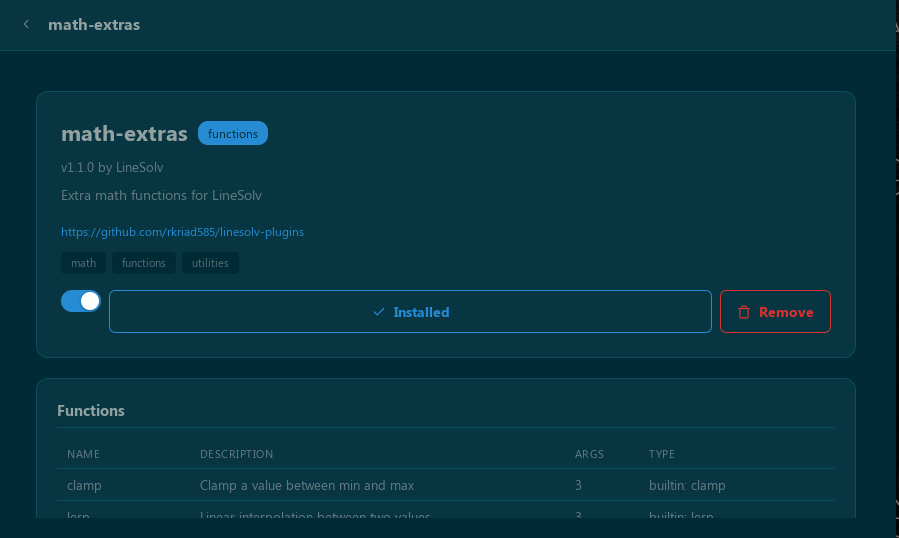
</p>

<p align="center">
  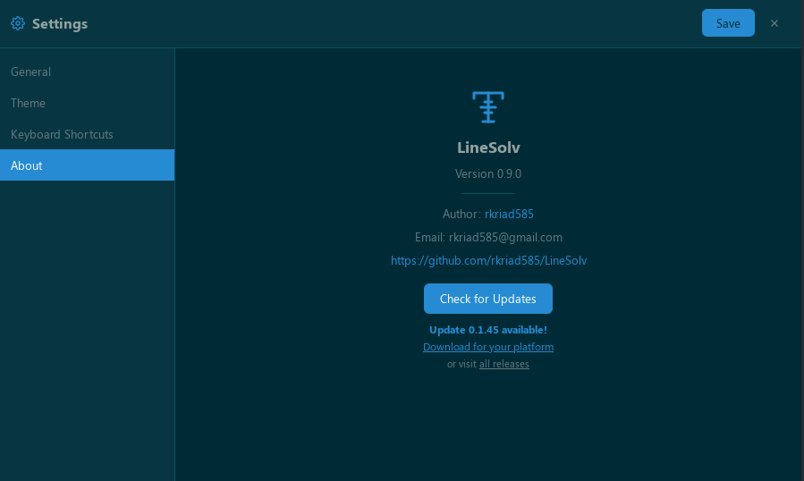
</p>

## Features

### Core Calculator

| Feature | Description | Example |
|---------|-------------|---------|
| **Natural Language** | Type conversational math phrases | `what is twenty five plus three` |
| **Basic Arithmetic** | Full PEMDAS with `+`, `-`, `*`, `/`, `%`, `^` | `2 + 3 * 4` |
| **Number Words** | spelled-out numbers up toillions | `twenty five times pi` |
| **Fraction Input** | Mixed numbers and fraction words | `2 1/2 + 1.5`, `three quarters` |
| **Scale Words** | `double`, `triple`, `half`, `quarter` | `double 5`, `half of 20` |
| **Power Words** | `squared`, `cubed`, `square root of` | `5 squared`, `cube root of 27` |
| **Comparison** | `which is bigger`, `more than`, `less than` | `5 more than 10` |
| **Division Phrases** | `over`, `out of`, `divided by`, `into` | `10 over 2`, `3 into 15` |
| **Multiplication Phrases** | `times`, `product of`, `lots of` | `product of 4 and 3` |
| **Collective Nouns** | `a dozen`, `a score`, `a couple` | `half a dozen` |
| **Possessive Plurals** | `3 tens`, `5 thousands` | `3 tens from 5 hundreds` |
| **SI Notation** | `k`, `M`, `B` suffixes | `2B / 5k` |
| **Ordinal Suffixes** | `1st`, `2nd`, `3rd`, `4th` | `1st + 2` |
| **Conversational Prefixes** | `hello`, `hey`, `ok`, `well`, etc. | `hey there calculate 6 times 7` |
| **Time Durations** | `2h30m`, `2h + 1h15m` | `2h30m in minutes` |
| **"How many times"** | Division as count | `how many times does 5 go into 20` |
| **"Split / Shared"** | Division by sharing | `10 split among 2` |
| **Combined Phrases** | Mix multiple patterns | `5 choose 2 + 3!` |

### Percentages

| Feature | Example |
|---------|---------|
| Percentage of | `10% of 200` |
| Add percentage | `100 + 15%` |
| Subtract percentage | `200 - 10%` |
| "of what" | `50% of what is 25` |
| "what percent" | `10 is what percent of 50` |
| Tax and discount | `100 with 8% tax`, `200 after 10% discount` |
| Tip calculation | `40 plus 15% tip` |
| Natural language | `how much is one hundred plus fifty percent` |

### Unit Conversion

| Category | Units | Example |
|----------|-------|---------|
| **Length** | mm, cm, m, km, in, ft, yd, mi | `10 inches in cm` |
| **Mass** | g, kg, lb, oz | `1 kg in lb` |
| **Volume** | ml, l, gal, qt, cup | `1 gal in l` |
| **Temperature** | °C, °F | `100 c to f` |
| **Time** | s, min, h, day | `2h30m in minutes` |
| **Currency** | 30+ currencies (live rates) | `$20 in euro - 5% discount` |

### Currency Support

USD, EUR, GBP, JPY, CNY, INR, CAD, AUD, CHF, KRW, RUB, ILS, VND, PHP, UAH, KZT, PYG, GHS, TRY, AZN, GEL, BTC, THB, HKD, SGD, MXN, ZAR, NZD, SEK, NOK, PLN, BRL, BDT, PKR, LKR, NPR, MYR, IDR, TWD, SAR, AED, KWD, EGP, NGN, COP, CLP, ARS, PEN, MAD, XAU (gold), XAG (silver).

### Math Functions

| Category | Functions |
|----------|-----------|
| **Trigonometry** | `sin`, `cos`, `tan`, `asin`, `acos`, `atan`, `atan2` |
| **Hyperbolic** | `sinh`, `cosh`, `tanh` |
| **Logarithmic** | `log`, `log2`, `log10`, `ln`, `exp` |
| **Roots & Power** | `sqrt`, `cbrt`, `pow` |
| **Rounding** | `round`, `ceil`, `floor`, `trunc`, `sign` |
| **Absolute** | `abs` |
| **Statistics** | `avg`, `median`, `mode`, `stdev`, `variance`, `range` |
| **Aggregation** | `sum`, `min`, `max` |
| **Combinatorics** | `fact`/`factorial`, `gcd`, `lcm`, `ncr`/`choose` |
| **Random** | `rand`, `random` |
| **Geometry** | `hypot`/`pythag`/`hypotenuse` |
| **Utility** | `fract`, `deg`, `rad` |
| **Number Theory** | `isprime`/`is_prime` |

### Constants

`pi` (π), `e`, `speed_of_light`, `gravity`, `planck`, `boltzmann`, `gas_constant`, `avogadro`, `stefan_boltzmann`, `electron_mass`, `proton_mass`, `neutron_mass`, `electron_charge`, `bohr_radius`, `rydberg`.

### Variables & Context

| Feature | Example |
|---------|---------|
| Assign variables | `x = 42` |
| Reference variables | `x * pi` |
| Chain assignments | `y = x + 8` |
| Context references | `of that * 2`, `then + 10`, `result / 2` |
| Previous result | `last`, `previous`, `prior`, `last answer` |

### Purchase Math

| Feature | Example |
|---------|---------|
| Item pricing | `5 items at $20 each` |
| With discount | `5 items at $20 each with a 15% discount` |
| With tax | `5 items at $20 each with a 15% discount and 8% sales tax` |
| Natural language | `I bought 8 items at $5 each with a 10% discount and 6% sales tax` |
| Freelance earnings | `I got 25 hours of freelance work at $37 per hour` |
| Sale price | `That $200 jacket is 25% off. What's the sale price?` |

### Date & Time Math

| Feature | Example |
|---------|---------|
| Relative dates | `today + 14 days`, `today - 7 days` |
| Named dates | `last month`, `next week`, `2 weeks from now` |
| Specific dates | `March 1 + 30 days` |
| Age calculation | `born in 2007`, `i am 25 years old` |
| Trailing noise | `I completing a book at today + 14 days some story` |

### Function Graphing

Auto-detect plot/graph expressions and render live charts:

| Feature | Example |
|---------|---------|
| Basic plot | `plot x^2` |
| Range specifiers | `plot x^2 from -5 to 5` |
| Trigonometric | `graph sin(x) from 0 to 6.2832` |
| Linear equations | `y = 2*x + 3` |
| Polynomials | `plot x^3 from -2 to 2` |

### Interface

| Feature | Description |
|---------|-------------|
| **7 Color Themes** | Dark, Light, Neon, Red, Obsidian, Plasma, Blood |
| **Multiple Notes** | Create, rename, delete, export, import calculation notebooks |
| **Notes Sidebar** | Drag-and-drop reorder, search, PDF export |
| **History Panel** | Searchable calculation history with timestamps |
| **Variable Explorer** | View and manage all assigned variables |
| **Steps Panel** | Step-by-step evaluation with intermediate results |
| **Documentation Viewer** | Built-in docs with offline caching |
| **Plugin Marketplace** | Browse, install, enable/disable plugins |
| **Settings** | General, Theme, Keyboard Shortcuts, About tabs |
| **Configurable Font** | Font family and size adjustable in Settings |
| **Customizable Shortcuts** | Rebind any keyboard shortcut |
| **PDF Export** | Export notes as formatted A4 PDFs |
| **Print** | Print with A4 formatting, watermark, and date |
| **Undo/Redo** | 200-entry custom stack |
| **Toast Notifications** | Non-modal feedback for actions |
| **Dirty-State Indicator** | Accent dot shows unsaved changes |
| **Delete Confirmation** | Optional "Don't ask again" preference |
| **Window Dragging** | Drag title bar to move window |
| **Double-Click Fullscreen** | Double-click title bar to toggle maximize |
| **Text Selection** | Select and copy text in docs and plugin details |
| **Frameless Window** | Clean, modern window chrome |

### Plugin System

| Feature | Description |
|---------|-------------|
| **Custom Functions** | Expression-based or builtin-backed functions |
| **Custom Themes** | 14 CSS color variables per theme |
| **Custom Variables** | Named constants available in all calculations |
| **12 Built-in Plugins** | Finance, Statistics, Geometry, Physics, Date/Time, Health, Arrays, Hex, Color, Base-N, Matrix, Random |
| **Plugin Marketplace** | Browse and install from GitHub repository |
| **Enable/Disable** | Toggle plugins on/off without restarting |
| **No Code Execution** | Safe expression-only evaluation |

See the [LineSolv Plugins](https://github.com/rkriad585/linesolv-plugins) repository for available community plugins.

### Keyboard Shortcuts

| Action | Shortcut |
|--------|----------|
| Force evaluate | `Shift + Enter` |
| Toggle notes sidebar | `Ctrl/Cmd + B` |
| Toggle variables panel | `Ctrl/Cmd + I` |
| Toggle history panel | `Ctrl/Cmd + H` |
| Toggle steps panel | `Ctrl/Cmd + S` |
| Open settings | `Ctrl/Cmd + ,` |
| Create new note | `Ctrl/Cmd + N` |
| Search notes | `Ctrl/Cmd + F` |
| Print current note | `Ctrl/Cmd + P` |
| Show shortcuts reference | `?` or `Cmd + /` |
| History navigation | `Ctrl/Cmd + ↑` / `Ctrl/Cmd + ↓` |
| Undo / Redo | `Ctrl/Cmd + Z` / `Ctrl/Cmd + Shift + Z` |
| Duplicate line | `Ctrl/Cmd + D` |
| Select current line | `Ctrl/Cmd + L` |
| Delete current line | `Ctrl/Cmd + Shift + K` |
| Toggle case | `Alt + Shift` |
| Move line up/down | `Alt + ↑` / `Alt + ↓` |
| Close panel / clear | `Escape` |
| Clear all | `Ctrl/Cmd + K` |
| Fullscreen toggle | Double-click title bar |

## Quick Start

### Download

Grab the latest release for your platform from the [releases page](https://github.com/rkriad585/LineSolv/releases).

| Platform | Package |
|----------|---------|
| Linux | `.deb` (Debian/Ubuntu) or standalone binary |
| macOS | `.dmg` (Intel & Apple Silicon) |
| Windows | `.exe` (NSIS installer) |

### Install

**Linux (Debian/Ubuntu)**

```bash
sudo dpkg -i linesolv-*.deb
linesolv
```

Or run the standalone binary:

```bash
chmod +x LineSolv
./LineSolv
```

**macOS**

Mount the `.dmg` and drag LineSolv into Applications. You may need to right-click -> Open to bypass Gatekeeper on first launch.

**Windows**

Run the NSIS installer. LineSolv will be available from the Start menu.

### Uninstall

**Linux (deb)**

```bash
sudo dpkg -r linesolv
```

To also remove user data:

```bash
rm -rf ~/.config/neostore/linesolv
```

**macOS**

```bash
rm -rf /Applications/LineSolv.app
rm -rf ~/.config/neostore/linesolv
```

**Windows**

Uninstall via Settings > Apps, then delete `%APPDATA%/neostore/linesolv` to remove user data.

### Requirements

- **Linux**: WebKit2GTK 4.1+ (Ubuntu 24.10+, Fedora 40+, Arch)
- **macOS**: macOS 12+
- **Windows**: Windows 10+

## Usage

Type calculations naturally. Results appear as you type — no equals button needed.

### Basic Math

| Input | Output |
|-------|--------|
| `42` | `42` |
| `2 + 3 * 4` | `14` |
| `(2 + 3) * 4` | `20` |
| `2^10` | `1024` |
| `5!` | `120` |

### Natural Language

| Input | Output |
|-------|--------|
| `twenty five plus 3` | `28` |
| `what is the square root of 144` | `12` |
| `calculate 15% of 200` | `30` |
| `how much is one hundred plus fifty percent` | `150` |

### Variables

| Input | Output |
|-------|--------|
| `x = 10` | `x = 10` |
| `x * pi` | `31.4159` |
| `y = x + 8` | `y = 18` |
| `of that * 2` | `36` |

### Unit Conversion

| Input | Output |
|-------|--------|
| `10 inches in cm` | `25.4 cm` |
| `1 kg in lb` | `2.205 lb` |
| `100 c to f` | `212.0 °F` |
| `2h30m in minutes` | `150 minutes` |

### Currency

| Input | Output |
|-------|--------|
| `$100 + €20` | `$122.80` |
| `$20 in euro - 5% discount` | `€18.26` |
| `£20 in usd` | `$26.60` |

### Percentages

| Input | Output |
|-------|--------|
| `10% of 200` | `20` |
| `100 + 15%` | `115` |
| `200 after 10% discount` | `180` |
| `10 is what percent of 50` | `20%` |

### Purchase Math

| Input | Output |
|-------|--------|
| `5 items at $20 each` | `$100.00` |
| `5 items at $20 each with a 15% discount` | `$85.00` |
| `I bought 8 items at $5 each with a 10% discount and 6% sales tax` | `$40.76` |

### Math Functions

| Input | Output |
|-------|--------|
| `sin(pi/4) + cos(pi/4)` | `1.4142` |
| `log2(8)` | `3` |
| `gcd(12, 8)` | `4` |
| `5 choose 3` | `10` |
| `avg(1, 2, 3, 4, 5)` | `3` |
| `stdev(10, 20, 30, 40, 50)` | `14.142` |

### Graphing

| Input | Output |
|-------|--------|
| `plot x^2` | Parabola chart |
| `graph sin(x) from 0 to 6.2832` | Sine wave chart |
| `y = 2*x + 3` | Linear chart |

## Architecture

```
LineSolv/
├── app/
│   ├── calculator/         # Arithmetic engine
│   │   ├── engine.go       # Core eval pipeline
│   │   ├── units.go        # Unit conversion database (100+ units)
│   │   ├── functions.go    # 40+ built-in math functions
│   │   ├── variables.go    # Variable storage
│   │   ├── steps.go        # Step-by-step evaluation
│   │   └── graph.go        # Function graphing (Chart.js)
│   ├── plugin/             # Plugin system
│   │   ├── types.go        # Manifest, Plugin, FunctionDef types
│   │   ├── loader.go       # Plugin scanning and loading
│   │   ├── builtins.go     # 20+ builtin plugin functions
│   │   ├── expr.go         # Expression evaluator for plugins
│   │   ├── state.go        # Plugin state persistence
│   │   └── state_test.go   # Plugin state tests
│   ├── service/            # Wails-bound Go methods
│   │   └── app.go          # 15+ service methods
│   └── storage/            # Persistence layer
│       ├── db.go           # SQLite database
│       ├── config.go       # TOML configuration
│       ├── exporter.go     # PDF/PNG export
│       └── fancyname.go    # Readable note names
├── frontend/
│   └── src/
│       ├── components/     # UI components
│       │   ├── TitleBar.ts           # Frameless window header
│       │   ├── CalculatorInput.ts    # Main input textarea
│       │   ├── ResultDisplay.ts      # Results column
│       │   ├── NotesPanel.ts         # Note management sidebar
│       │   ├── HistoryPanel.ts       # Searchable history
│       │   ├── VariableExplorer.ts   # Variable viewer
│       │   ├── StepsPanel.ts         # Step-by-step view
│       │   ├── GraphPanel.ts         # Chart.js graphing
│       │   ├── DocsViewer.ts         # Built-in documentation
│       │   ├── PluginPanel.ts        # Plugin marketplace
│       │   ├── SettingsModal.ts      # Settings (4 tabs)
│       │   ├── ShortcutModal.ts      # Keyboard shortcuts
│       │   ├── ConfirmDialog.ts      # Confirmation dialogs
│       │   └── ContextMenu.ts        # Right-click menu
│       ├── stores/         # Reactive state
│       │   ├── calculator.ts         # Calculator state store
│       │   └── notes.ts             # Notes state store
│       ├── utils/          # Utilities
│       │   ├── shortcuts.ts          # Keyboard shortcut handler
│       │   ├── shortcutDefs.ts       # Shortcut definitions
│       │   ├── format.ts            # Number formatting
│       │   ├── html.ts              # HTML escaping
│       │   └── toast.ts             # Toast notifications
│       ├── App.ts          # Main orchestrator
│       └── style.css       # CSS custom properties + theming
├── docs/                   # Documentation
├── main.go                 # Entrypoint
├── wails.json              # Wails configuration
├── go.mod                  # Go module definition
├── .version                # Current version (0.13.0)
├── logo.svg                # Project logo
├── docs/examples.txt       # Input examples
├── CHANGELOG.md            # Version history
├── CONTRIBUTING.md         # Contribution guidelines
├── CODE_OF_CONDUCT.md      # Community standards
├── ACCESSIBILITY.md        # Accessibility statement and WCAG compliance
├── SECURITY.md             # Security policy
├── Dockerfile              # Containerized build environment
└── LICENSE                 # MIT License
```

## Documentation

| Guide | Description |
|-------|-------------|
| [User Guide](docs/user-guide.md) | Full user documentation with input syntax, themes, shortcuts, and notes |
| [Getting Started](docs/getting-started.md) | Quick start for new users |
| [Configuration](docs/configuration.md) | Settings, config file options, and data storage |
| [FAQ & Troubleshooting](docs/faq.md) | Frequently asked questions and common issues |
| [Architecture](docs/architecture.md) | High-level architecture and component overview |
| [Frontend](docs/frontend.md) | Frontend component structure and styling guide |
| [Plugin Development](docs/plugins.md) | How to create and install plugins |
| [Themes](docs/themes.md) | Theme customization guide |
| [Development](docs/development.md) | Development setup, build, and code standards |
| [API Reference](docs/api-reference.md) | Wails-bound Go method reference |
| [Calculator Engine](docs/calculator-engine.md) | How the natural-language calculation engine works |
| [From Words to Numbers](docs/from-words-to-numbers.md) | End-to-end pipeline walkthrough |
| [Accessibility](ACCESSIBILITY.md) | WCAG 2.1 AA compliance and assistive technology support |

## Building from Source

### Prerequisites

- [Go](https://go.dev) 1.23+
- [Wails CLI](https://wails.io) v2.12.0+
- [Node.js](https://nodejs.org) 20+
- Linux: `libwebkit2gtk-4.1-dev`, `libgtk-3-dev`

### Steps

```bash
git clone https://github.com/rkriad585/LineSolv.git
cd LineSolv
npm install --prefix frontend
wails build -tags "webkit2_41"
./build/bin/LineSolv
```

### Development (HMR)

```bash
wails dev -tags "webkit2_41"
```

### Tests

```bash
# Backend tests
go test ./app/... -v

# Frontend tests
cd frontend && npx vitest run

# Type checking
cd frontend && npx tsc --noEmit
```

### Docker

```bash
docker build -t linesolv .
docker run linesolv
```

## License

[MIT](LICENSE) — LineSolv (c) 2026 rkriad585.

## Security

See [SECURITY.md](SECURITY.md) for reporting vulnerabilities.

## Contributing

Contributions are welcome. See [CONTRIBUTING.md](CONTRIBUTING.md) for guidelines, [CODE_OF_CONDUCT.md](CODE_OF_CONDUCT.md) for community standards, and [ACCESSIBILITY.md](ACCESSIBILITY.md) for accessibility information.
