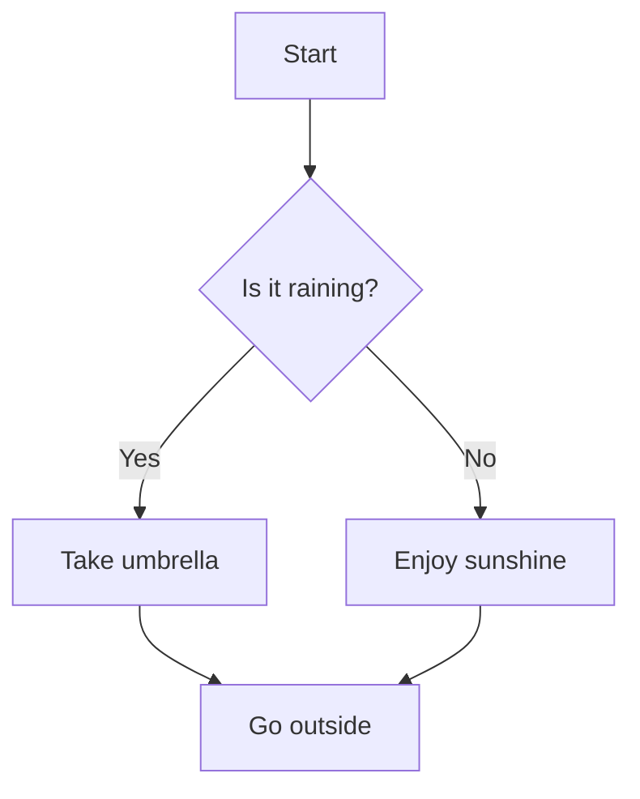

# Future Features — LineSolv Roadmap

> **Last updated:** July 2026
> **Target:** Incremental delivery, 2026–2027+
> **Status:** All features planned — implementation blocked on Wails 3 where noted

---

## Table of Contents

1. [Self-Updater (Wails 3)](#1-self-updater--wails-3)
2. [AI Integration System](#2-ai-integration-system)
3. [Image Support & Editing](#3-image-support--editing)
4. [Voice Input & Speech](#4-voice-input--speech)
5. [Timer & Schedule System](#5-timer--schedule-system)
6. [Notification System](#6-notification-system)
7. [Mobile Support](#7-mobile-support)
8. [Collaborative Notes](#8-collaborative-notes)
9. [Advanced Plugin Marketplace](#9-advanced-plugin-marketplace)
10. [Code Snippet Engine](#10-code-snippet-engine)
11. [LaTeX / Math Rendering](#11-latex--math-rendering)
12. [Export Enhancements](#12-export-enhancements)
13. [Accessibility Improvements](#13-accessibility-improvements)
14. [Performance & Stability](#14-performance--stability)
15. [UI/UX Polish](#15-uiux-polish)
16. [Advanced Graph Views](#16-advanced-graph-views)
17. [External File & Folder Support](#17-external-file--folder-support)
18. [Share & Collaboration Features](#18-share--collaboration-features)
19. [CLI Interface](#19-cli-interface)
20. [System Integration](#20-system-integration)
21. [Printing & Layout](#21-printing--layout)
22. [Rich Note Editor](#22-rich-note-editor)
23. [Spreadsheet Export](#23-spreadsheet-export)
24. [Document Export](#24-document-export)
25. [Smart Templates](#25-smart-templates)
26. [Calculation History Analytics](#26-calculation-history-analytics)
27. [Multi-language Support](#27-multi-language-support)
28. [Offline AI](#28-offline-ai)
29. [Smart Suggestions](#29-smart-suggestions)
30. [Data Visualization Dashboard](#30-data-visualization-dashboard)

---

## 1. Self-Updater — Wails 3

> **Blocked on:** Wails 3 stable release (estimated 2027)

### Why It Was Removed

The in-app self-update feature was removed in v0.15.25 (July 2026) because Wails v2's
runtime shutdown lifecycle makes reliable binary replacement difficult:

- The old process's goroutines (including `wailsruntime.Quit` handlers) can kill the new
  binary before it fully starts
- `os.Exit(0)` bypasses shutdown hooks, causing data loss
- The restart mechanism fails silently on some platforms

### Why Wails 3 Fixes This

Wails 3 introduces a proper app lifecycle API with:

- **Explicit shutdown phases** — the app can finish cleanup before the process exits
- **`app.Quit()` that waits** — no more race conditions between old and new processes
- **Graceful restart support** — first-class `app.Restart()` method
- **Plugin lifecycle hooks** — pre/post shutdown callbacks for safe cleanup

This makes in-app binary replacement trivially safe without workarounds.

### Architecture

```
internal/
    updater/
        updater.go        # Main orchestrator — Check → Download → Verify → Install → Restart
        github.go         # GitHub Release API client, version comparison
        downloader.go     # HTTP download with progress, resume, retry, cancellation
        version.go        # Semver parsing, comparison, channel filtering
        checksum.go       # SHA256 verification
        signature.go      # Ed25519 signature verification (embedded public key)
        events.go         # Wails event emission helpers
        platform/
            windows.go    # Windows rename-to-old + retry cleanup
            linux.go      # Linux atomic rename + permission preserve
            darwin.go     # macOS .app bundle replacement + codesign
```

### Flow

```
┌─────────────┐     ┌──────────┐     ┌──────────┐     ┌──────────┐     ┌──────────┐
│  CheckFor    │────▶│ Compare  │────▶│ Download │────▶│ Verify   │────▶│ Install  │
│  Update()    │     │ Versions │     │ Binary   │     │ SHA256 + │     │ Binary   │
│              │     │          │     │ + Resume │     │ Ed25519  │     │ + Restart│
└─────────────┘     └──────────┘     └──────────┘     └──────────┘     └──────────┘
      │                  │                 │                │                │
      ▼                  ▼                 ▼                ▼                ▼
  No update         Different         Progress          Signature        Platform-
  available         version?          events via        valid?           specific
                    → continue        Wails events      → proceed        replacement
```

### Backend Integration

```go
// app/service/app.go
func (s *AppService) CheckForUpdate() (*UpdateInfo, error) {
    u := updater.New(
        updater.WithVersion(appVersion),
        updater.WithChannel(updater.ChannelStable),
    )
    info, err := u.CheckForUpdates(ctx)
    if err != nil {
        return nil, err
    }
    return &UpdateInfo{
        Version:     info.Version,
        ReleaseNotes: info.Body,
        DownloadURL: info.AssetURL,
        Size:        info.Size,
    }, nil
}

func (s *AppService) PerformUpdate() (*UpdateInfo, error) {
    u := updater.New(
        updater.WithVersion(appVersion),
        updater.WithChannel(updater.ChannelStable),
        updater.WithEventHandler(func(name string, data ...interface{}) {
            wailsruntime.EventsEmit(ctx, name, data...)
        }),
    )
    // check → download → verify → install → restart
    // Use wailsruntime.AppRestart() instead of os.Exit(0)
    return u.PerformUpdate(ctx)
}

func (s *AppService) CancelUpdate() error {
    return updater.CancelContext(ctx)
}
```

### Frontend Integration

```typescript
// SettingsModal.ts — Update section
async function checkForUpdates() {
  const info = await CheckForUpdate();
  if (!info) {
    toast.show('You are up to date', 'success');
    return;
  }
  // Show release notes and download button
  showUpdateDialog(info);
}

async function performUpdate() {
  // Listen for progress events
  EventsOn('update:progress', (data: { percent: number; speed: string }) => {
    updateProgressBar(data.percent, data.speed);
  });

  EventsOn('update:complete', () => {
    toast.show('Update installed — restarting...', 'success');
  });

  const result = await PerformUpdate();
}
```

### Key Features

1. **GitHub Release API** — fetch latest release, select platform asset
2. **SHA256 checksum verification** — verify downloaded binary against SHA256SUMS
3. **Ed25519 signature verification** — verify SHA256SUMS is signed by trusted key
4. **Real-time download progress** — percentage, speed, ETA via Wails events
5. **HTTP resume** — interrupted downloads resume via Range headers
6. **Retry with backoff** — failed downloads retry up to 3 times
7. **Cancellation** — in-progress downloads can be cancelled
8. **Platform-specific install** — atomic replacement on all platforms
9. **Update channels** — stable, beta, nightly filtering via semver pre-release tags
10. **Release notes display** — show changelog before downloading

### Security

- Public key embedded via `//go:embed` — cannot be tampered with at runtime
- Private key stored in GitHub Actions secret only
- SHA256 checksums prevent accidental corruption
- Ed25519 signatures prevent supply chain attacks

---

## 2. AI Integration System

> **Status:** Planned — requires API key management and streaming infrastructure

### Overview

Inline AI assistance directly in the calculator editor. Users can query AI providers using
`@{provider}` syntax, get inline results, and fix errors via context menu.

### Supported Providers

| Provider          | Prefix       | API Format       | Streaming |
| ----------------- | ------------ | ---------------- | --------- |
| OpenAI            | `@openai`    | OpenAI API       | Yes       |
| Google Gemini     | `@google`    | Gemini API       | Yes       |
| Anthropic Claude  | `@anthropic` | Anthropic API    | Yes       |
| OpenCode          | `@opencode`  | OpenCode API     | Yes       |
| Custom OpenAI-    | `@custom-1`  | OpenAI-compat    | Yes       |
| compatible        | `@custom-2`  | OpenAI-compat    | Yes       |
| Custom Anthropic- | `@custom-3`  | Anthropic-compat | Yes       |
| compatible        |              |                  |           |

### Syntax

```
@openai what is the derivative of x^3 + 2x?
@gemini explain the step by step solution for: 2x + 5 = 15
@anthropic factor this polynomial: x^2 - 5x + 6
@opencode simplify: (3x + 2)(x - 1)
@custom-1 solve the system: x + y = 10, x - y = 4
```

### Flow — AI Query Execution

```
┌──────────────┐     ┌──────────────┐     ┌──────────────┐     ┌──────────────┐
│  User types   │────▶│  Parse       │────▶│  Route to    │────▶│  Stream      │
│  @provider    │     │  provider +  │     │  correct     │     │  response    │
│  query        │     │  query       │     │  API client  │     │  inline      │
└──────────────┘     └──────────────┘     └──────────────┘     └──────────────┘
      │                    │                     │                     │
      ▼                    ▼                     ▼                     ▼
  Triggers on         Extract provider     HTTP POST to         SSE/WebSocket
  "@" at line         name and query       provider API         chunks rendered
  start               text                                    token by token
```

### Backend Architecture

```
internal/
    ai/
        provider.go       # Provider interface
        openai.go         # OpenAI client (GPT-4o, GPT-4-turbo)
        google.go         # Google Gemini client
        anthropic.go      # Anthropic Claude client
        opencode.go       # OpenCode client
        custom.go         # Custom OpenAI/Anthropic-compatible
        parser.go         # @provider query parser
        stream.go         # SSE streaming reader
        keyring.go        # API key storage (OS keychain)
        ratelimit.go      # Per-provider rate limiting
        cache.go          # Response caching (optional)
```

### Provider Interface

```go
// internal/ai/provider.go
type Provider interface {
    Name() string
    StreamQuery(ctx context.Context, query string) (<-chan Chunk, error)
    Models() []Model
    SetAPIKey(key string) error
    ValidateAPIKey(key string) error
}

type Chunk struct {
    Text     string
    Done     bool
    Error    error
    Metadata *ChunkMetadata
}

type ChunkMetadata struct {
    TokensUsed   int
    TokensCached int
    Model        string
    Latency      time.Duration
}

type Model struct {
    ID          string
    Name        string
    MaxTokens   int
    SupportsVision bool
}
```

### OpenAI Client Example

```go
// internal/ai/openai.go
type OpenAIClient struct {
    apiKey     string
    model      string
    httpClient *http.Client
    baseURL    string
}

func (c *OpenAIClient) StreamQuery(ctx context.Context, query string) (<-chan Chunk, error) {
    ch := make(chan Chunk, 32)

    body := map[string]interface{}{
        "model":    c.model,
        "messages": []map[string]string{
            {"role": "user", "content": query},
        },
        "stream": true,
    }

    jsonBody, _ := json.Marshal(body)
    req, _ := http.NewRequestWithContext(ctx, "POST", c.baseURL+"/v1/chat/completions", bytes.NewReader(jsonBody))
    req.Header.Set("Authorization", "Bearer "+c.apiKey)
    req.Header.Set("Content-Type", "application/json")

    resp, err := c.httpClient.Do(req)
    if err != nil {
        close(ch)
        return nil, err
    }

    go func() {
        defer close(ch)
        defer resp.Body.Close()

        scanner := bufio.NewScanner(resp.Body)
        for scanner.Scan() {
            line := scanner.Text()
            if !strings.HasPrefix(line, "data: ") {
                continue
            }
            data := strings.TrimPrefix(line, "data: ")
            if data == "[DONE]" {
                ch <- Chunk{Done: true}
                return
            }

            var event struct {
                Choices []struct {
                    Delta struct {
                        Content string `json:"content"`
                    } `json:"delta"`
                } `json:"choices"`
            }
            if err := json.Unmarshal([]byte(data), &event); err == nil {
                if len(event.Choices) > 0 {
                    ch <- Chunk{Text: event.Choices[0].Delta.Content}
                }
            }
        }
    }()

    return ch, nil
}
```

### Frontend — Inline AI Rendering

```typescript
// AI integration in App.ts
interface AIQuery {
  provider: string;
  query: string;
  lineIndex: number;
}

function parseAILine(line: string): AIQuery | null {
  const match = line.match(/^@(\w+(?:-\w+)?)\s+(.+)$/);
  if (!match) return null;
  return { provider: match[1], query: match[2], lineIndex: getCurrentLine() };
}

function executeAIQuery(query: AIQuery) {
  const resultEl = createResultElement(query.lineIndex);
  resultEl.classList.add('ai-streaming');
  resultEl.textContent = '';

  // Stream chunks via Wails events
  EventsOn('ai:chunk', (data: { text: string; done: boolean }) => {
    resultEl.textContent += data.text;
    if (data.done) {
      resultEl.classList.remove('ai-streaming');
      EventsOff('ai:chunk');
    }
  });

  // Call backend
  Service.StreamAIQuery(query.provider, query.query);
}
```

### Context Menu — AI Fix

When a user selects text and right-clicks, the context menu includes an "AI Fix" option:

```
┌─────────────────────────────┐
│  Copy                       │
│  Cut                        │
│  Paste                      │
│  ─────────────────          │
│  AI Fix Selected            │  ← analyzes selected text + context
│  AI Explain Selected        │  ← explains selected text
│  AI Optimize Selected       │  ← suggests optimizations
│  ─────────────────          │
│  Search Selection           │
└─────────────────────────────┘
```

### Flow — AI Fix via Context Menu

```
┌──────────────┐     ┌──────────────┐     ┌──────────────┐     ┌──────────────┐
│  User selects │────▶│  Right-click │────▶│  "AI Fix"    │────▶│  Backend     │
│  text with    │     │  context     │     │  clicked     │     │  receives    │
│  error        │     │  menu opens  │     │              │     │  selection + │
│              │     │              │     │              │     │  line context│
└──────────────┘     └──────────────┘     └──────────────┘     └──────────────┘
                                                                     │
                                                                     ▼
                                                              ┌──────────────┐
                                                              │  AI analyzes │
                                                              │  error,      │
                                                              │  suggests    │
                                                              │  fix inline  │
                                                              └──────────────┘
```

### Settings Modal — AI Configuration

```
┌─ Settings ──────────────────────────────────────────────┐
│                                                          │
│  AI Integration                                         │
│                                                          │
│  Provider:         [ OpenAI          ▼]                 │
│  API Key:          [••••••••••••••••] [Show] [Test]     │
│  Model:            [ gpt-4o          ▼]                 │
│  Custom Endpoint:  [https://api.example.com/v1]         │
│                                                          │
│  ┌─ Supported Providers ──────────────────────────────┐ │
│  │  ● OpenAI      (GPT-4o, GPT-4-turbo, GPT-3.5)    │ │
│  │  ● Google      (Gemini Pro, Gemini Ultra)          │ │
│  │  ● Anthropic   (Claude 3.5 Sonnet, Claude 3 Opus) │ │
│  │  ● OpenCode    (big-pickle, etc.)                  │ │
│  │  ● Custom #1   (OpenAI-compatible endpoint)        │ │
│  │  ● Custom #2   (OpenAI-compatible endpoint)        │ │
│  │  ● Custom #3   (Anthropic-compatible endpoint)     │ │
│  └────────────────────────────────────────────────────┘ │
│                                                          │
│  Auto-fix errors:     [toggle]                          │
│  Stream responses:    [toggle]                          │
│  Cache responses:     [toggle]                          │
│  Max tokens:          [ 2048  ▼]                        │
│  Temperature:         [ 0.7   ▼]                        │
│                                                          │
└──────────────────────────────────────────────────────────┘
```

### API Key Storage

Keys stored in OS keychain, never in TOML config:

```go
// internal/ai/keyring.go
type Keyring struct {
    serviceName string
}

func (k *Keyring) Store(provider, apiKey string) error {
    key := k.serviceName + ":" + provider
    return keyring.Set(key, apiKey)
}

func (k *Keyring) Retrieve(provider string) (string, error) {
    key := k.serviceName + ":"
    return keyring.Get(key)
}
```

### Rate Limiting

```go
// internal/ai/ratelimit.go
type RateLimiter struct {
    mu       sync.Mutex
    requests map[string]*tokenBucket
}

type tokenBucket struct {
    tokens    float64
    maxTokens float64
    refillRate float64
    lastRefill time.Time
}

func (r *RateLimiter) Allow(provider string) bool {
    r.mu.Lock()
    defer r.mu.Unlock()

    bucket, exists := r.requests[provider]
    if !exists {
        bucket = &tokenBucket{maxTokens: 60, refillRate: 1.0}
        r.requests[provider] = bucket
    }

    // Refill tokens based on elapsed time
    elapsed := time.Since(bucket.lastRefill).Seconds()
    bucket.tokens = min(bucket.maxTokens, bucket.tokens+elapsed*bucket.refillRate)
    bucket.lastRefill = time.Now()

    if bucket.tokens >= 1 {
        bucket.tokens--
        return true
    }
    return false
}
```

---

## 3. Image Support & Editing

> **Status:** Planned — requires Canvas API integration and image storage

### Overview

Users can import images into notes, paste screenshots, and perform basic edits via
context menu. Images are stored in the note's data directory.

### Image Operations

| Operation            | Context Menu                  | Shortcut             |
| -------------------- | ----------------------------- | -------------------- |
| Import image         | Right-click → Import Image    | `Ctrl/Cmd + Shift+I` |
| Paste from clipboard | Right-click → Paste Image     | `Ctrl/Cmd + V`       |
| Copy image           | Right-click → Copy Image      | `Ctrl/Cmd + C`       |
| Delete image         | Right-click → Delete          | `Delete`             |
| Resize               | Right-click → Resize          | —                    |
| Crop                 | Right-click → Crop            | —                    |
| Rotate               | Right-click → Rotate          | `Ctrl/Cmd + R`       |
| Flip                 | Right-click → Flip            | —                    |
| Adjust brightness    | Right-click → Adjust          | —                    |
| Insert into calc     | Right-click → Insert as Value | —                    |

### Image Context Menu

```
┌─────────────────────────────┐
│  Copy Image                 │
│  Save Image As...           │
│  Delete Image               │
│  ─────────────────          │
│  Resize...                  │
│  Crop                       │
│  Rotate Left 90°            │
│  Rotate Right 90°           │
│  Flip Horizontal            │
│  Flip Vertical              │
│  ─────────────────          │
│  Adjust Brightness...       │
│  Adjust Contrast...         │
│  ─────────────────          │
│  Insert as Variable         │  ← image_dims = {w: 800, h: 600}
│  OCR Text Recognition       │  ← extract text from image
│  ─────────────────          │
│  AI Analyze Image           │  ← uses vision-capable model
└─────────────────────────────┘
```

### Backend — Image Storage

```go
// app/storage/image.go
type ImageStore struct {
    basePath string
}

type StoredImage struct {
    ID        string    `json:"id"`
    NoteID    string    `json:"note_id"`
    Filename  string    `json:"filename"`
    Width     int       `json:"width"`
    Height    int       `json:"height"`
    MIMEType  string    `json:"mime_type"`
    Size      int64     `json:"size"`
    CreatedAt time.Time `json:"created_at"`
}

func (s *ImageStore) Save(noteID string, data []byte, filename string) (*StoredImage, error) {
    id := generateUUID()
    ext := filepath.Ext(filename)
    path := filepath.Join(s.basePath, noteID, id+ext)

    if err := os.MkdirAll(filepath.Dir(path), 0755); err != nil {
        return nil, err
    }

    if err := os.WriteFile(path, data, 0644); err != nil {
        return nil, err
    }

    // Detect dimensions
    cfg, _, err := image.DecodeConfig(bytes.NewReader(data))
    if err != nil {
        cfg = image.Config{Width: 0, Height: 0}
    }

    img := &StoredImage{
        ID:       id,
        NoteID:   noteID,
        Filename: filename,
        Width:    cfg.Width,
        Height:   cfg.Height,
        MIMEType: http.DetectContentType(data),
        Size:     int64(len(data)),
        CreatedAt: time.Now(),
    }

    return img, s.saveMetadata(noteID, img)
}
```

### Backend — Image Processing

```go
// app/service/image_edit.go
func (s *AppService) ResizeImage(imageID string, width, height int) error {
    img, err := s.imageStore.Get(imageID)
    if err != nil {
        return err
    }

    file, err := os.Open(img.Path())
    if err != nil {
        return err
    }
    defer file.Close()

    src, _, err := image.Decode(file)
    if err != nil {
        return err
    }

    resized := imaging.Resize(src, width, height, imaging.Lanczos)
    return imaging.Save(resized, img.Path())
}

func (s *AppService) CropImage(imageID string, x, y, w, h int) error {
    img, err := s.imageStore.Get(imageID)
    if err != nil {
        return err
    }

    file, err := os.Open(img.Path())
    if err != nil {
        return err
    }
    defer file.Close()

    src, _, err := image.Decode(file)
    if err != nil {
        return err
    }

    cropped := imaging.Crop(src, image.Rect(x, y, x+w, y+h))
    return imaging.Save(cropped, img.Path())
}

func (s *AppService) RotateImage(imageID string, degrees float64) error {
    img, err := s.imageStore.Get(imageID)
    if err != nil {
        return err
    }

    file, err := os.Open(img.Path())
    if err != nil {
        return err
    }
    defer file.Close()

    src, _, err := image.Decode(file)
    if err != nil {
        return err
    }

    rotated := imaging.Rotate(src, degrees, color.Transparent)
    return imaging.Save(rotated, img.Path())
}
```

### Frontend — Image Rendering in Notes

```typescript
// Image component in NotesPanel.ts
interface NoteImage {
  id: string;
  noteId: string;
  filename: string;
  width: number;
  height: number;
  dataUrl: string;
}

function renderImage(img: NoteImage): HTMLElement {
  const container = document.createElement('div');
  container.className = 'note-image';
  container.dataset.imageId = img.id;

  const imgEl = document.createElement('img');
  imgEl.src = img.dataUrl;
  imgEl.alt = img.filename;
  imgEl.draggable = true;

  // Resize handle
  const handle = document.createElement('div');
  handle.className = 'resize-handle';

  container.appendChild(imgEl);
  container.appendChild(handle);

  // Context menu
  container.addEventListener('contextmenu', (e) => {
    e.preventDefault();
    showImageContextMenu(e, img);
  });

  // Resize drag
  handle.addEventListener('mousedown', (e) => startResize(e, container, img));

  return container;
}
```

### Flow — Image Import

```
┌──────────────┐     ┌──────────────┐     ┌──────────────┐     ┌──────────────┐
│  User clicks  │────▶│  File dialog │────▶│  Read file   │────▶│  Detect      │
│  "Import      │     │  (native)    │     │  bytes       │     │  dimensions  │
│  Image"       │     │              │     │              │     │  + MIME type │
└──────────────┘     └──────────────┘     └──────────────┘     └──────────────┘
                                                                     │
                                                                     ▼
                                                              ┌──────────────┐
                                                              │  Save to     │
                                                              │  note data   │
                                                              │  directory   │
                                                              │  + metadata  │
                                                              └──────────────┘
                                                                     │
                                                                     ▼
                                                              ┌──────────────┐
                                                              │  Render in   │
                                                              │  note body   │
                                                              │  inline      │
                                                              └──────────────┘
```

---

## 4. Voice Input & Speech

> **Status:** Planned — requires Web Speech API or platform-native speech APIs

### Overview

Two modes: **Speech-to-Text** (dictate calculations) and **Text-to-Speech** (read results aloud).

### Speech-to-Text

```
┌──────────────┐     ┌──────────────┐     ┌──────────────┐     ┌──────────────┐
│  User clicks  │────▶│  Start mic   │────▶│  Stream audio│────▶│  Transcribe  │
│  mic button   │     │  recording   │     │  to speech   │     │  to text     │
│  (or hotkey)  │     │              │     │  API         │     │  + evaluate  │
└──────────────┘     └──────────────┘     └──────────────┘     └──────────────┘
      │                                          │                     │
      ▼                                          ▼                     ▼
  Pulsing mic                               Audio levels           Text inserted
  icon in title                             visualized             at cursor,
  bar                                                          calculation runs
```

### Backend — Speech-to-Text

```go
// internal/speech/transcriber.go
type Transcriber struct {
    provider string // "whisper", "google", "vosk"
    apiKey   string
}

type TranscriptResult struct {
    Text       string  `json:"text"`
    Confidence float64 `json:"confidence"`
    Language   string  `json:"language"`
    Duration   float64 `json:"duration"`
}

func (t *Transcriber) Transcribe(ctx context.Context, audio []byte, format string) (*TranscriptResult, error) {
    switch t.provider {
    case "whisper":
        return t.transcribeWhisper(ctx, audio, format)
    case "google":
        return t.transcribeGoogle(ctx, audio, format)
    case "vosk":
        return t.transcribeVosk(ctx, audio, format)
    default:
        return nil, fmt.Errorf("unknown provider: %s", t.provider)
    }
}

func (t *Transcriber) transcribeWhisper(ctx context.Context, audio []byte, format string) (*TranscriptResult, error) {
    // OpenAI Whisper API
    body := &bytes.Buffer{}
    writer := multipart.NewWriter(body)

    part, _ := writer.CreateFormFile("file", "audio."+format)
    part.Write(audio)
    writer.WriteField("model", "whisper-1")
    writer.WriteField("language", "en")
    writer.Close()

    req, _ := http.NewRequestWithContext(ctx, "POST", "https://api.openai.com/v1/audio/transcriptions", body)
    req.Header.Set("Authorization", "Bearer "+t.apiKey)
    req.Header.Set("Content-Type", writer.FormDataContentType())

    resp, err := http.DefaultClient.Do(req)
    if err != nil {
        return nil, err
    }
    defer resp.Body.Close()

    var result TranscriptResult
    json.NewDecoder(resp.Body).Decode(&result)
    return &result, nil
}
```

### Text-to-Speech

```go
// internal/speech/synthesizer.go
type Synthesizer struct {
    provider string // "openai", "google", "system"
    voice    string // "alloy", "echo", "fable", "onyx", "nova", "shimmer"
    speed    float64
}

func (s *Synthesizer) Synthesize(ctx context.Context, text string) ([]byte, error) {
    switch s.provider {
    case "openai":
        return s.synthesizeOpenAI(ctx, text)
    case "google":
        return s.synthesizeGoogle(ctx, text)
    case "system":
        return s.synthesizeSystem(ctx, text)
    default:
        return nil, fmt.Errorf("unknown provider: %s", s.provider)
    }
}

func (s *Synthesizer) synthesizeOpenAI(ctx context.Context, text string) ([]byte, error) {
    body := map[string]interface{}{
        "model": "tts-1",
        "input": text,
        "voice": s.voice,
        "speed": s.speed,
    }
    jsonBody, _ := json.Marshal(body)

    req, _ := http.NewRequestWithContext(ctx, "POST", "https://api.openai.com/v1/audio/speech", bytes.NewReader(jsonBody))
    req.Header.Set("Authorization", "Bearer "+s.apiKey)
    req.Header.Set("Content-Type", "application/json")

    resp, err := http.DefaultClient.Do(req)
    if err != nil {
        return nil, err
    }
    defer resp.Body.Close()

    return io.ReadAll(resp.Body)
}
```

### Frontend — Voice Button

```typescript
// VoiceInput.ts
class VoiceInput {
  private mediaRecorder: MediaRecorder | null = null;
  private isRecording = false;

  async startRecording() {
    const stream = await navigator.mediaDevices.getUserMedia({ audio: true });
    this.mediaRecorder = new MediaRecorder(stream);
    const chunks: Blob[] = [];

    this.mediaRecorder.ondataavailable = (e) => chunks.push(e.data);
    this.mediaRecorder.onstop = async () => {
      const blob = new Blob(chunks, { type: 'audio/webm' });
      const arrayBuffer = await blob.arrayBuffer();
      const result = await Service.TranscribeAudio(new Uint8Array(arrayBuffer), 'webm');
      if (result.text) {
        insertTextAtCursor(result.text);
      }
      stream.getTracks().forEach((t) => t.stop());
    };

    this.mediaRecorder.start();
    this.isRecording = true;
    this.showRecordingUI();
  }

  stopRecording() {
    this.mediaRecorder?.stop();
    this.isRecording = false;
    this.hideRecordingUI();
  }

  private showRecordingUI() {
    // Pulsing mic icon in title bar
    const micBtn = document.getElementById('voice-btn');
    micBtn?.classList.add('recording');
  }
}
```

### Voice Settings

```
┌─ Settings > Voice ─────────────────────────────────────┐
│                                                         │
│  Speech-to-Text                                         │
│  Provider:     [ OpenAI Whisper  ▼]                    │
│  Language:     [ English         ▼]                    │
│  Hotkey:       [ Ctrl+Shift+V    ]                     │
│  Auto-evaluate:[ toggle          ]                     │
│                                                         │
│  Text-to-Speech                                         │
│  Provider:     [ OpenAI TTS      ▼]                    │
│  Voice:        [ Nova            ▼]                    │
│  Speed:        [ 1.0x            ▼]                    │
│  Read result:  [ toggle          ]                     │
│  Hotkey:       [ Ctrl+Shift+R    ]                     │
│                                                         │
│  Providers:                                             │
│  ● OpenAI Whisper / TTS (requires API key)             │
│  ● Google Cloud Speech (requires API key)              │
│  ● Vosk (offline, local)                               │
│  ● System TTS (OS native, no API key)                  │
│                                                         │
└─────────────────────────────────────────────────────────┘
```

---

## 5. Timer & Schedule System

> **Status:** Planned — requires background task scheduling

### Overview

Set timers, schedule calculations, and create recurring tasks. Useful for time-tracking,
reminders, and periodic calculations.

### Timer Types

| Type      | Example                                   | Use Case          |
| --------- | ----------------------------------------- | ----------------- |
| Countdown | `timer 5 minutes`                         | Focus sessions    |
| Stopwatch | `stopwatch start`                         | Time tracking     |
| Scheduled | `schedule "calculate daily sales" at 9am` | Daily reports     |
| Recurring | `every 30 minutes check weather`          | Monitoring        |
| Pomodoro  | `pomodoro 25/5`                           | Work/break cycles |

### Syntax Examples

```
timer 25 minutes                    → countdown timer, shows in status bar
stopwatch start                     → starts stopwatch, shows elapsed time
timer 5m break after 25m           → pomodoro: 25m work, 5m break
schedule "run budget calc" daily 9am → runs expression at 9am daily
every 1h check currency rates       → runs expression every hour
```

### Backend — Timer Engine

```go
// internal/timer/engine.go
type Engine struct {
    mu       sync.RWMutex
    timers   map[string]*Timer
    store    *TimerStore
    events   func(string, interface{})
}

type Timer struct {
    ID        string        `json:"id"`
    Type      TimerType     `json:"type"`
    Name      string        `json:"name"`
    Duration  time.Duration `json:"duration"`
    Remaining time.Duration `json:"remaining"`
    Expression string       `json:"expression"`
    Interval  time.Duration `json:"interval"`
    CronExpr  string        `json:"cron_expr"`
    Active    bool          `json:"active"`
    CreatedAt time.Time     `json:"created_at"`
}

type TimerType string

const (
    TimerTypeCountdown  TimerType = "countdown"
    TimerTypeStopwatch  TimerType = "stopwatch"
    TimerTypeScheduled  TimerType = "scheduled"
    TimerTypeRecurring  TimerType = "recurring"
    TimerTypePomodoro   TimerType = "pomodoro"
)

func (e *Engine) CreateTimer(t *Timer) error {
    e.mu.Lock()
    defer e.mu.Unlock()

    e.timers[t.ID] = t

    switch t.Type {
    case TimerTypeCountdown:
        go e.runCountdown(t)
    case TimerTypeScheduled:
        go e.runScheduled(t)
    case TimerTypeRecurring:
        go e.runRecurring(t)
    case TimerTypePomodoro:
        go e.runPomodoro(t)
    }

    return e.store.Save(t)
}

func (e *Engine) runCountdown(t *Timer) {
    ticker := time.NewTicker(time.Second)
    defer ticker.Stop()

    for range ticker.C {
        e.mu.Lock()
        t.Remaining -= time.Second
        remaining := t.Remaining
        e.mu.Unlock()

        e.events("timer:tick", map[string]interface{}{
            "id":        t.ID,
            "remaining": remaining.Seconds(),
        })

        if remaining <= 0 {
            e.events("timer:complete", map[string]interface{}{
                "id":   t.ID,
                "name": t.Name,
            })
            // Play notification sound
            e.playNotification()
            return
        }
    }
}

func (e *Engine) runRecurring(t *Timer) {
    ticker := time.NewTicker(t.Interval)
    defer ticker.Stop()

    for range ticker.C {
        e.events("timer:recurring:fire", map[string]interface{}{
            "id":         t.ID,
            "expression": t.Expression,
        })
        // Evaluate the expression
        result, err := e.evaluateExpression(t.Expression)
        if err != nil {
            e.events("timer:error", map[string]interface{}{
                "id":    t.ID,
                "error": err.Error(),
            })
        } else {
            e.events("timer:result", map[string]interface{}{
                "id":     t.ID,
                "result": result,
            })
        }
    }
}
```

### Frontend — Timer Display

```typescript
// TimerWidget.ts
class TimerWidget {
  private timers: Map<string, TimerState> = new Map();

  constructor() {
    EventsOn('timer:tick', (data) => this.updateDisplay(data));
    EventsOn('timer:complete', (data) => this.showComplete(data));
  }

  private updateDisplay(data: { id: string; remaining: number }) {
    const timer = this.timers.get(data.id);
    if (!timer) return;

    const minutes = Math.floor(data.remaining / 60);
    const seconds = Math.floor(data.remaining % 60);
    timer.element.textContent = `${minutes}:${seconds.toString().padStart(2, '0')}`;

    // Visual progress
    const progress = data.remaining / timer.duration;
    timer.element.style.setProperty('--progress', `${progress * 100}%`);
  }

  private showComplete(data: { id: string; name: string }) {
    toast.show(`Timer "${data.name}" complete!`, 'success');
    // Play sound, flash notification
  }
}
```

### Timer in Status Bar

```
┌──────────────────────────────────────────────────────────────────┐
│  LineSolv  [Notes] [History] [Vars] [Steps]   ⏱ 24:35  [⚙]  │
│                                                  ↑              │
│                                          Active timer           │
│                                          countdown              │
└──────────────────────────────────────────────────────────────────┘
```

---

## 6. Notification System

> **Status:** Planned — requires OS notification integration

### Overview

Non-intrusive notifications for timer completions, scheduled tasks, AI responses, and
system events.

### Notification Types

| Type     | Trigger                        | Style        |
| -------- | ------------------------------ | ------------ |
| Info     | AI response received           | Subtle       |
| Success  | Timer complete, export done    | Green accent |
| Warning  | Rate limit approaching         | Yellow       |
| Error    | API key invalid, network error | Red accent   |
| Reminder | Scheduled task firing          | Blue accent  |

### Backend — Notification Manager

```go
// internal/notify/manager.go
type Manager struct {
    mu       sync.RWMutex
    store    *NotificationStore
    events   func(string, interface{})
    settings *NotifySettings
}

type Notification struct {
    ID        string           `json:"id"`
    Type      NotificationType `json:"type"`
    Title     string           `json:"title"`
    Message   string           `json:"message"`
    Data      interface{}      `json:"data,omitempty"`
    Read      bool             `json:"read"`
    CreatedAt time.Time        `json:"created_at"`
}

type NotifySettings struct {
    DesktopEnabled bool `toml:"desktop_enabled"`
    SoundEnabled   bool `toml:"sound_enabled"`
    BadgeEnabled   bool `toml:"badge_enabled"`
    ToastEnabled   bool `toml:"toast_enabled"`
    QuietHoursStart int  `toml:"quiet_hours_start"` // 22 = 10pm
    QuietHoursEnd   int  `toml:"quiet_hours_end"`   // 7 = 7am
}

func (m *Manager) Notify(n *Notification) error {
    m.mu.Lock()
    m.mu.Unlock()

    // Store
    if err := m.store.Save(n); err != nil {
        return err
    }

    // Toast (in-app)
    if m.settings.ToastEnabled {
        m.events("notification:toast", n)
    }

    // Desktop notification
    if m.settings.DesktopEnabled && !m.isQuietHours() {
        m.sendDesktop(n)
    }

    // Sound
    if m.settings.SoundEnabled {
        m.playSound(n.Type)
    }

    // Badge
    if m.settings.BadgeEnabled {
        m.updateBadge()
    }

    return nil
}

func (m *Manager) isQuietHours() bool {
    hour := time.Now().Hour()
    start := m.settings.QuietHoursStart
    end := m.settings.QuietHoursEnd

    if start < end {
        return hour >= start && hour < end
    }
    return hour >= start || hour < end
}
```

### Frontend — Notification Toast

```typescript
// NotificationToast.ts
class NotificationToast {
  private container: HTMLElement;
  private queue: Notification[] = [];

  constructor() {
    this.container = document.createElement('div');
    this.container.className = 'notification-container';
    document.body.appendChild(this.container);

    EventsOn('notification:toast', (data: Notification) => {
      this.show(data);
    });
  }

  show(n: Notification) {
    const toast = document.createElement('div');
    toast.className = `notification-toast notification-${n.type}`;
    toast.innerHTML = `
      <div class="notification-icon">${this.getIcon(n.type)}</div>
      <div class="notification-content">
        <div class="notification-title">${n.title}</div>
        <div class="notification-message">${n.message}</div>
      </div>
      <button class="notification-close">&times;</button>
    `;

    toast.querySelector('.notification-close')?.addEventListener('click', () => {
      toast.remove();
    });

    this.container.appendChild(toast);

    // Auto-dismiss after 5 seconds
    setTimeout(() => {
      toast.classList.add('notification-fadeout');
      setTimeout(() => toast.remove(), 300);
    }, 5000);
  }
}
```

### Notification Settings

```
┌─ Settings > Notifications ─────────────────────────────┐
│                                                         │
│  Desktop notifications:  [toggle]                       │
│  Sound:                  [toggle]                       │
│  Badge count:            [toggle]                       │
│  In-app toasts:          [toggle]                       │
│                                                         │
│  Quiet Hours                                            │
│  Start:   [ 22:00 ▼]  (10:00 PM)                      │
│  End:     [ 07:00 ▼]  (7:00 AM)                       │
│                                                         │
│  Notification Types                                     │
│  ● Timer complete          [toggle]                     │
│  ● Scheduled task fires    [toggle]                     │
│  ● AI response received    [toggle]                     │
│  ● Export complete         [toggle]                     │
│  ● Update available        [toggle]                     │
│  ● Error occurred          [toggle]                     │
│                                                         │
└─────────────────────────────────────────────────────────┘
```

---

## 7. Mobile Support

> **Status:** Planned — Wails 3 mobile runtime or companion app

### Approach

Two options depending on Wails 3 mobile support:

#### Option A: Wails 3 Native Mobile (if supported)

```
┌─────────────────────────────────────┐
│  Wails 3 Mobile Runtime             │
│  ├── iOS (WKWebView)                │
│  ├── Android (WebView)              │
│  └── Shared Go backend              │
│      ├── Calculator engine          │
│      ├── Storage (SQLite)           │
│      └── Plugin system              │
└─────────────────────────────────────┘
```

#### Option B: Companion App (React Native / Flutter)

```
┌─────────────────────────────────────┐
│  Mobile Companion App               │
│  ├── Calculator (JS/TS engine port) │
│  ├── Notes (sync via cloud/DB)      │
│  ├── Voice input (native APIs)      │
│  └── Offline-first architecture     │
└─────────────────────────────────────┘
```

### Mobile-Specific Features

| Feature            | Implementation                           |
| ------------------ | ---------------------------------------- |
| Voice input        | Native speech APIs (no browser polyfill) |
| Haptic feedback    | Timer complete, error, success           |
| Share sheet        | Share results to other apps              |
| Widgets            | Quick calculation widget (iOS/Android)   |
| Offline mode       | Full calculator engine bundled           |
| Push notifications | Scheduled task reminders                 |
| Biometric auth     | Lock notes behind fingerprint/face       |

### Mobile UI Adaptations

```
┌─ Desktop ─────────────────────┐  ┌─ Mobile ─────────────────────┐
│  ┌─ Notes ─┬─ Editor ──────┐  │  │  ┌─────────────────────────┐ │
│  │         │               │  │  │  │  Menu (hamburger)        │ │
│  │  Note 1 │  Line 1 | R1 │  │  │  ├─────────────────────────┤ │
│  │  Note 2 │  Line 2 | R2 │  │  │  │  Line 1          | R1   │ │
│  │  Note 3 │  Line 3 | R3 │  │  │  │  Line 2          | R2   │ │
│  │         │               │  │  │  │  Line 3          | R3   │ │
│  └─────────┴───────────────┘  │  │  │                         │ │
│  [Status bar: timers, etc]    │  │  ├─────────────────────────┤ │
└───────────────────────────────┘  │  │  🎤  📊  ⏱  ⚙           │ │
                                   │  └─────────────────────────┘ │
                                   └───────────────────────────────┘
```

### Backend — Mobile Sync

```go
// internal/sync/engine.go
type SyncEngine struct {
    localDB    *storage.DB
    remoteURL  string
    authToken  string
    conflictResolver ConflictResolver
}

type ConflictResolver interface {
    Resolve(local, remote *Note) (*Note, error)
}

func (s *SyncEngine) Sync() error {
    // Get local changes since last sync
    localChanges, err := s.localDB.GetChangesSince(s.lastSyncTime)
    if err != nil {
        return err
    }

    // Push local changes
    for _, change := range localChanges {
        if err := s.pushChange(change); err != nil {
            // Handle conflict
            remote, err := s.pullRemote(change.NoteID)
            if err != nil {
                return err
            }
            resolved, err := s.conflictResolver.Resolve(change.Note, remote)
            if err != nil {
                return err
            }
            s.localDB.SaveNote(resolved)
        }
    }

    // Pull remote changes
    remoteChanges, err := s.pullChangesSince(s.lastSyncTime)
    if err != nil {
        return err
    }

    for _, change := range remoteChanges {
        s.localDB.SaveNote(change.Note)
    }

    s.lastSyncTime = time.Now()
    return s.localDB.SaveSyncState(s.lastSyncTime)
}
```

---

## 8. Collaborative Notes

> **Status:** Planned — requires real-time sync infrastructure

### Overview

Real-time collaborative editing with conflict resolution. Multiple users can edit the same
note simultaneously.

### Architecture

```
┌──────────────┐     ┌──────────────┐     ┌──────────────┐
│  User A      │────▶│  WebSocket   │────▶│  Sync Server │
│  (Desktop)   │     │  Connection  │     │  (Go)        │
└──────────────┘     └──────────────┘     └──────────────┘
                                              │     ▲
┌──────────────┐     ┌──────────────┐          │     │
│  User B      │────▶│  WebSocket   │──────────┘     │
│  (Mobile)    │     │  Connection  │                 │
└──────────────┘     └──────────────┘                 │
                                              ┌──────┴──────┐
                                              │  Operational │
                                              │  Transform   │
                                              │  Engine      │
                                              └─────────────┘
```

### Operational Transform

```go
// internal/collab/ot.go
type Operation struct {
    Type    OpType  `json:"type"`    // insert, delete, retain
    Position int    `json:"position"`
    Text    string `json:"text,omitempty"`
    Length   int    `json:"length,omitempty"`
    UserID  string `json:"user_id"`
    Version int    `json:"version"`
}

type Document struct {
    mu        sync.RWMutex
    content   string
    version   int
    operations []Operation
    users     map[string]*UserCursor
}

func (d *Document) Apply(op Operation) error {
    d.mu.Lock()
    defer d.mu.Unlock()

    // Transform against concurrent operations
    transformed := d.transform(op)

    // Apply transformed operation
    switch transformed.Type {
    case OpInsert:
        d.content = d.content[:transformed.Position] +
            transformed.Text +
            d.content[transformed.Position:]
    case OpDelete:
        d.content = d.content[:transformed.Position] +
            d.content[transformed.Position+transformed.Length:]
    }

    d.version++
    d.operations = append(d.operations, transformed)
    return nil
}

func (d *Document) transform(op Operation) Operation {
    // Transform operation against all concurrent operations
    for _, existing := range d.operations {
        if existing.Version >= op.Version {
            op = d.transformPair(existing, op)
        }
    }
    return op
}
```

---

## 9. Advanced Plugin Marketplace

> **Status:** Planned — extends current plugin system

### Features

| Feature             | Description                             |
| ------------------- | --------------------------------------- |
| Plugin reviews      | Star ratings and comments               |
| Plugin analytics    | Download counts, active installations   |
| Plugin updates      | Auto-update plugins                     |
| Plugin dependencies | Declare and resolve plugin dependencies |
| Plugin sandboxing   | Run plugins in isolated contexts        |
| Plugin marketplace  | Browse, search, install from UI         |
| Plugin CLI          | `linesolv plugin install <name>`        |

### Plugin Manifest (Enhanced)

```json
{
  "name": "finance-advanced",
  "version": "2.0.0",
  "description": "Advanced financial calculations",
  "author": "LineSolv Community",
  "license": "MIT",
  "repository": "https://github.com/linesolv-plugins/finance-advanced",
  "dependencies": {
    "finance": ">=1.0.0"
  },
  "permissions": ["calculator", "storage", "network"],
  "minAppVersion": "0.17.0",
  "functions": [
    {
      "name": "compound_interest",
      "expression": "principal * (1 + rate / n) ^ (n * years)",
      "params": ["principal", "rate", "n", "years"],
      "description": "Calculate compound interest"
    }
  ],
  "themes": [],
  "variables": {
    "tax_rate": "0.08"
  }
}
```

### Marketplace API

```go
// internal/marketplace/client.go
type Client struct {
    baseURL string
    cache   *Cache
}

type PluginInfo struct {
    Name            string    `json:"name"`
    Version         string    `json:"version"`
    Description     string    `json:"description"`
    Author          string    `json:"author"`
    Downloads       int       `json:"downloads"`
    Rating          float64   `json:"rating"`
    RatingCount     int       `json:"rating_count"`
    UpdatedAt       time.Time `json:"updated_at"`
    Verified        bool      `json:"verified"`
    Tags            []string  `json:"tags"`
}

func (c *Client) Search(query string, tags []string) ([]PluginInfo, error) {
    // Check cache first
    cacheKey := fmt.Sprintf("search:%s:%v", query, tags)
    if cached, ok := c.cache.Get(cacheKey); ok {
        return cached.([]PluginInfo), nil
    }

    // Fetch from API
    resp, err := c.doRequest("GET", "/plugins/search", nil)
    if err != nil {
        return nil, err
    }

    var results []PluginInfo
    json.NewDecoder(resp.Body).Decode(&results)
    c.cache.Set(cacheKey, results, 5*time.Minute)

    return results, nil
}
```

---

## 10. Code Snippet Engine

> **Status:** Planned — for users who embed code in calculations

### Overview

Insert, format, and syntax-highlight code snippets within notes. Supports execution
of simple code blocks.

### Supported Languages

| Language   | Syntax Highlight | Execution        |
| ---------- | ---------------- | ---------------- |
| Python     | Yes              | Yes (sandboxed)  |
| JavaScript | Yes              | Yes (V8 sandbox) |
| Go         | Yes              | Yes (native)     |
| SQL        | Yes              | Yes (SQLite)     |
| Shell      | Yes              | Yes (restricted) |

### Syntax

````
```python
import math
result = math.sqrt(144)
print(f"The square root of 144 is {result}")
```

```sql
SELECT SUM(amount) FROM sales WHERE date > '2026-01-01'
```

```javascript
const circumference = 2 * Math.PI * 42
console.log(`Circumference: ${circumference}`)
```
````

### Backend — Code Executor

```go
// internal/codeexecutor/executor.go
type Executor struct {
    sandbox *Sandbox
    limits  *Limits
}

type Limits struct {
    MaxExecutionTime time.Duration
    MaxMemory        int64
    MaxOutputSize    int
    AllowedCommands  []string
}

type ExecutionResult struct {
    Output   string        `json:"output"`
    Error    string        `json:"error,omitempty"`
    ExitCode int           `json:"exit_code"`
    Duration time.Duration `json:"duration"`
}

func (e *Executor) Execute(ctx context.Context, lang, code string) (*ExecutionResult, error) {
    ctx, cancel := context.WithTimeout(ctx, e.limits.MaxExecutionTime)
    defer cancel()

    switch lang {
    case "python":
        return e.executePython(ctx, code)
    case "javascript":
        return e.executeJS(ctx, code)
    case "go":
        return e.executeGo(ctx, code)
    case "sql":
        return e.executeSQL(ctx, code)
    case "shell":
        return e.executeShell(ctx, code)
    default:
        return nil, fmt.Errorf("unsupported language: %s", lang)
    }
}
```

---

## 11. LaTeX / Math Rendering

> **Status:** Planned — for beautiful math display

### Overview

Render mathematical expressions as beautifully typeset LaTeX alongside plain-text results.

### Syntax

```
$$ \int_0^1 x^2 dx = \frac{1}{3} $$
$$ \sum_{i=1}^{n} i = \frac{n(n+1)}{2} $$
$$ e^{i\pi} + 1 = 0 $$
```

### Frontend — LaTeX Renderer

```typescript
// LaTeXRenderer.ts
import katex from 'katex';

class LaTeXRenderer {
  render(expression: string): string {
    try {
      return katex.renderToString(expression, {
        displayMode: true,
        throwOnError: false,
        trust: true,
        strict: false,
      });
    } catch (e) {
      return `<span class="latex-error">${e.message}</span>`;
    }
  }

  renderInline(expression: string): string {
    try {
      return katex.renderToString(expression, {
        displayMode: false,
        throwOnError: false,
      });
    } catch (e) {
      return `<span class="latex-error">${e.message}</span>`;
    }
  }
}
```

### Math Display Modes

| Mode         | Input                              | Output               |
| ------------ | ---------------------------------- | -------------------- |
| Plain        | `sqrt(144)`                        | `12`                 |
| LaTeX        | `$$ \sqrt{144} $$`                 | Rendered square root |
| Mixed        | `The answer is $$ \pi^2 $$ ≈ 9.87` | Inline LaTeX in text |
| Step-by-step | `$$ \frac{d}{dx} x^3 $$`           | Rendered derivative  |

---

## 12. Export Enhancements

> **Status:** Planned — extends current PDF export

### New Export Formats

| Format   | Description                          |
| -------- | ------------------------------------ |
| Markdown | Notes as formatted markdown          |
| HTML     | Standalone HTML with embedded styles |
| LaTeX    | Academic paper format                |
| DOCX     | Microsoft Word document              |
| CSV      | Variables and results as spreadsheet |
| PNG/SVG  | Graph export as image                |
| JSON     | Structured note data                 |

### Export Flow

```
┌──────────────┐     ┌──────────────┐     ┌──────────────┐     ┌──────────────┐
│  User clicks  │────▶│  Select      │────▶│  Configure   │────▶│  Generate    │
│  Export       │     │  format      │     │  options     │     │  file        │
│              │     │              │     │  (style, etc)│     │              │
└──────────────┘     └──────────────┘     └──────────────┘     └──────────────┘
                                                                     │
                                                                     ▼
                                                              ┌──────────────┐
                                                              │  Save/Share  │
                                                              │  dialog      │
                                                              └──────────────┘
```

---

## 13. Accessibility Improvements

> **Status:** Planned — WCAG 2.1 AAA compliance

### Features

| Feature               | Description                              |
| --------------------- | ---------------------------------------- |
| Screen reader support | ARIA labels on all interactive elements  |
| High contrast mode    | Enhanced contrast beyond current themes  |
| Keyboard-only nav     | Full keyboard navigation without mouse   |
| Focus indicators      | Visible focus rings on all focusable els |
| Reduced motion        | Respect `prefers-reduced-motion`         |
| Font scaling          | User-controlled font scaling (50%–200%)  |
| Color blind modes     | Deuteranopia, protanopia, tritanopia     |
| VoiceOver/TalkBack    | Native screen reader integration         |
| Braille display       | Refreshable braille support              |

---

## 14. Performance & Stability

> **Status:** Ongoing — continuous improvement

### Targets

| Metric                    | Current | Target |
| ------------------------- | ------- | ------ |
| Cold start time           | ~2s     | <500ms |
| Memory usage (idle)       | ~150MB  | <80MB  |
| Memory usage (1000 notes) | ~300MB  | <150MB |
| Evaluation latency (p95)  | ~50ms   | <10ms  |
| UI frame rate             | 60fps   | 60fps  |
| Crash rate                | <1%     | <0.1%  |
| Binary size               | ~50MB   | <30MB  |

### Optimization Strategies

```
1. Lazy loading       — Load notes/plugins on demand
2. Virtual scrolling  — Render only visible note lines
3. Go GC tuning       — GOGC=200, memory limit
4. SQLite WAL mode    — Concurrent reads during writes
5. WASM modules       — Move heavy computation to WASM
6. Tree shaking       — Remove unused frontend code
7. Asset compression  — Brotli/gzip all static assets
8. Connection pooling — Reuse HTTP connections for API calls
```

---

## 15. UI/UX Polish

> **Status:** Ongoing — continuous improvement

### Planned Improvements

| Feature                                                       | Description                               |
| ------------------------------------------------------------- | ----------------------------------------- |
| Animations                                                    | Smooth panel open/close, note transitions |
| Drag-and-drop themes                                          | Reorder themes by dragging                |
| Custom CSS variables — User-defined CSS variables for theming |
| Split view                                                    | Side-by-side notes comparison             |
| Minimap                                                       | Code minimap for long notes               |
| Breadcrumbs                                                   | Folder path navigation                    |
| Command palette                                               | `Ctrl+K` command palette (like VS Code)   |
| Zen mode                                                      | Full-screen distraction-free editing      |
| Focus mode                                                    | Highlight current line, dim others        |
| Word count                                                    | Character/word/line count in status bar   |
| Reading time                                                  | Estimated reading time for notes          |
| Link preview                                                  | Hover over URLs to preview                |
| Table support                                                 | Markdown tables with alignment            |
| Checklist support                                             | `- [ ]` task checkboxes                   |
| Tag system                                                    | `#tag` syntax for note categorization     |
| Smart quotes                                                  | Auto-convert straight quotes to curly     |
| Auto-save indicators                                          | Visual feedback when notes are saved      |

### Command Palette

```
┌─ Command Palette (Ctrl+K) ──────────────────────────────┐
│  🔍 Type a command...                                   │
│                                                          │
│  Recent Commands                                         │
│  ├── New Note                                            │
│  ├── Toggle Dark Mode                                    │
│  ├── Open Settings                                       │
│  └── Export as PDF                                       │
│                                                          │
│  Available Commands                                      │
│  ├── File: New Note                          Ctrl+N      │
│  ├── File: Save                              Ctrl+S      │
│  ├── File: Export as PDF                     Ctrl+E      │
│  ├── Edit: Undo                              Ctrl+Z      │
│  ├── Edit: Find                              Ctrl+F      │
│  ├── View: Toggle Notes Panel                Ctrl+B      │
│  ├── View: Toggle History                    Ctrl+H      │
│  ├── View: Zen Mode                          Ctrl+Shift+Z│
│  ├── AI: Ask Question                        Ctrl+Shift+A│
│  ├── Timer: Start Pomodoro                   Ctrl+Shift+P│
│  └── Help: Keyboard Shortcuts                Ctrl+/      │
└──────────────────────────────────────────────────────────┘
```

---

## 16. Advanced Graph Views

> **Status:** Planned — extends current Chart.js line graph

### Overview

The current graph panel supports single function line plots. This feature adds multiple
graph types, interactive controls, multi-function overlay, and advanced visualizations.

### Graph Types

| Type       | Syntax                               | Description               |
| ---------- | ------------------------------------ | ------------------------- |
| Line       | `plot x^2`                           | Current — single function |
| Scatter    | `scatter (1,2) (3,4) (5,6)`          | Data points               |
| Bar        | `bar 10 20 30 40`                    | Bar chart                 |
| Histogram  | `histogram 1,2,2,3,3,3,4,4,4,4`      | Frequency distribution    |
| Pie        | `pie 30 20 50`                       | Proportion chart          |
| Area       | `area x^2 from -5 to 5`              | Filled line chart         |
| Polar      | `polar sin(x) from 0 to 6.28`        | Polar coordinates         |
| Parametric | `parametric cos(t) sin(t) t=0..6.28` | Parametric curves         |
| Implicit   | `implicit x^2 + y^2 = 25`            | Implicit plots (contour)  |
| 3D Surface | `surface sin(x)*cos(y)`              | 3D wireframe (future)     |

### Multi-Function Overlay

```
plot x^2, 2*x, sin(x) from -3 to 3

→ Overlays three functions on the same axes
→ Auto-legend with function labels
→ Different colors per function (accent palette)
```

### Interactive Controls

```
┌─ Graph Panel ──────────────────────────────────────────────┐
│  Graph: x^2  [Zoom In] [Zoom Out] [Reset] [Grid] [Export]│
│                                                            │
│  ┌──────────────────────────────────────────────────────┐  │
│  │                    Chart Area                        │  │
│  │                                                      │  │
│  │  Mouse wheel = zoom, drag = pan                      │  │
│  │  Hover = crosshair with (x, y) coordinates          │  │
│  │  Click = add point marker with value                 │  │
│  │                                                      │  │
│  └──────────────────────────────────────────────────────┘  │
│  Range: [ x: -10 to 10 ] [ y: auto | -50 to 50 ]         │
│  Resolution: [ 200 ▼ ] points                              │
│  [Save as PNG] [Copy to Clipboard] [Export SVG]           │
└────────────────────────────────────────────────────────────┘
```

### Backend — Enhanced Graph Engine

```go
// app/calculator/graph.go (enhanced)

type GraphType string

const (
    GraphTypeLine      GraphType = "line"
    GraphTypeScatter   GraphType = "scatter"
    GraphTypeBar       GraphType = "bar"
    GraphTypeHistogram GraphType = "histogram"
    GraphTypeArea      GraphType = "area"
    GraphTypePolar     GraphType = "polar"
    GraphTypeParametric GraphType = "parametric"
)

type GraphConfig struct {
    Type        GraphType `json:"type"`
    Functions   []string  `json:"functions"`   // multiple expressions
    XRange      [2]float64 `json:"x_range"`
    YRange      *[2]float64 `json:"y_range"`   // nil = auto
    Resolution  int       `json:"resolution"`  // default 200
    GridVisible bool      `json:"grid_visible"`
    Legend      bool      `json:"legend"`
    Title       string    `json:"title"`
}

type EnhancedGraphResult struct {
    Type     GraphType   `json:"type"`
    Series   []Series    `json:"series"`
    Config   GraphConfig `json:"config"`
    Markers  []Marker    `json:"markers,omitempty"`
}

type Series struct {
    Label   string   `json:"label"`
    Color   string   `json:"color"`
    Points  []Point  `json:"points"`
    Visible bool     `json:"visible"`
}

type Marker struct {
    X     float64 `json:"x"`
    Y     float64 `json:"y"`
    Label string  `json:"label"`
}

func (e *Engine) EvaluateEnhancedGraph(input string, cfg GraphConfig) (*EnhancedGraphResult, error) {
    switch cfg.Type {
    case GraphTypeLine, GraphTypeArea:
        return e.evalMultiFunctionGraph(cfg)
    case GraphTypeScatter:
        return e.evalScatterGraph(input)
    case GraphTypeBar:
        return e.evalBarGraph(input)
    case GraphTypeHistogram:
        return e.evalHistogram(input)
    case GraphTypePolar:
        return e.evalPolarGraph(cfg)
    case GraphTypeParametric:
        return e.evalParametricGraph(cfg)
    default:
        return nil, fmt.Errorf("unsupported graph type: %s", cfg.Type)
    }
}

func (e *Engine) evalMultiFunctionGraph(cfg GraphConfig) (*EnhancedGraphResult, error) {
    series := make([]Series, len(cfg.Functions))
    colors := []string{"#a78bfa", "#60a5fa", "#34d399", "#fbbf24", "#f472b6"}

    for i, expr := range cfg.Functions {
        points := make([]Point, cfg.Resolution)
        step := (cfg.XRange[1] - cfg.XRange[0]) / float64(cfg.Resolution-1)

        for j := 0; j < cfg.Resolution; j++ {
            x := cfg.XRange[0] + float64(j)*step
            e.vars["x"] = x
            y, err := e.evalExpression(expr)
            if err != nil {
                continue
            }
            points[j] = Point{X: x, Y: y}
        }

        series[i] = Series{
            Label:   expr,
            Color:   colors[i%len(colors)],
            Points:  points,
            Visible: true,
        }
    }

    return &EnhancedGraphResult{
        Type:   GraphTypeLine,
        Series: series,
        Config: cfg,
    }, nil
}
```

### Frontend — Interactive Graph Panel

```typescript
// GraphPanel.ts (enhanced)
class EnhancedGraphPanel {
  private chart: Chart | null = null;
  private markers: Marker[] = [];
  private zoomLevel = 1;

  render(result: EnhancedGraphResult) {
    const datasets = result.series.map((s) => ({
      label: s.label,
      data: s.points.map((p) => ({ x: p.x, y: p.y })),
      borderColor: s.color,
      backgroundColor:
        result.type === 'area'
          ? s.color + '33' // 20% opacity
          : 'transparent',
      fill: result.type === 'area',
      tension: 0.1,
      pointRadius: 0,
      borderWidth: 2,
      hidden: !s.visible,
    }));

    this.chart = new Chart(this.canvas, {
      type: this.mapGraphType(result.type),
      data: { datasets },
      options: {
        responsive: true,
        animation: false,
        scales: {
          x: { type: 'linear', min: result.config.x_range[0], max: result.config.x_range[1] },
          y: result.config.y_range
            ? { min: result.config.y_range[0], max: result.config.y_range[1] }
            : { auto: true },
        },
        plugins: {
          legend: { display: result.series.length > 1 },
          tooltip: { mode: 'nearest', intersect: false },
        },
        // Zoom & pan via chartjs-plugin-zoom
        zoom: {
          wheel: { enabled: true },
          pinch: { enabled: true },
          drag: { enabled: true, backgroundColor: '#a78bfa33' },
        },
      },
    });
  }

  // Mouse hover crosshair with coordinates
  private onHover(event: ChartEvent) {
    const point = event.chart.getElementsAtEventForMode(
      event.native,
      'nearest',
      { intersect: false },
      false,
    );
    if (point.length) {
      const { x, y } = point[0].element;
      this.showCrosshair(x, y);
      this.showCoordinates(x, y);
    }
  }

  // Click to add marker
  private onClick(event: ChartEvent) {
    const point = event.chart.getElementsAtEventForMode(
      event.native,
      'nearest',
      { intersect: false },
      false,
    );
    if (point.length) {
      const meta = point[0];
      const x = meta.element.x;
      const y = meta.element.y;
      this.addMarker({ x, y, label: `(${x.toFixed(2)}, ${y.toFixed(2)})` });
    }
  }

  exportAsPNG() {
    const link = document.createElement('a');
    link.download = `graph-${Date.now()}.png`;
    link.href = this.canvas.toDataURL('image/png');
    link.click();
  }

  exportAsSVG() {
    // Serialize Chart.js canvas to SVG
    const svg = this.canvasToSVG(this.canvas);
    const blob = new Blob([svg], { type: 'image/svg+xml' });
    const url = URL.createObjectURL(blob);
    const link = document.createElement('a');
    link.download = `graph-${Date.now()}.svg`;
    link.href = url;
    link.click();
    URL.revokeObjectURL(url);
  }
}
```

### Graph Syntax Examples

```
plot x^2 from -5 to 5                    → line graph (default)
plot x^2, sin(x), cos(x) from -3 to 3   → multi-function overlay
scatter (1,2) (3,4) (5,1) (7,8)          → scatter plot
bar 10 25 15 30 20                       → bar chart
histogram 1,2,2,3,3,3,4,4,4,4            → frequency histogram
area x^2 from -3 to 3                    → filled area chart
polar sin(x) from 0 to 6.28              → polar plot
parametric cos(t) sin(t) t=0..6.28       → parametric curve
```

---

## 17. External File & Folder Support

> **Status:** Planned — requires file system integration

### Overview

Open, import, and link to external files and folders directly from LineSolv. Users can
attach files to notes, open folders in the system file manager, and link to external
documents.

### Features

| Feature                     | Description                                    |
| --------------------------- | ---------------------------------------------- |
| Open file in default app    | Double-click attached file to open             |
| Open folder in file manager | Right-click folder → "Open in Explorer/Finder" |
| Attach files to notes       | Drag-and-drop or context menu → "Attach File"  |
| File preview                | Preview text/image/PDF files inline in notes   |
| Relative path links         | `[Report](./reports/q1.pdf)` markdown-style    |
| File tree view              | Browse attached files in a tree sidebar        |
| Recent files                | Quick access to recently opened files          |
| File search                 | Search across all attached files               |

### Context Menu — File Operations

```
┌─────────────────────────────────┐
│  Open in Default App            │
│  Open Containing Folder         │
│  Open in Terminal               │
│  ─────────────────              │
│  Copy File Path                 │
│  Copy Relative Path             │
│  Copy File Contents             │
│  ─────────────────              │
│  Attach to Current Note         │
│  Detach from Note               │
│  ─────────────────              │
│  Preview                        │
│  Quick Look (macOS)             │
│  ─────────────────              │
│  Show in File Manager           │
│  Delete File                    │
└─────────────────────────────────┘
```

### Backend — File Manager

```go
// app/service/filemanager.go
type FileManager struct {
    dataDir    string
    recentFiles []string
    maxRecent  int
}

type AttachedFile struct {
    ID         string    `json:"id"`
    NoteID     string    `json:"note_id"`
    FilePath   string    `json:"file_path"`
    RelPath    string    `json:"rel_path"`
    Filename   string    `json:"filename"`
    MIMEType   string    `json:"mime_type"`
    Size       int64     `json:"size"`
    CreatedAt  time.Time `json:"created_at"`
}

type FileInfo struct {
    Name     string    `json:"name"`
    Path     string    `json:"path"`
    Size     int64     `json:"size"`
    IsDir    bool      `json:"is_dir"`
    Modified time.Time `json:"modified"`
    MIMEType string    `json:"mime_type"`
}

// OpenFile opens a file with the system default application
func (fm *FileManager) OpenFile(path string) error {
    var cmd *exec.Cmd
    switch runtime.GOOS {
    case "darwin":
        cmd = exec.Command("open", path)
    case "linux":
        cmd = exec.Command("xdg-open", path)
    case "windows":
        cmd = exec.Command("rundll32", "url.dll,FileProtocolHandler", path)
    }
    return cmd.Start()
}

// OpenInFileExplorer opens the containing folder
func (fm *FileManager) OpenInFileExplorer(path string) error {
    dir := filepath.Dir(path)
    var cmd *exec.Cmd
    switch runtime.GOOS {
    case "darwin":
        cmd = exec.Command("open", dir)
    case "linux":
        cmd = exec.Command("xdg-open", dir)
    case "windows":
        cmd = exec.Command("explorer", "/select,", path)
    }
    return cmd.Start()
}

// OpenInTerminal opens a terminal at the file's location
func (fm *FileManager) OpenInTerminal(path string) error {
    dir := filepath.Dir(path)
    var cmd *exec.Cmd
    switch runtime.GOOS {
    case "darwin":
        cmd = exec.Command("open", "-a", "Terminal", dir)
    case "linux":
        // Try common terminals
        for _, term := range []string{"gnome-terminal", "kitty", "alacritty", "xterm"} {
            if _, err := exec.LookPath(term); err == nil {
                cmd = exec.Command(term, "--working-directory="+dir)
                return cmd.Start()
            }
        }
    case "windows":
        cmd = exec.Command("cmd", "/c", "start", "cmd", "/k", "cd", dir)
    }
    if cmd == nil {
        return fmt.Errorf("no terminal found")
    }
    return cmd.Start()
}

// AttachFile copies a file to the note's data directory and creates a reference
func (fm *FileManager) AttachFile(noteID, srcPath string) (*AttachedFile, error) {
    info, err := os.Stat(srcPath)
    if err != nil {
        return nil, err
    }

    // Copy file to note data directory
    destDir := filepath.Join(fm.dataDir, "attachments", noteID)
    os.MkdirAll(destDir, 0755)

    destPath := filepath.Join(destDir, filepath.Base(srcPath))
    src, err := os.Open(srcPath)
    if err != nil {
        return nil, err
    }
    defer src.Close()

    dst, err := os.Create(destPath)
    if err != nil {
        return nil, err
    }
    defer dst.Close()

    if _, err := io.Copy(dst, src); err != nil {
        return nil, err
    }

    return &AttachedFile{
        ID:        generateUUID(),
        NoteID:    noteID,
        FilePath:  destPath,
        RelPath:   filepath.Base(srcPath),
        Filename:  filepath.Base(srcPath),
        MIMEType:  http.DetectContentType([]byte{}), // detect from file
        Size:      info.Size(),
        CreatedAt: time.Now(),
    }, nil
}

// PreviewFile reads a file and returns its content for inline preview
func (fm *FileManager) PreviewFile(path string, maxBytes int64) (*FilePreview, error) {
    info, err := os.Stat(path)
    if err != nil {
        return nil, err
    }

    mime := mime.TypeByExtension(filepath.Ext(path))

    switch {
    case strings.HasPrefix(mime, "text/"):
        data, err := os.ReadFile(path)
        if err != nil {
            return nil, err
        }
        if int64(len(data)) > maxBytes {
            data = data[:maxBytes]
        }
        return &FilePreview{Type: "text", Content: string(data)}, nil

    case strings.HasPrefix(mime, "image/"):
        return &FilePreview{Type: "image", URL: "file://" + path}, nil

    case mime == "application/pdf":
        return &FilePreview{Type: "pdf", URL: "file://" + path}, nil

    default:
        return &FilePreview{Type: "binary", Size: info.Size()}, nil
    }
}

type FilePreview struct {
    Type    string `json:"type"`    // text, image, pdf, binary
    Content string `json:"content,omitempty"`
    URL     string `json:"url,omitempty"`
    Size    int64  `json:"size,omitempty"`
}
```

### Frontend — File Attachment UI

```typescript
// FileAttachment.ts
class FileAttachment {
  render(attachment: AttachedFile): HTMLElement {
    const el = document.createElement('div');
    el.className = 'file-attachment';
    el.draggable = true;

    const icon = this.getFileIcon(attachment.mimeType);
    const size = this.formatSize(attachment.size);

    el.innerHTML = `
      <span class="file-icon">${icon}</span>
      <span class="file-name">${attachment.filename}</span>
      <span class="file-size">${size}</span>
      <button class="file-open" title="Open">↗</button>
      <button class="file-menu" title="More">⋯</button>
    `;

    // Double-click to open
    el.addEventListener('dblclick', () => {
      Service.OpenFile(attachment.filePath);
    });

    // Context menu
    el.addEventListener('contextmenu', (e) => {
      e.preventDefault();
      showFileContextMenu(e, attachment);
    });

    return el;
  }

  // Drag-and-drop attachment
  onDrop(e: DragEvent, noteId: string) {
    const files = e.dataTransfer?.files;
    if (!files) return;

    for (const file of files) {
      Service.AttachFile(noteId, file.path);
    }
  }
}
```

---

## 18. Share & Collaboration Features

> **Status:** Planned — requires sharing infrastructure

### Overview

Proper sharing functionality beyond the current "copy to clipboard". Share notes as
links, export to cloud services, collaborate in real-time, and share calculation results.

### Share Methods

| Method              | Description                                  |
| ------------------- | -------------------------------------------- |
| Copy as link        | Generate shareable link (via LineSolv Cloud) |
| Copy as markdown    | Copy note content as formatted markdown      |
| Copy as image       | Render note as PNG/SVG image                 |
| Email               | Open default email client with note attached |
| AirDrop (macOS)     | Share via AirDrop                            |
| Social media        | Share result to Twitter/Reddit/Hacker News   |
| QR code             | Generate QR code for mobile access           |
| Share to other apps | System share sheet (macOS/Windows)           |

### Share Context Menu

```
┌─────────────────────────────────┐
│  Copy as Markdown               │
│  Copy as Plain Text             │
│  Copy as Image (PNG)            │
│  Copy as Image (SVG)            │
│  Copy as LaTeX                  │
│  Copy as JSON                   │
│  ─────────────────              │
│  Share Link...                  │  ← generates shareable URL
│  Share via Email                │
│  Share via AirDrop              │  ← macOS only
│  Share via QR Code              │
│  ─────────────────              │
│  Export to Notion               │
│  Export to Obsidian             │
│  Export to Google Docs          │
│  ─────────────────              │
│  System Share...                │  ← OS share sheet
└─────────────────────────────────┘
```

### Backend — Share Engine

```go
// app/service/share.go
type ShareEngine struct {
    cloudURL  string
    httpClient *http.Client
}

type ShareLink struct {
    URL       string    `json:"url"`
    ExpiresAt time.Time `json:"expires_at"`
    ViewOnly  bool      `json:"view_only"`
}

type ShareOptions struct {
    Format    string `json:"format"`    // markdown, plain, image, latex, json
    ViewOnly  bool   `json:"view_only"`
    ExpiresIn int    `json:"expires_in"` // hours, 0 = never
}

// ShareAsLink uploads note to LineSolv Cloud and returns a shareable link
func (s *ShareEngine) ShareAsLink(note *storage.Note, opts ShareOptions) (*ShareLink, error) {
    payload := map[string]interface{}{
        "content":  note.Content,
        "name":     note.Name,
        "format":   opts.Format,
        "viewOnly": opts.ViewOnly,
    }

    jsonBody, _ := json.Marshal(payload)
    resp, err := s.httpClient.Post(s.cloudURL+"/api/share", "application/json", bytes.NewReader(jsonBody))
    if err != nil {
        return nil, err
    }
    defer resp.Body.Close()

    var result ShareLink
    json.NewDecoder(resp.Body).Decode(&result)
    return &result, nil
}

// ShareAsImage renders the note as an image
func (s *ShareEngine) ShareAsImage(note *storage.Note, format string) ([]byte, error) {
    switch format {
    case "png":
        return s.renderToPNG(note)
    case "svg":
        return s.renderToSVG(note)
    default:
        return nil, fmt.Errorf("unsupported format: %s", format)
    }
}

// ShareToEmail opens the default email client with the note attached
func (s *ShareEngine) ShareToEmail(note *storage.Note, to string) error {
    subject := url.QueryEscape("Note: " + note.Name)
    body := url.QueryEscape(note.Content)
    mailto := fmt.Sprintf("mailto:%s?subject=%s&body=%s", to, subject, body)

    var cmd *exec.Cmd
    switch runtime.GOOS {
    case "darwin":
        cmd = exec.Command("open", mailto)
    case "linux":
        cmd = exec.Command("xdg-open", mailto)
    case "windows":
        cmd = exec.Command("rundll32", "url.dll,FileProtocolHandler", mailto)
    }
    return cmd.Start()
}

// GenerateQRCode generates a QR code for the share link
func (s *ShareEngine) GenerateQRCode(url string, size int) ([]byte, error) {
    qr, err := qrcode.Encode(url, qrcode.Medium, size)
    if err != nil {
        return nil, err
    }
    return qr, nil
}

// SystemShare opens the OS share sheet (macOS/Windows)
func (s *ShareEngine) SystemShare(note *storage.Note) error {
    tmpFile := filepath.Join(os.TempDir(), note.Name+".md")
    if err := os.WriteFile(tmpFile, []byte(note.Content), 0600); err != nil {
        return err
    }

    var cmd *exec.Cmd
    switch runtime.GOOS {
    case "darwin":
        cmd = exec.Command("open", "-a", "ShareService", tmpFile)
    case "windows":
        cmd = exec.Command("powershell", "-Command",
            fmt.Sprintf("Start-Process -FilePath '%s' -Verb Share", tmpFile))
    default:
        return fmt.Errorf("system share not supported on %s", runtime.GOOS)
    }
    return cmd.Start()
}
```

### Frontend — Share Dialog

```typescript
// ShareDialog.ts
class ShareDialog {
  show(note: Note) {
    const dialog = document.createElement('div');
    dialog.className = 'share-dialog';
    dialog.innerHTML = `
      <div class="share-header">
        <h3>Share "${note.name}"</h3>
        <button class="close-btn">&times;</button>
      </div>
      <div class="share-options">
        <button class="share-option" data-action="copy-md">
          <span class="share-icon">📋</span>
          <span>Copy as Markdown</span>
        </button>
        <button class="share-option" data-action="copy-plain">
          <span class="share-icon">📝</span>
          <span>Copy as Plain Text</span>
        </button>
        <button class="share-option" data-action="copy-image">
          <span class="share-icon">🖼️</span>
          <span>Copy as Image</span>
        </button>
        <button class="share-option" data-action="share-link">
          <span class="share-icon">🔗</span>
          <span>Generate Share Link</span>
        </button>
        <button class="share-option" data-action="email">
          <span class="share-icon">✉️</span>
          <span>Share via Email</span>
        </button>
        <button class="share-option" data-action="qr">
          <span class="share-icon">📱</span>
          <span>QR Code</span>
        </button>
        <button class="share-option" data-action="system">
          <span class="share-icon">📤</span>
          <span>System Share</span>
        </button>
      </div>
    `;
  }
}
```

---

## 19. CLI Interface

> **Status:** Planned — for power users and automation

### Overview

Full command-line interface for LineSolv. Run calculations, manage notes, and control
the app from the terminal. Works alongside the GUI — the CLI can launch the GUI or
run headless.

### Commands

```
Usage: linesolv [command] [options]

Commands:
  (no command)              Open the GUI application
  calc, c <expression>      Evaluate a calculation and print result
  eval, e <file>            Evaluate all lines in a file
  note, n <subcommand>      Note management
    note list               List all notes
    note create <name>      Create a new note
    note show <id>          Display note content
    note delete <id>        Delete a note
    note export <id> [-f]   Export note (format: lv, txt, md, json, pdf)
  folder, f <subcommand>    Folder management
    folder list             List all folders
    folder create <name>    Create a new folder
    folder delete <id>      Delete a folder
  plugin, p <subcommand>    Plugin management
    plugin list             List installed plugins
    plugin install <name>   Install a plugin
    plugin remove <name>    Remove a plugin
    plugin enable <name>    Enable a plugin
    plugin disable <name>   Disable a plugin
    plugin update [name]    Update a plugin (or all if no name given)
    plugin search <query>   Search available plugins
    plugin info <name>      Show plugin details
  i, install <name>         Shorthand: install a plugin
  u, update [name]          Shorthand: update LineSolv or a plugin
  theme <subcommand>        Theme management
    theme list              List available themes
    theme set <id>          Set active theme
  history, h                Show calculation history
  vars, v                   Show current variables
  self-uninstall            Uninstall LineSolv from this machine
  doctor                    Check system requirements and diagnose issues
  config <subcommand>       Configuration management
    config get <key>        Get a config value
    config set <key> <val>  Set a config value
    config list             List all config values
    config reset            Reset to defaults
  version, ver              Show version
  help, ?                   Show help

Options:
  --theme <id>              Override theme
  --style <id>              Override UI style
  --font-size <px>          Override font size
  --no-gui                  Run headless (CLI only)
  --json                    Output as JSON
  --verbose                 Verbose output
  --quiet                   Suppress non-essential output
  --yes, -y                 Skip confirmation prompts
  --force                   Force operation (skip safety checks)
```

### Usage Examples

````bash
# Quick calculation
$ linesolv calc "20% of 150"
30

# Natural language
$ linesolv calc "what is the square root of 144"
12

# Currency conversion
$ linesolv calc '$100 in euro'
€92.30

# Evaluate a file
$ linesolv eval calculations.txt
Line 1: 2 + 2 = 4
Line 2: 10% of 500 = 50
Line 3: $20 in GBP = £15.80

# Manage notes
$ linesolv note list
ID                                  Name                    Folder
a1b2c3d4-...                       Cosmic Dreams           Work
e5f6g7h8-...                       Stellar Notes           Personal

$ linesolv note create "Quick Calc" --folder work
Created note: Quick Calc (i9j0k1l2-...)

$ linesolv note show a1b2c3d4-...
# Cosmic Dreams
x = 42
y = x * pi
result / 2

# Plugin management — install
$ linesolv plugin install physics
Installing physics v1.1.0...
Installed successfully.

# Shorthand install
$ linesolv i finance
Installing finance v1.2.0...
Installed successfully.

# Shorthand install with alias
$ linesolv install statistics
Installing statistics v1.0.0...
Installed successfully.

# Plugin management — update
$ linesolv plugin update physics
Checking for updates...
physics: v1.1.0 → v1.2.0
Updated successfully.

# Update all plugins
$ linesolv plugin update
Checking for updates...
finance: v1.2.0 → v1.3.0 (updated)
statistics: v1.0.0 (up to date)
geometry: v0.9.0 → v1.0.0 (updated)

# Shorthand update plugin
$ linesolv u physics
Checking for updates...
physics: v1.1.0 → v1.2.0
Updated successfully.

# Shorthand update all
$ linesolv update
Checking for updates...
finance: v1.2.0 → v1.3.0 (updated)
statistics: up to date
geometry: v0.9.0 → v1.0.0 (updated)

# Search plugins
$ linesolv plugin search finance
NAME              VERSION  AUTHOR      DESCRIPTION
finance           1.2.0    rkriad585   Financial calculations
crypto            1.0.0    dev123      Cryptocurrency tracker
tax-calc          0.8.0    user456     Tax estimation tools

# Plugin info
$ linesolv plugin info finance
Name:        finance
Version:     1.2.0
Author:      rkriad585
Description: Financial calculations — loan amortization, compound interest, tax estimation
Functions:   8 (loan_payment, compound_interest, simple_interest, ...)
Variables:   3 (apr, tax_rate, inflation_rate)
Homepage:    https://github.com/rkriad585/linesolv-plugins

# Plugin list with details
$ linesolv plugin list
NAME              VERSION  ENABLED  FUNCTIONS  VARIABLES
finance           1.2.0    yes      8          3
statistics        1.0.0    yes      6          2
geometry          0.9.0    no       4          1

# Remove plugin
$ linesolv plugin remove geometry
Removed geometry.

# Enable/disable plugin
$ linesolv plugin disable finance
Disabled finance.
$ linesolv plugin enable finance
Enabled finance.

# Theme switching
$ linesolv theme list
dark, light, neon, red, obsidian, plasma, blood, midnight,
aurora, mono, frost, prism, lavender, sage, warm-light,
blue-trust-dark, blue-trust-light, orange-energy-dark, ...

$ linesolv theme set neon
Theme changed to neon.

# History
$ linesolv history --limit 10
2026-07-17 14:30  20% of 150         = 30
2026-07-17 14:28  $100 in euro       = €92.30
2026-07-17 14:25  sqrt(144)          = 12

# JSON output for scripting
$ linesolv calc "42 * 2" --json
{"result": "84", "expression": "42 * 2", "time_ms": 1.2}

# Pipe support
$ echo "5 + 3" | linesolv calc
8

# Variable export
$ linesolv vars --json
{"x": 42, "y": 131.95, "pi": 3.14159}

# Self-update
$ linesolv update --self
Checking for updates...
Current version: 0.17.0
Latest version:  0.17.0
Release notes:
  - Added folder icons
  - Fixed drag-and-drop
  - Performance improvements

Download LineSolv 0.17.0? [y/N]: y
Downloading... 100% (45.2 MB)
Verifying checksum... OK
Installing...
Updated to 0.17.0. Restart to apply.

# Self-uninstall
$ linesolv self-uninstall
LineSolv v0.17.0
Data directory: ~/.config/neostore/linesolv/

This will remove:
  - LineSolv binary (/usr/local/bin/linesolv)
  - Desktop entries and file associations
  - Plugin registry entries

User data will NOT be removed (use --purge to include).

Proceed? [y/N]: y
Removing binary... OK
Removing desktop entries... OK
Removing file associations... OK
LineSolv uninstalled. User data preserved at ~/.config/neostore/linesolv/

# Self-uninstall with data
$ linesolv self-uninstall --purge
LineSolv v0.17.0
Data directory: ~/.config/neostore/linesolv/

WARNING: This will permanently delete ALL LineSolv data including:
  - All notes and calculation history
  - All installed plugins
  - All settings and configuration
  - All exported files

This action cannot be undone.

Type "DELETE ALL DATA" to confirm: DELETE ALL DATA
Removing binary... OK
Removing desktop entries... OK
Removing file associations... OK
Removing data directory... OK
LineSolv fully uninstalled. All data removed.

# Doctor — system check
$ linesolv doctor
LineSolv v0.17.0 — System Diagnostics

Platform:     linux (amd64)
Binary:       /usr/local/bin/linesolv
Config:       ~/.config/neostore/linesolv/
Version:      0.17.0

Checking system requirements:
  ✓ Go 1.24.1
  ✓ WebKit2GTK 4.1
  ✓ GTK 3.24.38
  ✓ SQLite 3.45.0
  ✓ Node.js 20.11.0

Checking plugins:
  ✓ finance v1.2.0 (enabled)
  ✓ statistics v1.0.0 (enabled)
  ✗ geometry v0.9.0 (disabled — enable with: linesolv plugin enable geometry)

Checking database:
  ✓ Database connected
  ✓ 12 notes, 156 history entries
  ✓ No corruption detected

All checks passed.

# Config management
$ linesolv config get theme
dark

$ linesolv config set theme neon
Theme set to neon.

$ linesolv config list
app.theme          = dark
app.version        = 0.17.0
settings.font_size = 16
settings.opacity   = 95
...

$ linesolv config reset
Reset all settings to defaults.

### Backend — CLI Entry Point

```go
// cmd/linesolv/main.go
package main

import (
    "flag"
    "fmt"
    "os"
    "strings"

    "LineSolv/app/calculator"
    "LineSolv/app/storage"
    "LineSolv/internal/updater"
    "LineSolv/internal/system"
)

func main() {
    if len(os.Args) < 2 {
        // No command — launch GUI
        launchGUI()
        return
    }

    cmd := os.Args[1]
    args := os.Args[2:]

    switch cmd {
    case "calc", "c":
        runCalc(args)
    case "eval", "e":
        runEval(args)
    case "note", "n":
        runNote(args)
    case "folder", "f":
        runFolder(args)
    case "plugin", "p":
        runPlugin(args)
    case "i", "install":
        runPluginInstall(args)
    case "u", "update":
        runUpdate(args)
    case "theme":
        runTheme(args)
    case "history", "h":
        runHistory(args)
    case "vars", "v":
        runVars(args)
    case "self-uninstall":
        runSelfUninstall(args)
    case "doctor":
        runDoctor()
    case "config":
        runConfig(args)
    case "version", "ver":
        fmt.Printf("LineSolv %s\n", appVersion)
    case "help", "?":
        printHelp()
    default:
        fmt.Fprintf(os.Stderr, "Unknown command: %s\nRun 'linesolv help' for usage.\n", cmd)
        os.Exit(1)
    }
}

func runCalc(args []string) {
    fs := flag.NewFlagSet("calc", flag.ExitOnError)
    jsonOutput := fs.Bool("json", false, "Output as JSON")
    quiet := fs.Bool("quiet", false, "Suppress non-essential output")
    fs.Parse(args)

    input := strings.Join(fs.Args(), " ")
    if input == "" {
        fmt.Fprintln(os.Stderr, "Error: no expression provided")
        os.Exit(1)
    }

    engine := calculator.NewEngine()
    result, err := engine.EvaluateLine(input)
    if err != nil {
        fmt.Fprintf(os.Stderr, "Error: %v\n", err)
        os.Exit(1)
    }

    if *jsonOutput {
        fmt.Printf(`{"result":"%s","expression":"%s"}`, result, input)
    } else if !*quiet {
        fmt.Println(result)
    }
}

func runPluginInstall(args []string) {
    fs := flag.NewFlagSet("install", flag.ExitOnError)
    yes := fs.Bool("yes", false, "Skip confirmation")
    fs.Parse(args)

    if len(fs.Args()) == 0 {
        fmt.Fprintln(os.Stderr, "Error: plugin name required")
        fmt.Fprintln(os.Stderr, "Usage: linesolv install <plugin-name>")
        os.Exit(1)
    }

    name := fs.Args()[0]
    pm := plugin.NewManager(pluginDir)

    if pm.IsInstalled(name) {
        fmt.Printf("Plugin '%s' is already installed.\n", name)
        fmt.Println("Use 'linesolv plugin update <name>' to update.")
        return
    }

    if !*yes {
        fmt.Printf("Install plugin '%s'? [y/N]: ", name)
        var confirm string
        fmt.Scanln(&confirm)
        if confirm != "y" && confirm != "Y" {
            fmt.Println("Aborted.")
            return
        }
    }

    fmt.Printf("Installing %s...\n", name)
    if err := pm.Install(name); err != nil {
        fmt.Fprintf(os.Stderr, "Error: %v\n", err)
        os.Exit(1)
    }
    fmt.Println("Installed successfully.")
}

func runUpdate(args []string) {
    fs := flag.NewFlagSet("update", flag.ExitOnError)
    selfUpdate := fs.Bool("self", false, "Update LineSolv itself")
    yes := fs.Bool("yes", false, "Skip confirmation")
    fs.Parse(args)

    if *selfUpdate {
        runSelfUpdate(yes)
        return
    }

    // Update a specific plugin or all plugins
    if len(fs.Args()) == 0 {
        // Update all plugins
        pm := plugin.NewManager(pluginDir)
        fmt.Println("Checking for updates...")
        results, err := pm.UpdateAll()
        if err != nil {
            fmt.Fprintf(os.Stderr, "Error: %v\n", err)
            os.Exit(1)
        }
        for _, r := range results {
            if r.Updated {
                fmt.Printf("%s: %s → %s (updated)\n", r.Name, r.OldVersion, r.NewVersion)
            } else {
                fmt.Printf("%s: %s (up to date)\n", r.Name, r.CurrentVersion)
            }
        }
    } else {
        // Update specific plugin
        name := fs.Args()[0]
        pm := plugin.NewManager(pluginDir)

        info, err := pm.CheckUpdate(name)
        if err != nil {
            fmt.Fprintf(os.Stderr, "Error: %v\n", err)
            os.Exit(1)
        }

        if info == nil {
            fmt.Printf("%s: up to date.\n", name)
            return
        }

        if !*yes {
            fmt.Printf("%s: %s → %s. Update? [y/N]: ", name, info.OldVersion, info.NewVersion)
            var confirm string
            fmt.Scanln(&confirm)
            if confirm != "y" && confirm != "Y" {
                fmt.Println("Aborted.")
                return
            }
        }

        fmt.Printf("Updating %s...\n", name)
        if err := pm.Update(name); err != nil {
            fmt.Fprintf(os.Stderr, "Error: %v\n", err)
            os.Exit(1)
        }
        fmt.Printf("Updated %s to %s.\n", name, info.NewVersion)
    }
}

func runSelfUpdate(yes *bool) {
    u := updater.New(
        updater.WithVersion(appVersion),
        updater.WithChannel(updater.ChannelStable),
    )

    info, err := u.CheckForUpdates(context.Background())
    if err != nil {
        fmt.Fprintf(os.Stderr, "Error checking for updates: %v\n", err)
        os.Exit(1)
    }

    if info == nil {
        fmt.Println("You are up to date.")
        return
    }

    fmt.Printf("Current version: %s\n", appVersion)
    fmt.Printf("Latest version:  %s\n", info.Version)
    if info.Body != "" {
        fmt.Printf("Release notes:\n%s\n", info.Body)
    }

    if !*yes {
        fmt.Printf("\nDownload LineSolv %s? [y/N]: ", info.Version)
        var confirm string
        fmt.Scanln(&confirm)
        if confirm != "y" && confirm != "Y" {
            fmt.Println("Aborted.")
            return
        }
    }

    // Download
    fmt.Println("Downloading...")
    if err := u.DownloadUpdate(context.Background(), info, func(percent float64) {
        fmt.Printf("\rDownloading... %.0f%%", percent)
    }); err != nil {
        fmt.Fprintf(os.Stderr, "\nError downloading: %v\n", err)
        os.Exit(1)
    }
    fmt.Println("\nVerifying checksum... OK")

    // Install
    fmt.Println("Installing...")
    if err := u.InstallUpdate(info); err != nil {
        fmt.Fprintf(os.Stderr, "Error installing: %v\n", err)
        os.Exit(1)
    }

    fmt.Printf("Updated to %s. Restart to apply.\n", info.Version)
}

func runSelfUninstall(args []string) {
    fs := flag.NewFlagSet("self-uninstall", flag.ExitOnError)
    purge := fs.Bool("purge", false, "Remove all user data")
    force := fs.Bool("force", false, "Skip confirmation")
    fs.Parse(args)

    // Get paths
    exePath, _ := os.Executable()
    dataDir := system.GetDataDir()

    fmt.Printf("LineSolv %s\n", appVersion)
    fmt.Printf("Binary:     %s\n", exePath)
    fmt.Printf("Data dir:   %s\n\n", dataDir)

    if *purge {
        fmt.Println("WARNING: This will permanently delete ALL LineSolv data including:")
        fmt.Println("  - All notes and calculation history")
        fmt.Println("  - All installed plugins")
        fmt.Println("  - All settings and configuration")
        fmt.Println("  - All exported files")
        fmt.Println("\nThis action cannot be undone.")
        fmt.Print("\nType \"DELETE ALL DATA\" to confirm: ")
        var confirm string
        fmt.Scanln(&confirm)
        if confirm != "DELETE ALL DATA" {
            fmt.Println("Aborted.")
            return
        }
    } else {
        fmt.Println("This will remove:")
        fmt.Println("  - LineSolv binary")
        fmt.Println("  - Desktop entries and file associations")
        fmt.Println("  - Plugin registry entries")
        fmt.Println("\nUser data will NOT be removed (use --purge to include).")
        if !*force {
            fmt.Print("\nProceed? [y/N]: ")
            var confirm string
            fmt.Scanln(&confirm)
            if confirm != "y" && confirm != "Y" {
                fmt.Println("Aborted.")
                return
            }
        }
    }

    // Remove binary
    fmt.Print("Removing binary... ")
    if err := os.Remove(exePath); err != nil {
        fmt.Printf("failed: %v\n", err)
    } else {
        fmt.Println("OK")
    }

    // Remove desktop entries
    fmt.Print("Removing desktop entries... ")
    if err := system.UnregisterDesktopEntries(); err != nil {
        fmt.Printf("failed: %v\n", err)
    } else {
        fmt.Println("OK")
    }

    // Remove file associations
    fmt.Print("Removing file associations... ")
    if err := system.UnregisterFileAssociations(); err != nil {
        fmt.Printf("failed: %v\n", err)
    } else {
        fmt.Println("OK")
    }

    // Purge data if requested
    if *purge {
        fmt.Print("Removing data directory... ")
        if err := os.RemoveAll(dataDir); err != nil {
            fmt.Printf("failed: %v\n", err)
        } else {
            fmt.Println("OK")
        }
        fmt.Println("LineSolv fully uninstalled. All data removed.")
    } else {
        fmt.Printf("LineSolv uninstalled. User data preserved at %s\n", dataDir)
    }
}

func runDoctor() {
    fmt.Printf("LineSolv %s — System Diagnostics\n\n", appVersion)

    // Platform info
    fmt.Printf("Platform:     %s (%s)\n", runtime.GOOS, runtime.GOARCH)
    exePath, _ := os.Executable()
    fmt.Printf("Binary:       %s\n", exePath)
    fmt.Printf("Data dir:     %s\n", system.GetDataDir())
    fmt.Printf("Version:      %s\n\n", appVersion)

    // System requirements
    fmt.Println("Checking system requirements:")
    checkGoVersion()
    checkWebKit()
    checkGTK()
    checkSQLite()
    checkNode()

    // Plugins
    fmt.Println("\nChecking plugins:")
    pm := plugin.NewManager(pluginDir)
    plugins := pm.ListAll()
    for _, p := range plugins {
        status := "enabled"
        if !p.Enabled {
            status = "disabled"
        }
        fmt.Printf("  ✓ %s v%s (%s)\n", p.Name, p.Version, status)
    }

    // Database
    fmt.Println("\nChecking database:")
    db, err := storage.NewDB()
    if err != nil {
        fmt.Printf("  ✗ Database error: %v\n", err)
    } else {
        defer db.Close()
        notes, _ := db.GetAllNotes()
        history, _ := db.GetHistoryCount()
        fmt.Printf("  ✓ Database connected\n")
        fmt.Printf("  ✓ %d notes, %d history entries\n", len(notes), history)
        if err := db.CheckIntegrity(); err != nil {
            fmt.Printf("  ✗ Database corruption: %v\n", err)
        } else {
            fmt.Printf("  ✓ No corruption detected\n")
        }
    }

    fmt.Println("\nAll checks passed.")
}

func runConfig(args []string) {
    if len(args) == 0 {
        fmt.Println("Usage: linesolv config <get|set|list|reset> [key] [value]")
        return
    }

    cfg := storage.LoadConfig()

    switch args[0] {
    case "get":
        if len(args) < 2 {
            fmt.Fprintln(os.Stderr, "Usage: linesolv config get <key>")
            os.Exit(1)
        }
        value := cfg.Get(args[1])
        fmt.Println(value)
    case "set":
        if len(args) < 3 {
            fmt.Fprintln(os.Stderr, "Usage: linesolv config set <key> <value>")
            os.Exit(1)
        }
        cfg.Set(args[1], args[2])
        if err := cfg.Save(); err != nil {
            fmt.Fprintf(os.Stderr, "Error: %v\n", err)
            os.Exit(1)
        }
        fmt.Printf("Set %s = %s\n", args[1], args[2])
    case "list":
        for key, value := range cfg.All() {
            fmt.Printf("%-25s = %s\n", key, value)
        }
    case "reset":
        cfg.Reset()
        if err := cfg.Save(); err != nil {
            fmt.Fprintf(os.Stderr, "Error: %v\n", err)
            os.Exit(1)
        }
        fmt.Println("Reset all settings to defaults.")
    default:
        fmt.Fprintf(os.Stderr, "Unknown subcommand: %s\n", args[0])
    }
}

func runNote(args []string) {
    if len(args) == 0 {
        printNoteHelp()
        return
    }

    db, err := storage.NewDB()
    if err != nil {
        fmt.Fprintf(os.Stderr, "Error: %v\n", err)
        os.Exit(1)
    }
    defer db.Close()

    subcmd := args[0]
    switch subcmd {
    case "list":
        notes, _ := db.GetAllNotes()
        fmt.Printf("%-36s %-30s %-20s\n", "ID", "NAME", "FOLDER")
        for _, n := range notes {
            fmt.Printf("%-36s %-30s %-20s\n", n.ID, n.Name, n.FolderID)
        }
    case "create":
        name := "Quick Note"
        if len(args) > 1 {
            name = args[1]
        }
        note, err := db.CreateNote(name)
        if err != nil {
            fmt.Fprintf(os.Stderr, "Error: %v\n", err)
            os.Exit(1)
        }
        fmt.Printf("Created note: %s (%s)\n", note.Name, note.ID)
    case "show":
        if len(args) < 2 {
            fmt.Fprintln(os.Stderr, "Usage: linesolv note show <id>")
            os.Exit(1)
        }
        note, err := db.GetNote(args[1])
        if err != nil {
            fmt.Fprintf(os.Stderr, "Error: %v\n", err)
            os.Exit(1)
        }
        fmt.Printf("# %s\n\n%s\n", note.Name, note.Content)
    case "delete":
        if len(args) < 2 {
            fmt.Fprintln(os.Stderr, "Usage: linesolv note delete <id>")
            os.Exit(1)
        }
        if err := db.DeleteNote(args[1]); err != nil {
            fmt.Fprintf(os.Stderr, "Error: %v\n", err)
            os.Exit(1)
        }
        fmt.Println("Note deleted.")
    }
}

func launchGUI() {
    // Import and run Wails app (same as main.go)
    // This shares the same binary — GUI mode
    import "LineSolv/app/service"
    // ... Wails setup ...
}
````

### CLI in Title Bar

```
┌──────────────────────────────────────────────────────────────────┐
│  LineSolv  [Notes] [History] [Vars] [Steps]   [Terminal] [⚙]  │
│                                                     ↑            │
│                                          Opens integrated        │
│                                          terminal panel          │
└──────────────────────────────────────────────────────────────────┘
```

### Integrated Terminal Panel

```
┌─ Terminal ──────────────────────────────────────────────┐
│  $ linesolv calc "20% of 150"                           │
│  30                                                     │
│                                                         │
│  $ linesolv note list                                   │
│  ID                    Name              Folder          │
│  a1b2c3d4-...         Cosmic Dreams     Work            │
│  e5f6g7h8-...         Stellar Notes     Personal        │
│                                                         │
│  $ _                                                    │
│  [Clear] [Export] [↑ History]                           │
└─────────────────────────────────────────────────────────┘
```

---

## 20. System Integration

> **Status:** Planned — deep OS integration

### Overview

Register LineSolv in the operating system's context menus, search, and file associations.
Make LineSolv a first-class citizen on the desktop.

### Features

| Feature                       | Platform | Description                          |
| ----------------------------- | -------- | ------------------------------------ |
| "Open with LineSolv"          | All      | Right-click any file → Open with     |
| Global context menu           | Windows  | Registry entry in shell context menu |
| Finder integration            | macOS    | Finder extension / Services menu     |
| Nautilus/Thunar integration   | Linux    | File manager context menu extension  |
| Spotlight/Alfred integration  | macOS    | Calculate from Spotlight/Alfred      |
| Windows Search integration    | Windows  | Indexed in Windows Search            |
| Linux desktop search          | Linux    | Freedesktop Search Provider          |
| File association (.lv, .calc) | All      | Open LineSolv files directly         |
| URL scheme (linesolv://)      | All      | Open links to calculations           |
| System tray                   | All      | Minimize to tray, quick access       |
| Auto-start                    | All      | Optional launch at login             |
| Global hotkey                 | All      | Quick-calculate from anywhere        |
| Clipboard monitoring          | All      | Detect math expressions in clipboard |

### Global Context Menu — Windows

```go
// internal/system/windows_registry.go
func RegisterContextMenu() error {
    exePath, _ := os.Executable()

    // "Open with LineSolv" for .txt, .md, .lv files
    key := `HKCR\SystemFileAssociations\.txt\shell\LineSolv`
    regwrite(key, "Open with LineSolv", exePath)

    // "Calculate with LineSolv" for any file
    key = `HKCR\*\shell\CalculateWithLineSolv`
    regwrite(key, "Calculate with LineSolv", exePath)

    // Background context menu (right-click folder background)
    key = `HKCR\Directory\Background\shell\LineSolv`
    regwrite(key, "Open LineSolv Here", exePath)

    return nil
}

func regwrite(key, name, value string) error {
    cmd := exec.Command("reg", "add", key, "/v", "", "/t", "REG_SZ", "/d", value, "/f")
    return cmd.Run()
}
```

### macOS — Finder Extension & Services

```go
// internal/system/macos_services.go

// RegisterServices registers LineSolv as a macOS Service
// Appears in: Finder → Services, right-click → Services
func RegisterServices() error {
    plist := map[string]interface{}{
        "NSServices": []map[string]interface{}{
            {
                "NSMessage":    "calculateSelection",
                "NSMenuItem":   map[string]string{"default": "Calculate with LineSolv"},
                "NSPortName":   "LineSolv",
                "NSReturnData": true,
            },
        },
    }

    plistPath := filepath.Join(os.Getenv("HOME"), "Library", "Services",
        "LineSolv.service", "Contents", "Info.plist")
    os.MkdirAll(filepath.Dir(plistPath), 0755)

    data, _ := json.MarshalIndent(plist, "", "  ")
    return os.WriteFile(plistPath, data, 0644)
}

// RegisterFileAssociation registers .lv and .calc files
func RegisterFileAssociation() error {
    // Uses duti or plistbuddy for file association
    // .lv files → LineSolv
    // .calc files → LineSolv
    return nil
}
```

### Linux — Desktop Integration

```go
// internal/system/linux_desktop.go

// RegisterDesktopEntry creates a .desktop file
func RegisterDesktopEntry() error {
    desktop := fmt.Sprintf(`[Desktop Entry]
Name=LineSolv
Comment=Natural-language desktop calculator
Exec=%s
Icon=linesolv
Type=Application
Categories=Utility;Calculator;
MimeType=application/x-linesolv;text/plain;
Terminal=false
StartupNotify=true
`)
    exePath, _ := os.Executable()
    content := fmt.Sprintf(desktop, exePath)

    desktopPath := filepath.Join(os.Getenv("HOME"), ".local", "share", "applications",
        "linesolv.desktop")
    os.MkdirAll(filepath.Dir(desktopPath), 0755)
    return os.WriteFile(desktopPath, []byte(content), 0644)
}

// RegisterMIME registers .lv and .calc MIME types
func RegisterMIME() error {
    mimeDir := filepath.Join(os.Getenv("HOME"), ".local", "share", "mime")
    packagesDir := filepath.Join(mimeDir, "packages")
    os.MkdirAll(packagesDir, 0755)

    mimeXML := `<?xml version="1.0" encoding="UTF-8"?>
<mime-info xmlns="http://www.freedesktop.org/standards/shared-mime-info">
  <mime-type type="application/x-linesolv">
    <comment>LineSolv Calculation</comment>
    <glob pattern="*.lv"/>
    <glob pattern="*.calc"/>
  </mime-type>
</mime-info>`

    os.WriteFile(filepath.Join(packagesDir, "linesolv.xml"), []byte(mimeXML), 0644)
    exec.Command("update-mime-database", mimeDir).Run()
    return nil
}

// RegisterFileAssociation associates .lv with LineSolv
func RegisterFileAssociation() error {
    // Uses xdg-mime
    exec.Command("xdg-mime", "default", "linesolv.desktop", "application/x-linesolv").Run()
    return nil
}
```

### URL Scheme Handler

```
linesolv://calculate?expr=20%25+of%20150
linesolv://note/a1b2c3d4-...
linesolv://theme/neon
linesolv://plugin/finance
```

```go
// internal/system/url_scheme.go
func HandleURL(url string) error {
    parsed, err := urlpkg.Parse(url)
    if err != nil {
        return err
    }

    switch parsed.Host {
    case "calculate":
        expr := parsed.Query().Get("expr")
        // Open GUI and evaluate expression
        return evaluateInGUI(expr)
    case "note":
        noteID := strings.TrimPrefix(parsed.Path, "/")
        // Open GUI and switch to note
        return openNoteInGUI(noteID)
    case "theme":
        theme := strings.TrimPrefix(parsed.Path, "/")
        return setTheme(theme)
    case "plugin":
        plugin := strings.TrimPrefix(parsed.Path, "/")
        return openPluginInGUI(plugin)
    default:
        return fmt.Errorf("unknown URL scheme host: %s", parsed.Host)
    }
}
```

### Global Hotkey

```
┌─ Settings > System Integration ──────────────────────────┐
│                                                           │
│  Global Hotkey                                            │
│  Quick Calculate:    [ Ctrl+Shift+C  ▼]                  │
│  Behavior:           [ Open GUI      ▼]                   │
│    ○ Open GUI with last expression                        │
│    ○ Open GUI with clipboard content                      │
│    ○ Show floating calculator                             │
│                                                           │
│  System Tray                                              │
│  Enable system tray:    [toggle]                          │
│  Minimize to tray:      [toggle]                          │
│  Close to tray:         [toggle]                          │
│                                                           │
│  Auto-Start                                               │
│  Launch at login:       [toggle]                          │
│                                                           │
│  Clipboard Monitoring                                     │
│  Watch for math:        [toggle]                          │
│  Auto-evaluate:         [toggle]                          │
│  Notification:          [toggle]                          │
│                                                           │
└───────────────────────────────────────────────────────────┘
```

### System Tray

```
┌─ System Tray Menu ──────────────┐
│  Open LineSolv                  │
│  Quick Calculate...             │
│  ─────────────────              │
│  Recent Calculations            │
│  ├── 20% of 150 = 30           │
│  ├── $100 in euro = €92.30     │
│  └── sqrt(144) = 12            │
│  ─────────────────              │
│  Theme: Dark  ●               │
│  ─────────────────              │
│  Quit                           │
└─────────────────────────────────┘
```

---

## 21. Printing & Layout

> **Status:** Planned — extends current A4 print

### Overview

Multiple printing layouts, templates, and export options. Currently LineSolv prints
A4 with a simple table layout. This feature adds professional templates and custom layouts.

### Print Layouts

| Layout           | Description                                     |
| ---------------- | ----------------------------------------------- |
| Simple (current) | Basic table with expressions and results        |
| Academic         | LaTeX-style with headers, page numbers, TOC     |
| Report           | Professional report with cover page, sections   |
| Spreadsheet      | Grid layout optimized for data                  |
| Receipt          | Compact receipt-style for purchase calculations |
| Notebook         | Ruled-paper style with margins                  |
| Presentation     | Slides layout for sharing                       |
| Custom           | User-defined template with CSS                  |

### Print Preview

```
┌─ Print Preview ──────────────────────────────────────────────────┐
│  Layout: [ Academic ▼ ]    Paper: [ A4 ▼ ]    Orientation: [Portrait ▼] │
│                                                                   │
│  ┌─────────────────────────────────────────────────────────────┐  │
│  │                                                             │  │
│  │  ╔═══════════════════════════════════════════════════════╗  │  │
│  │  ║                                                       ║  │  │
│  │  ║              CALCULATION REPORT                       ║  │  │
│  │  ║              Generated by LineSolv                    ║  │  │
│  │  ║              July 17, 2026                            ║  │  │
│  │  ║                                                       ║  │  │
│  │  ╠═══════════════════════════════════════════════════════╣  │  │
│  │  ║                                                       ║  │  │
│  │  ║  Expression              Result                      ║  │  │
│  │  ║  ─────────────────────── ─────────────────────────── ║  │  │
│  │  ║  x = 42                  x = 42                      ║  │  │
│  │  ║  y = x * pi              y = 131.95                  ║  │  │
│  │  ║  result / 2              65.98                       ║  │  │
│  │  ║                                                       ║  │  │
│  │  ╚═══════════════════════════════════════════════════════╝  │  │
│  │                                                             │  │
│  └─────────────────────────────────────────────────────────────┘  │
│                                                                   │
│  [Print] [Save as PDF] [Export LaTeX]                            │
└───────────────────────────────────────────────────────────────────┘
```

### Backend — Print Templates

```go
// app/storage/printer.go
type PrintConfig struct {
    Layout      string `json:"layout"`       // simple, academic, report, etc.
    Paper       string `json:"paper"`        // a4, letter, legal
    Orientation string `json:"orientation"`  // portrait, landscape
    Margins     Margins `json:"margins"`
    Header      string `json:"header"`
    Footer      string `json:"footer"`
    Watermark   string `json:"watermark"`
    ShowLineNum bool   `json:"show_line_numbers"`
    ShowDate    bool   `json:"show_date"`
    FontSize    int    `json:"font_size"`
    FontFamily  string `json:"font_family"`
    CSS         string `json:"css"`          // custom CSS for custom layout
}

type Margins struct {
    Top    float64 `json:"top"`    // mm
    Right  float64 `json:"right"`
    Bottom float64 `json:"bottom"`
    Left   float64 `json:"left"`
}

// PrintNote renders a note with the specified layout
func (s *AppService) PrintNoteWithLayout(id string, cfg PrintConfig) ([]byte, error) {
    note, err := s.db.GetNote(id)
    if err != nil {
        return nil, err
    }

    switch cfg.Layout {
    case "simple":
        return s.printSimple(note, cfg)
    case "academic":
        return s.printAcademic(note, cfg)
    case "report":
        return s.printReport(note, cfg)
    case "spreadsheet":
        return s.printSpreadsheet(note, cfg)
    case "receipt":
        return s.printReceipt(note, cfg)
    case "notebook":
        return s.printNotebook(note, cfg)
    case "custom":
        return s.printCustom(note, cfg)
    default:
        return s.printSimple(note, cfg)
    }
}

func (s *AppService) printAcademic(note *storage.Note, cfg PrintConfig) ([]byte, error) {
    pdf := gofpdf.New("P", "mm", cfg.Paper)
    pdf.SetMargins(cfg.Margins.Left, cfg.Margins.Top, cfg.Margins.Right)
    pdf.AddPage()

    // Title
    pdf.SetFont("Helvetica", "B", 24)
    pdf.CellFormat(0, 15, note.Name, "", 1, "C", false, 0, "")
    pdf.Ln(5)

    // Subtitle
    pdf.SetFont("Helvetica", "I", 10)
    pdf.CellFormat(0, 8, "Generated by LineSolv — "+time.Now().Format("January 2, 2006"),
        "", 1, "C", false, 0, "")
    pdf.Ln(10)

    // Separator
    pdf.SetDrawColor(180, 180, 180)
    pdf.Line(cfg.Margins.Left, pdf.GetY(), 210-cfg.Margins.Right, pdf.GetY())
    pdf.Ln(10)

    // Content
    pdf.SetFont("Courier", "", cfg.FontSize)
    lines := strings.Split(note.Content, "\n")
    for _, line := range lines {
        parts := strings.SplitN(line, "\t", 2)
        if len(parts) == 2 {
            // Expression | Result
            pdf.SetFont("Courier", "", cfg.FontSize)
            pdf.CellFormat(120, 6, parts[0], "", 0, "L", false, 0, "")
            pdf.SetFont("Courier", "B", cfg.FontSize)
            pdf.CellFormat(0, 6, parts[1], "", 1, "R", false, 0, "")
        } else {
            pdf.CellFormat(0, 6, line, "", 1, "L", false, 0, "")
        }
    }

    // Footer
    pdf.SetY(-20)
    pdf.SetFont("Helvetica", "I", 8)
    pdf.CellFormat(0, 10, fmt.Sprintf("Page %d", pdf.PageNo()), "", 0, "C", false, 0, "")

    var buf bytes.Buffer
    pdf.Output(&buf)
    return buf.Bytes(), nil
}
```

### Frontend — Print Dialog

```typescript
// PrintDialog.ts
class PrintDialog {
  show(note: Note) {
    const dialog = document.createElement('div');
    dialog.className = 'print-dialog';
    dialog.innerHTML = `
      <div class="print-preview">
        <div class="print-toolbar">
          <select id="print-layout">
            <option value="simple">Simple</option>
            <option value="academic">Academic</option>
            <option value="report">Report</option>
            <option value="spreadsheet">Spreadsheet</option>
            <option value="receipt">Receipt</option>
            <option value="notebook">Notebook</option>
            <option value="custom">Custom CSS</option>
          </select>
          <select id="print-paper">
            <option value="a4">A4</option>
            <option value="letter">Letter</option>
            <option value="legal">Legal</option>
          </select>
          <select id="print-orientation">
            <option value="portrait">Portrait</option>
            <option value="landscape">Landscape</option>
          </select>
          <label><input type="checkbox" checked> Line Numbers</label>
          <label><input type="checkbox" checked> Date</label>
          <label><input type="checkbox"> Watermark</label>
        </div>
        <div class="print-preview-content" id="preview"></div>
      </div>
      <div class="print-actions">
        <button id="print-btn">Print</button>
        <button id="save-pdf-btn">Save as PDF</button>
        <button id="export-latex-btn">Export LaTeX</button>
        <button id="cancel-btn">Cancel</button>
      </div>
    `;
  }
}
```

### Keyboard Shortcut

```
Ctrl/Cmd + P  →  Print current note (opens print dialog)
```

---

## 22. Rich Note Editor

> **Status:** Planned — requires editor component upgrade

### Overview

Transform the plain-text calculator input into a rich editor supporting markdown, code blocks with syntax highlighting, interactive checkboxes, embedded tables, collapsible sections, and inline math. This turns LineSolv from a calculator into a full calculation notebook.

### Features

| Feature              | Syntax                     | Description                                |
| -------------------- | -------------------------- | ------------------------------------------ |
| Code blocks          | ` ```language ... ``` `    | Syntax-highlighted code for 100+ languages |
| Todos / Checkboxes   | `- [ ]` / `- [x]`          | Interactive checkboxes, toggleable         |
| Inline tables        | `\| col1 \| col2 \|`       | Editable markdown tables                   |
| Collapsible sections | `<details><summary>`       | Foldable content blocks                    |
| Inline math          | `$...$` / `$$...$$`        | KaTeX-rendered math expressions            |
| Bold / Italic        | `**bold**` / `*italic*`    | Rich text formatting                       |
| Headings             | `# H1` through `###### H6` | Document structure                         |
| Blockquotes          | `> text`                   | Quoted content                             |
| Horizontal rules     | `---`                      | Section dividers                           |
| Strikethrough        | `~~text~~`                 | Deleted text                               |
| Highlight            | `==text==`                 | Highlighted text                           |
| Footnotes            | `[^1]`                     | Reference notes                            |
| Task lists           | `- [ ] task`               | Checkable items with progress              |
| Mermaid diagrams     | ` ```mermaid ... ``` `     | Rendered flowcharts and diagrams           |
| Embed calculations   | `{{2 + 2}}`                | Inline calculation results                 |
| Variable references  | `{{x}}`                    | Live variable values                       |

### Code Block Syntax Highlighting

````
```python
# Calculate compound interest
principal = 10000
rate = 0.05
years = 10
result = principal * (1 + rate) ** years
```

```javascript
// Convert units
const inches = 12;
const cm = inches * 2.54;
console.log(`${inches} inches = ${cm} cm`);
```

```sql
-- Query calculation history
SELECT note_name, created_at, content
FROM notes
WHERE content LIKE '%compound%'
ORDER BY created_at DESC;
```
````

Supported languages: Python, JavaScript, TypeScript, Go, Rust, Java, C, C++, SQL, HTML, CSS, JSON, YAML, Bash, PowerShell, LaTeX, Markdown, and 80+ more via Chroma highlighter.

### Todo / Checkbox System

```
- [ ] Calculate monthly budget
  - [x] Income: $5000
  - [x] Rent: $1500
  - [ ] Groceries: estimated $400
  - [ ] Utilities: ~$150
  - [ ] Savings: target 20%
- [ ] Investment portfolio review
  - [ ] Stock allocation
  - [ ] Bond allocation
  - [ ] Rebalance calculations
```

Features:

- **Click to toggle** — checkboxes are interactive in the editor
- **Progress tracking** — show completion percentage in the note header
- **Nested checkboxes** — sub-tasks with independent toggles
- **Bulk operations** — check/uncheck all, clear completed
- **Export support** — checkboxes export as `- [ ]` / `- [x]` in markdown, as checkmarks in PDF

### Inline Calculation Embedding

```
Monthly budget: ${{5000 - 1500 - 400 - 150}}
Savings rate: ${{(5000 - 1500 - 400 - 150) / 5000 * 100}}%
Annual savings: ${{(5000 - 1500 - 400 - 150) * 12}}
```

- `{{expression}}` evaluates the expression inline
- Results update live when variables change
- Rendered as a styled badge showing the computed value
- Click to edit the expression, click away to re-evaluate

### Backend — Editor State

```go
// app/storage/editor.go
type EditorBlock struct {
    ID         string            `json:"id"`
    Type       BlockType         `json:"type"`       // text, code, todo, table, math, embed, mermaid
    Content    string            `json:"content"`
    Language   string            `json:"language"`   // for code blocks
    Checked    bool              `json:"checked"`    // for todos
    Children   []*EditorBlock    `json:"children"`   // for nested todos
    Metadata   map[string]string `json:"metadata"`
    CreatedAt  time.Time         `json:"created_at"`
    UpdatedAt  time.Time         `json:"updated_at"`
}

type BlockType string

const (
    BlockTypeText      BlockType = "text"
    BlockTypeCode      BlockType = "code"
    BlockTypeTodo      BlockType = "todo"
    BlockTypeTable     BlockType = "table"
    BlockTypeMath      BlockType = "math"
    BlockTypeEmbed     BlockType = "embed"
    BlockTypeMermaid   BlockType = "mermaid"
    BlockTypeDetails   BlockType = "details"
    BlockTypeFootnote  BlockType = "footnote"
)
```

### Frontend — Syntax Highlighting

```typescript
// SyntaxHighlighter.ts
import { highlight, supportedLanguages } from 'chroma-highlight';

class SyntaxHighlighter {
  private cache: Map<string, HTMLElement> = new Map();

  highlightCode(code: string, language: string): HTMLElement {
    const key = `${language}:${code}`;
    if (this.cache.has(key)) return this.cache.get(key)!.cloneNode(true) as HTMLElement;

    const pre = document.createElement('pre');
    pre.className = `code-block language-${language}`;

    const codeEl = document.createElement('code');
    codeEl.innerHTML = highlight(code, language);
    pre.appendChild(codeEl);

    // Copy button
    const copyBtn = document.createElement('button');
    copyBtn.className = 'code-copy-btn';
    copyBtn.textContent = 'Copy';
    copyBtn.onclick = () => navigator.clipboard.writeText(code);
    pre.appendChild(copyBtn);

    // Language label
    const langLabel = document.createElement('span');
    langLabel.className = 'code-lang-label';
    langLabel.textContent = language;
    pre.appendChild(langLabel);

    this.cache.set(key, pre);
    return pre.cloneNode(true) as HTMLElement;
  }
}
```

### Frontend — Interactive Checkboxes

```typescript
// TodoRenderer.ts
class TodoRenderer {
  renderTodo(block: EditorBlock): HTMLElement {
    const container = document.createElement('div');
    container.className = `todo-item ${block.checked ? 'checked' : ''}`;
    container.dataset.blockId = block.id;

    const checkbox = document.createElement('input');
    checkbox.type = 'checkbox';
    checkbox.checked = block.checked;
    checkbox.className = 'todo-checkbox';
    checkbox.onchange = () => this.toggleTodo(block.id, checkbox.checked);

    const text = document.createElement('span');
    text.className = 'todo-text';
    text.textContent = block.content;
    if (block.checked) text.style.textDecoration = 'line-through';

    container.appendChild(checkbox);
    container.appendChild(text);

    // Nested children
    if (block.children?.length) {
      const childContainer = document.createElement('div');
      childContainer.className = 'todo-children';
      block.children.forEach((child) => {
        childContainer.appendChild(this.renderTodo(child));
      });
      container.appendChild(childContainer);
    }

    return container;
  }

  private toggleTodo(blockId: string, checked: boolean) {
    Service.ToggleTodoBlock(blockId, checked);
  }

  getProgress(noteId: string): { total: number; completed: number; percent: number } {
    // Calculates completion percentage for progress display
    return Service.GetTodoProgress(noteId);
  }
}
```

### Frontend — Inline Calculation Embeds

```typescript
// EmbedRenderer.ts
class EmbedRenderer {
  renderEmbed(expression: string): HTMLElement {
    const badge = document.createElement('span');
    badge.className = 'calc-embed';
    badge.dataset.expression = expression;
    badge.contentEditable = 'false';

    // Evaluate expression
    const result = Service.EvaluateInline(expression);
    badge.textContent = result;
    badge.title = `Expression: ${expression}`;

    // Click to edit
    badge.addEventListener('click', () => {
      const input = document.createElement('input');
      input.type = 'text';
      input.value = expression;
      input.className = 'calc-embed-input';

      badge.replaceWith(input);
      input.focus();
      input.select();

      const finish = () => {
        const newExpr = input.value;
        const newResult = Service.EvaluateInline(newExpr);
        const newBadge = this.renderEmbed(newExpr);
        input.replaceWith(newBadge);
      };

      input.onblur = finish;
      input.onkeydown = (e) => {
        if (e.key === 'Enter') finish();
        if (e.key === 'Escape') badge.replaceWith(this.renderEmbed(expression));
      };
    });

    return badge;
  }
}
```

### Mermaid Diagram Support

````


Rendered as an SVG diagram inline in the note. Supports flowcharts, sequence diagrams, class diagrams, Gantt charts, and more.

### Editor Settings

```

┌─ Settings > Editor ────────────────────────────────────┐
│ │
│ Rich Editor │
│ Enable rich editor: [toggle] │
│ Syntax highlighting: [toggle] │
│ Auto-detect language: [toggle] │
│ Show line numbers: [toggle] │
│ Word wrap: [toggle] │
│ Tab size: [ 2 ▼] │
│ │
│ Todos │
│ Auto-progress bar: [toggle] │
│ Nesting depth: [ 3 ▼] │
│ Show completed: [toggle] │
│ │
│ Inline Math │
│ Render KaTeX: [toggle] │
│ Auto-evaluate embeds: [toggle] │
│ Embed badge style: [ pill ▼] │
│ │
│ Code Blocks │
│ Default language: [ plaintext ▼] │
│ Show copy button: [toggle] │
│ Show line numbers in code: [toggle] │
│ Highlight active line: [toggle] │
│ │
│ Mermaid │
│ Render diagrams: [toggle] │
│ Theme: [ dark ▼] │
│ │
└─────────────────────────────────────────────────────────┘

````

---

## 23. Spreadsheet Export

> **Status:** Planned — requires XLSX generation library

### Overview

Export notes, calculation results, and data to spreadsheet formats (XLSX, CSV, TSV) with
proper formatting, formulas, and styling. Supports both simple exports and complex multi-sheet
workbooks.

### Export Formats

| Format       | Extension | Description                                          |
| ------------ | --------- | ---------------------------------------------------- |
| **XLSX**     | `.xlsx`   | Full Excel workbook with formatting, formulas, styles |
| **CSV**      | `.csv`    | Comma-separated values (universal interchange)       |
| **TSV**      | `.tsv`    | Tab-separated values                                 |
| **ODS**      | `.ods`    | OpenDocument Spreadsheet (LibreOffice)               |
| **Google**   | —         | Direct upload to Google Sheets (via API)             |

### Export Options

| Option              | Description                                      |
| ------------------- | ------------------------------------------------ |
| Current note        | Export active note as spreadsheet                 |
| All notes           | Export all notes, one sheet per note              |
| Selection           | Export selected lines/range                       |
| With formulas       | Include calculated formulas in cells              |
| With styling        | Apply headers, colors, borders, number formatting |
| With metadata       | Include note name, creation date, timestamps      |
| Pivot table         | Auto-generate pivot from calculation history      |
| Chart embedding     | Embed graphs as Excel chart objects               |

### XLSX Generation

```go
// app/storage/spreadsheet.go
type SpreadsheetExporter struct {
    file *excelize.File
}

func NewSpreadsheetExporter() *SpreadsheetExporter {
    return &SpreadsheetExporter{
        file: excelize.NewFile(),
    }
}

func (e *SpreadsheetExporter) ExportNote(note *Note) error {
    sheet := e.sanitizeSheetName(note.Name)
    e.file.NewSheet(sheet)

    // Header row
    headers := []string{"Line", "Input", "Result", "Timestamp"}
    for i, h := range headers {
        cell, _ := excelize.CoordinatesToCellName(i+1, 1)
        e.file.SetCellValue(sheet, cell, h)
        // Style header
        style, _ := e.file.NewStyle(`{"fill":{"type":"pattern","color":["#4472C4"]},"font":{"bold":true,"color":["#FFFFFF"]}}`)
        e.file.SetCellStyle(sheet, cell, cell, style)
    }

    // Data rows
    for i, line := range note.Lines {
        row := i + 2
        e.file.SetCellValue(sheet, fmt.Sprintf("A%d", row), i+1)
        e.file.SetCellValue(sheet, fmt.Sprintf("B%d", row), line.Input)
        e.file.SetCellValue(sheet, fmt.Sprintf("C%d", row), line.Result)
        e.file.SetCellValue(sheet, fmt.Sprintf("D%d", row), line.Timestamp.Format(time.RFC3339))
    }

    // Auto-width columns
    e.file.SetColWidth(sheet, "A", "A", 8)
    e.file.SetColWidth(sheet, "B", "B", 40)
    e.file.SetColWidth(sheet, "C", "C", 20)
    e.file.SetColWidth(sheet, "D", "D", 22)

    return nil
}

func (e *SpreadsheetExporter) ExportWithFormulas(note *Note) error {
    sheet := e.sanitizeSheetName(note.Name)
    e.file.NewSheet(sheet)

    // Headers
    e.file.SetCellValue(sheet, "A1", "Expression")
    e.file.SetCellValue(sheet, "B1", "Formula")
    e.file.SetCellValue(sheet, "C1", "Result")
    e.file.SetCellValue(sheet, "D1", "Type")

    for i, line := range note.Lines {
        row := i + 2
        e.file.SetCellValue(sheet, fmt.Sprintf("A%d", row), line.Input)

        // If it's a simple arithmetic expression, embed as Excel formula
        if formula := e.toExcelFormula(line.Input); formula != "" {
            e.file.SetCellValue(sheet, fmt.Sprintf("B%d", row), formula)
            e.file.SetCellValue(sheet, fmt.Sprintf("D%d", row), "formula")
        } else {
            e.file.SetCellValue(sheet, fmt.Sprintf("B%d", row), line.Input)
            e.file.SetCellValue(sheet, fmt.Sprintf("C%d", row), line.Result)
            e.file.SetCellValue(sheet, fmt.Sprintf("D%d", row), "expression")
        }
    }

    return nil
}

func (e *SpreadsheetExporter) toExcelFormula(input string) string {
    // Convert simple expressions like "2+3*4" to "=2+3*4"
    // Convert "sum(A1:A10)" to "=SUM(A1:A10)"
    // Only convert if the expression is simple arithmetic
    if isSimpleArithmetic(input) {
        return "=" + input
    }
    return ""
}

func (e *SpreadsheetExporter) ExportCSV(note *Note, writer io.Writer) error {
    w := csv.NewWriter(writer)
    defer w.Flush()

    // Header
    w.Write([]string{"Line", "Input", "Result"})

    // Data
    for i, line := range note.Lines {
        w.Write([]string{
            strconv.Itoa(i + 1),
            line.Input,
            line.Result,
        })
    }

    return nil
}

func (e *SpreadsheetExporter) ExportAllNotes(notes []*Note) error {
    // Summary sheet
    summarySheet := "Summary"
    e.file.NewSheet(summarySheet)
    e.file.SetCellValue(summarySheet, "A1", "Note Name")
    e.file.SetCellValue(summarySheet, "B1", "Lines")
    e.file.SetCellValue(summarySheet, "C1", "Created")
    e.file.SetCellValue(summarySheet, "D1", "Last Modified")

    for i, note := range notes {
        row := i + 2
        e.file.SetCellValue(summarySheet, fmt.Sprintf("A%d", row), note.Name)
        e.file.SetCellValue(summarySheet, fmt.Sprintf("B%d", row), len(note.Lines))
        e.file.SetCellValue(summarySheet, fmt.Sprintf("C%d", row), note.CreatedAt.Format(time.RFC3339))
        e.file.SetCellValue(summarySheet, fmt.Sprintf("D%d", row), note.UpdatedAt.Format(time.RFC3339))
    }

    // One sheet per note
    for _, note := range notes {
        e.ExportNote(note)
    }

    return nil
}

func (e *SpreadsheetExporter) Save(path string) error {
    return e.file.SaveAs(path)
}
````

### Frontend — Export Dialog

```typescript
// SpreadsheetExportDialog.ts
class SpreadsheetExportDialog {
  showDialog(noteName: string) {
    const dialog = document.createElement('div');
    dialog.className = 'modal-overlay';
    dialog.innerHTML = `
      <div class="modal-content spreadsheet-export-dialog">
        <h3>Export to Spreadsheet</h3>

        <div class="export-options">
          <label>Format:</label>
          <select id="export-format">
            <option value="xlsx">Excel (.xlsx)</option>
            <option value="csv">CSV (.csv)</option>
            <option value="tsv">TSV (.tsv)</option>
            <option value="ods">OpenDocument (.ods)</option>
          </select>

          <label>Scope:</label>
          <select id="export-scope">
            <option value="current">Current note</option>
            <option value="all">All notes</option>
            <option value="selection">Selection only</option>
          </select>

          <label>Include:</label>
          <div class="checkbox-group">
            <label><input type="checkbox" checked> Headers</label>
            <label><input type="checkbox" checked> Line numbers</label>
            <label><input type="checkbox"> Formulas (XLSX only)</label>
            <label><input type="checkbox" checked> Timestamps</label>
            <label><input type="checkbox"> Metadata</label>
          </div>

          <label>Style:</label>
          <select id="export-style">
            <option value="default">Default</option>
            <option value="financial">Financial</option>
            <option value="academic">Academic</option>
            <option value="minimal">Minimal</option>
          </select>
        </div>

        <div class="export-preview" id="preview"></div>

        <div class="dialog-actions">
          <button id="export-btn" class="btn-primary">Export</button>
          <button id="cancel-btn" class="btn-secondary">Cancel</button>
        </div>
      </div>
    `;

    document.body.appendChild(dialog);

    // Preview
    this.updatePreview();

    // Export handler
    dialog.querySelector('#export-btn')?.addEventListener('click', async () => {
      const format = (dialog.querySelector('#export-format') as HTMLSelectElement).value;
      const scope = (dialog.querySelector('#export-scope') as HTMLSelectElement).value;
      const result = await Service.ExportSpreadsheet(format, scope, this.getOptions(dialog));
      if (result.path) {
        toast.show(`Exported to ${result.path}`, 'success');
        dialog.remove();
      }
    });
  }
}
```

### Google Sheets Integration

```go
// app/service/google_sheets.go
func (s *AppService) ExportToGoogleSheets(noteID string) (string, error) {
    // Authenticate via OAuth2
    token, err := s.googleAuth.GetToken()
    if err != nil {
        return "", err
    }

    // Create new spreadsheet
    spreadsheet, err := s.sheetsService.CreateSpreadsheet(token, &sheets.Spreadsheet{
        Properties: &sheets.SpreadsheetProperties{
            Title: note.Name,
        },
    })

    // Populate cells
    var data [][]interface{}
    data = append(data, []interface{}{"Line", "Input", "Result"})
    for i, line := range note.Lines {
        data = append(data, []interface{}{i + 1, line.Input, line.Result})
    }

    _, err = s.sheetsService.UpdateCells(token, spreadsheet.SpreadsheetId, "A1", data)

    return spreadsheet.SpreadsheetUrl, nil
}
```

### Keyboard Shortcut

```
Ctrl/Cmd + Shift + E  →  Export to spreadsheet
```

---

## 24. Document Export

> **Status:** Planned — requires DOCX/HTML generation libraries

### Overview

Export notes to professional document formats with styling, table of contents, headers/footers,
and print-ready formatting.

### Export Formats

| Format       | Extension | Description                                 |
| ------------ | --------- | ------------------------------------------- |
| **DOCX**     | `.docx`   | Microsoft Word document with styles and TOC |
| **HTML**     | `.html`   | Standalone HTML with embedded CSS           |
| **RTF**      | `.rtf`    | Rich Text Format (universal compatibility)  |
| **LaTeX**    | `.tex`    | LaTeX source for academic papers            |
| **Markdown** | `.md`     | Standard markdown with frontmatter          |
| **Plain**    | `.txt`    | Plain text with minimal formatting          |

### DOCX Generation

```go
// app/storage/docx_export.go
type DocxExporter struct {
    doc *document.Document
}

func NewDocxExporter() *DocxExporter {
    doc := document.New()
    // Set default styles
    style := doc.styles
    style.AddHeadingStyle("Heading1", 24, true)
    style.AddHeadingStyle("Heading2", 18, true)
    style.AddParagraphStyle("Body", 12, false)

    return &DocxExporter{doc: doc}
}

func (e *DocxExporter) ExportNote(note *Note) error {
    // Title
    e.doc.AddHeading(note.Name, 1)

    // Metadata
    e.doc.AddParagraph(fmt.Sprintf("Created: %s", note.CreatedAt.Format("January 2, 2006")))
    e.doc.AddParagraph(fmt.Sprintf("Modified: %s", note.UpdatedAt.Format("January 2, 2006")))
    e.doc.AddHorizontalRule()

    // Table of Contents
    e.doc.AddTableOfContents()

    // Content
    for _, line := range note.Lines {
        // Input
        p := e.doc.AddParagraph()
        run := p.AddRun(line.Input)
        run.Font().SetName("Consolas")
        run.Font().SetSize(10)

        // Result
        if line.Result != "" {
            p.AddTab()
            resultRun := p.AddRun(line.Result)
            resultRun.Font().SetBold(true)
            resultRun.Font().SetColor("2E74B5")
        }
    }

    // Footer
    e.doc.AddHorizontalRule()
    footer := e.doc.AddParagraph()
    footer.AddRun("Generated by LineSolv").Font().SetSize(8)

    return nil
}

func (e *DocxExporter) ExportWithTOC(note *Note) error {
    e.doc.AddHeading(note.Name, 1)

    // Auto-detect sections from headings
    sections := e.extractSections(note)

    // Add TOC
    toc := e.doc.AddTableOfContents()
    for _, section := range sections {
        toc.AddEntry(section.Level, section.Title, section.Page)
    }

    // Add content with proper heading levels
    for _, section := range sections {
        e.doc.AddHeading(section.Title, section.Level)
        e.doc.AddParagraph(section.Content)
    }

    return e.doc.Save(note.Name + ".docx")
}
```

### HTML Export

```go
// app/storage/html_export.go
type HTMLExporter struct {
    template *template.Template
}

func (e *HTMLExporter) ExportNote(note *Note) (string, error) {
    data := struct {
        Title     string
        CreatedAt string
        UpdatedAt string
        Lines     []NoteLine
        Theme     string
    }{
        Title:     note.Name,
        CreatedAt: note.CreatedAt.Format("January 2, 2006 3:04 PM"),
        UpdatedAt: note.UpdatedAt.Format("January 2, 2006 3:04 PM"),
        Lines:     note.Lines,
        Theme:     "github-dark",
    }

    var buf bytes.Buffer
    e.template.Execute(&buf, data)
    return buf.String(), nil
}
```

HTML template:

```html
<!DOCTYPE html>
<html lang="en">
  <head>
    <meta charset="UTF-8" />
    <meta name="viewport" content="width=device-width, initial-scale=1.0" />
    <title>{{.Title}} — LineSolv</title>
    <style>
      body {
        font-family: -apple-system, sans-serif;
        max-width: 800px;
        margin: 0 auto;
        padding: 2rem;
      }
      .header {
        border-bottom: 2px solid #e5e7eb;
        padding-bottom: 1rem;
        margin-bottom: 2rem;
      }
      .line {
        display: flex;
        gap: 2rem;
        padding: 0.5rem 0;
        border-bottom: 1px solid #f3f4f6;
      }
      .input {
        flex: 1;
        font-family: 'JetBrains Mono', monospace;
      }
      .result {
        flex: 1;
        font-weight: 600;
        color: #2563eb;
      }
      .footer {
        margin-top: 3rem;
        padding-top: 1rem;
        border-top: 1px solid #e5e7eb;
        font-size: 0.75rem;
        color: #9ca3af;
      }
    </style>
  </head>
  <body>
    <div class="header">
      <h1>{{.Title}}</h1>
      <p>Created: {{.CreatedAt}} | Modified: {{.UpdatedAt}}</p>
    </div>
    <div class="content">
      {{range .Lines}}
      <div class="line">
        <div class="input">{{.Input}}</div>
        <div class="result">{{.Result}}</div>
      </div>
      {{end}}
    </div>
    <div class="footer">Generated by LineSolv</div>
  </body>
</html>
```

### LaTeX Export

```go
// app/storage/latex_export.go
func (e *LaTeXExporter) ExportNote(note *Note) (string, error) {
    var buf bytes.Buffer

    // Preamble
    buf.WriteString(`\documentclass[12pt]{article}
\usepackage[margin=1in]{geometry}
\usepackage{listings}
\usepackage{xcolor}
\usepackage{hyperref}
\usepackage{fancyhdr}

\lstset{
  basicstyle=\ttfamily\small,
  backgroundcolor=\color{gray!10},
  frame=single,
  breaklines=true,
}

\pagestyle{fancy}
\fancyhf{}
\rhead{LineSolv}
\lhead{` + note.Name + `}
\rfoot{Page \thepage}

\begin{document}
\maketitle
\tableofcontents
\newpage
`)

    // Content
    for _, line := range note.Lines {
        if isHeading(line.Input) {
            buf.WriteString(fmt.Sprintf("\\section{%s}\n", escapeLaTeX(line.Input)))
        } else {
            buf.WriteString(fmt.Sprintf("\\begin{lstlisting}\n%s\n\\end{lstlisting}\n", line.Input))
            if line.Result != "" {
                buf.WriteString(fmt.Sprintf("\\textbf{Result:} %s\n\n", escapeLaTeX(line.Result)))
            }
        }
    }

    buf.WriteString(`\end{document}`)
    return buf.String(), nil
}
```

### Frontend — Document Export Dialog

```typescript
// DocumentExportDialog.ts
class DocumentExportDialog {
  showDialog(noteName: string) {
    const dialog = document.createElement('div');
    dialog.className = 'modal-overlay';
    dialog.innerHTML = `
      <div class="modal-content doc-export-dialog">
        <h3>Export as Document</h3>

        <div class="format-grid">
          <button class="format-card" data-format="docx">
            <div class="format-icon">📄</div>
            <div class="format-name">Word Document</div>
            <div class="format-ext">.docx</div>
          </button>
          <button class="format-card" data-format="html">
            <div class="format-icon">🌐</div>
            <div class="format-name">Web Page</div>
            <div class="format-ext">.html</div>
          </button>
          <button class="format-card" data-format="latex">
            <div class="format-icon">📐</div>
            <div class="format-name">LaTeX</div>
            <div class="format-ext">.tex</div>
          </button>
          <button class="format-card" data-format="rtf">
            <div class="format-icon">📝</div>
            <div class="format-name">Rich Text</div>
            <div class="format-ext">.rtf</div>
          </button>
          <button class="format-card" data-format="markdown">
            <div class="format-icon">📋</div>
            <div class="format-name">Markdown</div>
            <div class="format-ext">.md</div>
          </button>
          <button class="format-card" data-format="plain">
            <div class="format-icon">📃</div>
            <div class="format-name">Plain Text</div>
            <div class="format-ext">.txt</div>
          </button>
        </div>

        <div class="doc-options">
          <label><input type="checkbox" checked> Include table of contents</label>
          <label><input type="checkbox" checked> Include metadata</label>
          <label><input type="checkbox"> Include line numbers</label>
          <label><input type="checkbox"> Embed formulas</label>
        </div>

        <div class="dialog-actions">
          <button id="cancel-btn" class="btn-secondary">Cancel</button>
        </div>
      </div>
    `;

    document.body.appendChild(dialog);

    dialog.querySelectorAll('.format-card').forEach((card) => {
      card.addEventListener('click', async () => {
        const format = card.dataset.format;
        const result = await Service.ExportDocument(noteName, format, this.getOptions(dialog));
        if (result.path) {
          toast.show(`Exported as ${format.toUpperCase()}`, 'success');
          dialog.remove();
        }
      });
    });
  }
}
```

### Keyboard Shortcuts

```
Ctrl/Cmd + Shift + D  →  Export as document
Ctrl/Cmd + Shift + H  →  Export as HTML
Ctrl/Cmd + Shift + L  →  Export as LaTeX
```

---

## 25. Smart Templates

> **Status:** Planned — requires template engine and variable substitution

### Overview

Pre-built calculation templates for common scenarios — finance, engineering, science, education,
and everyday math. Templates include placeholder variables, pre-defined formulas, and structured
output formats.

### Template Categories

| Category        | Templates                                                                                  |
| --------------- | ------------------------------------------------------------------------------------------ |
| **Finance**     | Loan amortization, mortgage calculator, investment returns, tax estimation, budget planner |
| **Engineering** | Ohm's law, beam deflection, gear ratios, stress analysis, fluid dynamics                   |
| **Science**     | Projectile motion, Ideal gas law, radioactive decay, titration calculations                |
| **Education**   | Pythagorean theorem, quadratic formula, area/volume formulas, trig identities              |
| **Everyday**    | Tip calculator, unit price comparison, recipe scaling, distance/time/speed                 |
| **Health**      | BMI calculator, calorie needs, heart rate zones, macro nutrient split                      |
| **Data**        | Mean/median/mode, standard deviation, confidence intervals, regression                     |

### Template Syntax

```
---
name: Loan Amortization
category: Finance
description: Calculate monthly payments and total interest for a loan
variables:
  principal: { type: number, label: "Loan Amount", default: 250000, min: 1000 }
  rate: { type: number, label: "Annual Interest Rate (%)", default: 6.5, min: 0, max: 30 }
  years: { type: number, label: "Loan Term (years)", default: 30, min: 1, max: 50 }
---

# Loan Amortization Calculator

**Loan Amount:** ${{principal}}
**Interest Rate:** {{rate}}%
**Term:** {{years}} years

## Monthly Payment

{{monthly = principal * (rate/1200) * (1 + rate/1200)^(years*12) / ((1 + rate/1200)^(years*12) - 1)}}

**Monthly Payment:** ${{round(monthly, 2)}}

## Total Cost

{{total = monthly * years * 12}}
{{interest = total - principal}}

**Total Amount Paid:** ${{round(total, 2)}}
**Total Interest:** ${{round(interest, 2)}}
**Interest-to-Principal Ratio:** {{round(interest/principal * 100, 1)}}%

## Amortization Schedule (First 12 Months)

| Month | Payment | Principal | Interest | Balance |
|-------|---------|-----------|----------|---------|
{{for m in 1..12}}
| {{m}} | ${{round(monthly, 2)}} | ${{round(principal * rate/1200 * (1 - (1+rate/1200)^(m-1) / (1+rate/1200)^(years*12)), 2)}} | ${{round(monthly - principal * rate/1200 * (1 - (1+rate/1200)^(m-1) / (1+rate/1200)^(years*12)), 2)}} | ${{round(principal * ((1+rate/1200)^(years*12) - (1+rate/1200)^m) / ((1+rate/1200)^(years*12) - 1), 2)}} |
{{end}}
```

### Template Engine

```go
// app/template/engine.go
type Engine struct {
    templates map[string]*Template
    store     *TemplateStore
}

type Template struct {
    ID          string                 `json:"id"`
    Name        string                 `json:"name"`
    Category    string                 `json:"category"`
    Description string                 `json:"description"`
    Content     string                 `json:"content"`
    Variables   []VariableDef          `json:"variables"`
    Examples    []Example              `json:"examples"`
    Author      string                 `json:"author"`
    Version     string                 `json:"version"`
    Tags        []string               `json:"tags"`
}

type VariableDef struct {
    Name    string      `json:"name"`
    Type    string      `json:"type"`    // number, string, boolean, date
    Label   string      `json:"label"`
    Default interface{} `json:"default"`
    Min     *float64    `json:"min,omitempty"`
    Max     *float64    `json:"max,omitempty"`
    Options []string    `json:"options,omitempty"`
}

func (e *Engine) Render(templateID string, vars map[string]interface{}) (string, error) {
    tmpl, ok := e.templates[templateID]
    if !ok {
        return "", fmt.Errorf("template not found: %s", templateID)
    }

    // Validate variables
    for _, v := range tmpl.Variables {
        if _, ok := vars[v.Name]; !ok {
            if v.Default != nil {
                vars[v.Name] = v.Default
            } else {
                return "", fmt.Errorf("missing variable: %s", v.Name)
            }
        }
    }

    // Template substitution
    result := tmpl.Content
    for name, value := range vars {
        placeholder := fmt.Sprintf("{{%s}}", name)
        result = strings.ReplaceAll(result, placeholder, fmt.Sprintf("%v", value))
    }

    // Evaluate embedded expressions
    result = e.evaluateExpressions(result, vars)

    return result, nil
}

func (e *Engine) evaluateExpressions(content string, vars map[string]interface{}) string {
    // Find all {{expression}} patterns
    re := regexp.MustCompile(`\{\{(.+?)\}\}`)
    return re.ReplaceAllStringFunc(content, func(match string) string {
        expr := match[2 : len(match)-2]
        // Skip variable references (already substituted)
        if _, ok := vars[expr]; ok {
            return match
        }
        // Evaluate as math expression
        result, err := e.calcEngine.Evaluate(expr)
        if err != nil {
            return fmt.Sprintf("Error: %s", err.Error())
        }
        return fmt.Sprintf("%v", result)
    })
}
```

### Template Manager UI

```
┌─ Template Manager ──────────────────────────────────────────────┐
│                                                                 │
│  [Finance] [Engineering] [Science] [Education] [Everyday] [All] │
│                                                                 │
│  Search: [_________________________________] [🔍]               │
│                                                                 │
│  ┌─ Loan Amortization ──────┐  ┌─ Tip Calculator ───────────┐ │
│  │  💰 Finance               │  │  🍽️ Everyday               │ │
│  │  Calculate monthly        │  │  Quick tip splitting       │ │
│  │  payments and total       │  │  with custom percentages   │ │
│  │  interest for a loan      │  │                            │ │
│  │                           │  │  Variables:                │ │
│  │  Variables:               │  │  • bill: number            │ │
│  │  • principal: number      │  │  • tip_percent: number     │ │
│  │  • rate: number           │  │  • split: number           │ │
│  │  • years: number          │  │                            │ │
│  │                           │  │  [Use Template] [Preview]  │ │
│  │  [Use Template] [Preview] │  │                            │ │
│  └───────────────────────────┘  └────────────────────────────┘ │
│                                                                 │
│  ┌─ Create Custom Template ─────────────────────────────────┐  │
│  │  Name: [________________]  Category: [Finance ▼]         │  │
│  │  Description: [________________________________]         │  │
│  │  Variables: [+ Add Variable]                             │  │
│  │  Content: [________________________________________]     │  │
│  │  [Save Template] [Test]                                  │  │
│  └──────────────────────────────────────────────────────────┘  │
│                                                                 │
└─────────────────────────────────────────────────────────────────┘
```

### Keyboard Shortcut

```
Ctrl/Cmd + Shift + T  →  Open template manager
```

---

## 26. Calculation History Analytics

> **Status:** Planned — requires history data analysis and visualization

### Overview

Analyze calculation patterns, track frequently used expressions, identify calculation trends,
and generate insights from your calculation history over time.

### Analytics Features

| Feature                  | Description                                          |
| ------------------------ | ---------------------------------------------------- |
| **Usage Patterns**       | Most-used functions, operators, and expressions      |
| **Time Analysis**        | When you calculate most (hour of day, day of week)   |
| **Expression Frequency** | Top 20 most frequently evaluated expressions         |
| **Error Patterns**       | Common mistakes and error-prone expressions          |
| **Session Summaries**    | Daily/weekly calculation summaries                   |
| **Variable Tracking**    | How often variables are created and modified         |
| **Currency Usage**       | Most-used currencies and conversion patterns         |
| **Topic Clusters**       | Group calculations by topic (finance, science, etc.) |
| **Productivity Metrics** | Calculations per day, average session length         |
| **Export Reports**       | Generate PDF/CSV analytics reports                   |

### Analytics Dashboard

```
┌─ Calculation Analytics ──────────────────────────────────────────┐
│                                                                  │
│  This Week                          This Month                   │
│  ┌─────────────────────────┐       ┌─────────────────────────┐  │
│  │  142 calculations       │       │  587 calculations       │  │
│  │  ↑ 23% from last week  │       │  ↑ 12% from last month  │  │
│  │  12 unique variables    │       │  45 unique variables    │  │
│  │  3 sessions             │       │  18 sessions            │  │
│  └─────────────────────────┘       └─────────────────────────┘  │
│                                                                  │
│  Top Functions                   Usage Over Time                 │
│  ┌─────────────────────────┐    ┌─────────────────────────────┐ │
│  │  1. sqrt()        (34)  │    │  ▁▂▃▅▇▆▄▃▅▇▆▅▃▂▁▂▃▅▇▆▅  │ │
│  │  2. sin()         (28)  │    │  Mon Tue Wed Thu Fri Sat Sun│ │
│  │  3. log()         (21)  │    └─────────────────────────────┘ │
│  │  4. avg()         (18)  │                                    │
│  │  5. round()       (15)  │    Peak Hours                      │
│  └─────────────────────────┘    ┌─────────────────────────────┐ │
│                                 │  ████████████░░░░░░░░░░░░░░ │ │
│  Most Used Variables            │  00  06  12  18  24          │ │
│  ┌─────────────────────────┐    │       ↑ Peak at 10am        │ │
│  │  x          (89 uses)   │    └─────────────────────────────┘ │
│  │  pi         (45 uses)   │                                    │
│  │  rate       (32 uses)   │    Error Rate                      │
│  │  principal  (28 uses)   │    ┌─────────────────────────────┐ │
│  │  months     (21 uses)   │    │  3.2% (19 errors / 587)    │ │
│  └─────────────────────────┘    │  Most common: division by 0  │ │
│                                 └─────────────────────────────┘ │
│                                                                  │
│  [Export Report] [Clear History] [Settings]                      │
│                                                                  │
└──────────────────────────────────────────────────────────────────┘
```

### Backend — Analytics Engine

```go
// app/service/analytics.go
type AnalyticsEngine struct {
    db     *storage.DB
    period time.Duration
}

type AnalyticsReport struct {
    Period           string                 `json:"period"`
    TotalCalcs       int                    `json:"total_calcs"`
    UniqueVariables  int                    `json:"unique_variables"`
    Sessions         int                    `json:"sessions"`
    TopFunctions     []FunctionUsage        `json:"top_functions"`
    TopVariables     []VariableUsage        `json:"top_variables"`
    UsageByHour      [24]int               `json:"usage_by_hour"`
    UsageByDay       [7]int                `json:"usage_by_day"`
    ErrorPatterns    []ErrorPattern         `json:"error_patterns"`
    TopicClusters    []TopicCluster         `json:"topic_clusters"`
    Trend            string                 `json:"trend"`  // "up", "down", "stable"
    TrendPercent     float64                `json:"trend_percent"`
}

type FunctionUsage struct {
    Name  string `json:"name"`
    Count int    `json:"count"`
}

type VariableUsage struct {
    Name  string `json:"name"`
    Count int    `json:"count"`
}

type ErrorPattern struct {
    Expression string `json:"expression"`
    Error      string `json:"error"`
    Count      int    `json:"count"`
}

type TopicCluster struct {
    Topic       string   `json:"topic"`
    Keywords    []string `json:"keywords"`
    CalcCount   int      `json:"calc_count"`
    Percentage  float64  `json:"percentage"`
}

func (a *AnalyticsEngine) GenerateReport(period time.Duration) (*AnalyticsReport, error) {
    report := &AnalyticsReport{Period: period.String()}

    // Total calculations
    report.TotalCalcs = a.db.CountCalculations(period)

    // Unique variables
    report.UniqueVariables = a.db.CountUniqueVariables(period)

    // Sessions
    report.Sessions = a.db.CountSessions(period)

    // Top functions
    report.TopFunctions = a.db.GetTopFunctions(period, 10)

    // Top variables
    report.TopVariables = a.db.GetTopVariables(period, 10)

    // Usage by hour
    report.UsageByHour = a.db.GetUsageByHour(period)

    // Usage by day
    report.UsageByDay = a.db.GetUsageByDay(period)

    // Error patterns
    report.ErrorPatterns = a.db.GetErrorPatterns(period, 5)

    // Topic clustering
    report.TopicClusters = a.clusterTopics(period)

    // Trend
    report.Trend, report.TrendPercent = a.calculateTrend(period)

    return report, nil
}

func (a *AnalyticsEngine) clusterTopics(period time.Duration) []TopicCluster {
    // Simple keyword-based clustering
    keywords := map[string][]string{
        "finance":  {"loan", "mortgage", "interest", "tax", "budget", "investment", "apr", "roi"},
        "science":  {"velocity", "acceleration", "force", "energy", "mass", "gravity"},
        "engineering": {"voltage", "current", "resistance", "torque", "stress", "strain"},
        "geometry": {"area", "volume", "perimeter", "radius", "diameter", "triangle", "circle"},
        "statistics": {"mean", "median", "mode", "stdev", "variance", "probability"},
    }

    expressions := a.db.GetRecentExpressions(period)
    clusters := make(map[string]int)

    for _, expr := range expressions {
        lower := strings.ToLower(expr)
        for topic, words := range keywords {
            for _, word := range words {
                if strings.Contains(lower, word) {
                    clusters[topic]++
                    break
                }
            }
        }
    }

    var result []TopicCluster
    total := a.db.CountCalculations(period)
    for topic, count := range clusters {
        result = append(result, TopicCluster{
            Topic:      topic,
            CalcCount:  count,
            Percentage: float64(count) / float64(total) * 100,
        })
    }

    // Sort by count descending
    sort.Slice(result, func(i, j int) bool {
        return result[i].CalcCount > result[j].CalcCount
    })

    return result
}
```

### Frontend — Analytics Panel

```typescript
// AnalyticsPanel.ts
class AnalyticsPanel {
  private report: AnalyticsReport | null = null;

  async show(period: string = '7d') {
    this.report = await Service.GetAnalytics(period);
    this.render();
  }

  private render() {
    const panel = document.createElement('div');
    panel.className = 'analytics-panel';
    panel.innerHTML = `
      <div class="analytics-header">
        <h2>Calculation Analytics</h2>
        <div class="period-selector">
          <button data-period="7d" class="active">7 Days</button>
          <button data-period="30d">30 Days</button>
          <button data-period="90d">90 Days</button>
          <button data-period="all">All Time</button>
        </div>
      </div>
      <div class="analytics-grid">
        ${this.renderMetricCards()}
        ${this.renderTopFunctions()}
        ${this.renderUsageChart()}
        ${this.renderTopicClusters()}
      </div>
    `;

    // Period selector
    panel.querySelectorAll('[data-period]').forEach((btn) => {
      btn.addEventListener('click', () => {
        panel.querySelectorAll('[data-period]').forEach((b) => b.classList.remove('active'));
        btn.classList.add('active');
        this.show(btn.dataset.period!);
      });
    });

    return panel;
  }

  private renderUsageChart(): string {
    if (!this.report) return '';
    const max = Math.max(...this.report.usageByHour);
    const bars = this.report.usageByHour
      .map((count, hour) => {
        const height = max > 0 ? (count / max) * 100 : 0;
        return `<div class="bar" style="height: ${height}%" title="${hour}:00 — ${count} calcs"></div>`;
      })
      .join('');

    return `
      <div class="chart-card">
        <h3>Usage by Hour</h3>
        <div class="bar-chart">${bars}</div>
        <div class="chart-labels">
          ${this.report.usageByHour.map((_, i) => `<span>${i}</span>`).join('')}
        </div>
      </div>
    `;
  }

  async exportReport(format: string) {
    const result = await Service.ExportAnalytics(format);
    toast.show(`Analytics report exported`, 'success');
  }
}
```

### Keyboard Shortcut

```
Ctrl/Cmd + Shift + A  →  Open analytics dashboard
```

---

## 27. Multi-language Support

> **Status:** Planned — requires NLP pipeline for multiple languages

### Overview

Support natural-language calculations in multiple languages — not just English. Users can type
expressions in their native language and get the same results.

### Supported Languages

| Language   | Status  | Example Input                | Result |
| ---------- | ------- | ---------------------------- | ------ |
| English    | Current | `twenty five plus three`     | `28`   |
| Spanish    | Planned | `veinticinco más tres`       | `28`   |
| French     | Planned | `vingt-cinq plus trois`      | `28`   |
| German     | Planned | `fünfundzwanzig plus drei`   | `28`   |
| Portuguese | Planned | `vinte e cinco mais três`    | `28`   |
| Italian    | Planned | `venticinque più tre`        | `28`   |
| Dutch      | Planned | `vijfentwintig plus drie`    | `28`   |
| Russian    | Planned | `двадцать пять плюс три`     | `28`   |
| Japanese   | Planned | `二十五たす三`               | `28`   |
| Chinese    | Planned | `二十五加三`                 | `28`   |
| Korean     | Planned | `스물다섯 더하기 셋`         | `28`   |
| Arabic     | Planned | `خمسة وعشرون زائد ثلاثة`     | `28`   |
| Hindi      | Planned | `पच्चीस जमा तीन`             | `28`   |
| Turkish    | Planned | `yirmi beş artı üç`          | `28`   |
| Polish     | Planned | `dwadzieścia pięć plus trzy` | `28`   |
| Swedish    | Planned | `tjugofem plus tre`          | `28`   |

### Architecture

```
┌──────────────┐     ┌──────────────┐     ┌──────────────┐     ┌──────────────┐
│  User types   │────▶│  Language    │────▶│  Translate   │────▶│  Evaluate    │
│  in native    │     │  Detection   │     │  to internal │     │  expression  │
│  language     │     │              │     │  format      │     │              │
└──────────────┘     └──────────────┘     └──────────────┘     └──────────────┘
       │                    │                     │                     │
       ▼                    ▼                     ▼                     ▼
   Detects "veinticinco  Maps to Spanish      Converts to          Returns same
   más tres" → Spanish    language pack        "25 + 3"             result: 28
```

### Backend — Language Packs

```go
// internal/i18n/pack.go
type LanguagePack struct {
    Code        string            `json:"code"`        // "es", "fr", "de"
    Name        string            `json:"name"`        // "Spanish"
    NativeName  string            `json:"native_name"` // "Español"
    NumberWords map[string]int    `json:"number_words"` // "veinticinco" → 25
    Operators   map[string]string `json:"operators"`   // "más" → "+"
    Functions   map[string]string `json:"functions"`   // "raíz cuadrada" → "sqrt"
    Queries     []string          `json:"queries"`     // ["cuánto es", "calcula"]
    Fillers     []string          `json:"fillers"`     // ["hola", "oye", "bueno"]
    Units       map[string]string `json:"units"`       // "kilómetros" → "km"
    Currencies  map[string]string `json:"currencies"`  // ["euro", "dólar"]
}

var SpanishPack = &LanguagePack{
    Code:       "es",
    Name:       "Spanish",
    NativeName: "Español",
    NumberWords: map[string]int{
        "cero": 0, "uno": 1, "dos": 2, "tres": 3, "cuatro": 4,
        "cinco": 5, "seis": 6, "siete": 7, "ocho": 8, "nueve": 9,
        "diez": 10, "veinte": 20, "treinta": 30, "cuarenta": 40,
        "cincuenta": 50, "sesenta": 60, "setenta": 70, "ochenta": 80,
        "noventa": 90, "cien": 100, "mil": 1000, "millón": 1000000,
        "veinticinco": 25, "treinta y dos": 32, "ciento cincuenta": 150,
    },
    Operators: map[string]string{
        "más": "+", "menos": "-", "por": "*", "entre": "/",
        "elevado a": "^", "modulo": "%",
    },
    Functions: map[string]string{
        "raíz cuadrada": "sqrt", "raíz cúbica": "cbrt",
        "seno": "sin", "coseno": "cos", "tangente": "tan",
        "logaritmo": "log", "valor absoluto": "abs",
        "factorial": "fact", "promedio": "avg",
    },
    Queries: []string{
        "cuánto es", "calcula", "cuál es", "resuelve",
        "dame", "necesito saber", "quiero saber",
    },
    Fillers: []string{
        "hola", "oye", "bueno", "buenos días", "por favor",
        "gracias", "a ver", "escucha", "mira",
    },
}

func (lp *LanguagePack) DetectNumberWords(input string) (string, bool) {
    // Multi-word number detection: "treinta y dos" → "32"
    words := strings.Fields(strings.ToLower(input))
    result := 0
    current := 0
    found := false

    for _, word := range words {
        if val, ok := lp.NumberWords[word]; ok {
            if val >= 1000 {
                if current == 0 {
                    current = 1
                }
                result += current * val
                current = 0
            } else if val >= 100 {
                current += val
            } else {
                current += val
            }
            found = true
        } else if word == "y" {
            continue // Spanish conjunction "y" between numbers
        } else {
            break
        }
    }

    result += current
    return strconv.Itoa(result), found
}
```

### Frontend — Language Detection

```typescript
// LanguageDetector.ts
class LanguageDetector {
  private packs: Map<string, LanguagePack> = new Map();

  detect(input: string): { language: string; confidence: number } | null {
    const lower = input.toLowerCase();

    for (const [code, pack] of this.packs) {
      let score = 0;
      let checks = 0;

      // Check for number words
      for (const word of Object.keys(pack.numberWords)) {
        if (lower.includes(word)) score += 2;
        checks++;
      }

      // Check for operators
      for (const op of Object.keys(pack.operators)) {
        if (lower.includes(op)) score += 3;
        checks++;
      }

      // Check for query prefixes
      for (const query of pack.queries) {
        if (lower.startsWith(query)) score += 5;
        checks++;
      }

      // Check for fillers
      for (const filler of pack.fillers) {
        if (lower.startsWith(filler)) score += 1;
        checks++;
      }

      if (score > 0) {
        const confidence = Math.min(score / 10, 1.0);
        return { language: code, confidence };
      }
    }

    return null; // Default to English
  }
}
```

### Language Settings

```
┌─ Settings > Language ────────────────────────────────────────┐
│                                                              │
│  Primary Language:  [ English ▼]                             │
│                                                              │
│  Enabled Languages:                                          │
│  ☑ English (en)                                              │
│  ☑ Spanish (es)                                              │
│  ☐ French (fr)                                               │
│  ☐ German (de)                                               │
│  ☐ Portuguese (pt)                                           │
│  ☐ Italian (it)                                              │
│  ☐ Russian (ru)                                              │
│  ☐ Japanese (ja)                                             │
│  ☐ Chinese (zh)                                              │
│  ☐ Korean (ko)                                               │
│  ☐ Arabic (ar)                                               │
│  ☐ Hindi (hi)                                                │
│                                                              │
│  Auto-detect language:  [toggle]                             │
│  Show language badge:   [toggle]                             │
│                                                              │
└──────────────────────────────────────────────────────────────┘
```

### Keyboard Shortcut

```
Ctrl/Cmd + Shift + G  →  Cycle through enabled languages
```

---

## 28. Offline AI

> **Status:** Planned — requires local model inference (ONNX Runtime, llama.cpp)

### Overview

Run AI models locally on the user's machine for privacy-focused assistance. No API keys needed,
no data leaves the device. Supports local LLMs, speech recognition, and image analysis.

### Supported Local Models

| Model             | Size   | Use Case                   | Backend      |
| ----------------- | ------ | -------------------------- | ------------ |
| Llama 3.2 1B      | 1.2 GB | General math assistance    | llama.cpp    |
| Phi-3 Mini        | 2.2 GB | Code generation            | llama.cpp    |
| Gemma 2 2B        | 2.4 GB | Multi-language support     | llama.cpp    |
| Whisper Tiny      | 75 MB  | Speech-to-text             | whisper.cpp  |
| Whisper Base      | 142 MB | Better speech accuracy     | whisper.cpp  |
| Tesseract OCR     | 15 MB  | Text recognition in images | tesseract    |
| MiniLM embeddings | 23 MB  | Semantic search in notes   | ONNX Runtime |

### Architecture

```
┌──────────────────────────────────────────────────────────────┐
│  Local AI Runtime                                            │
│                                                              │
│  ┌──────────────┐  ┌──────────────┐  ┌──────────────┐      │
│  │  llama.cpp    │  │  whisper.cpp │  │  ONNX        │      │
│  │  (LLM infer) │  │  (STT)       │  │  (embeddings)│      │
│  └──────┬───────┘  └──────┬───────┘  └──────┬───────┘      │
│         │                  │                  │              │
│  ┌──────┴──────────────────┴──────────────────┴───────┐     │
│  │              Model Manager                          │     │
│  │  • Download models from Hugging Face                │     │
│  │  • Auto-detect GPU (CUDA, Metal, Vulkan)           │     │
│  │  • Fallback to CPU if no GPU                        │     │
│  │  • Model caching and cleanup                        │     │
│  └────────────────────────────────────────────────────┘     │
│                                                              │
│  ┌────────────────────────────────────────────────────┐     │
│  │              Inference Engine                       │     │
│  │  • Streaming token generation                      │     │
│  │  • Context window management                       │     │
│  │  • Batch processing for embeddings                 │     │
│  │  • Memory-mapped model loading                     │     │
│  └────────────────────────────────────────────────────┘     │
└──────────────────────────────────────────────────────────────┘
```

### Backend — Model Manager

```go
// internal/offlineai/manager.go
type ModelManager struct {
    modelsDir string
    runtime   string // "cpu", "cuda", "metal", "vulkan"
    models    map[string]*LocalModel
}

type LocalModel struct {
    ID          string `json:"id"`
    Name        string `json:"name"`
    Size        int64  `json:"size"`
    Path        string `json:"path"`
    Backend     string `json:"backend"`     // "llama", "whisper", "onnx"
    GPU         bool   `json:"gpu"`
    Loaded      bool   `json:"loaded"`
    VRAMUsage   int64  `json:"vram_usage"`
}

func (m *ModelManager) DetectGPU() string {
    // Detect available GPU backends
    if runtime.GOOS == "darwin" {
        return "metal" // Apple Silicon
    }
    if hasCUDA() {
        return "cuda"
    }
    if hasVulkan() {
        return "vulkan"
    }
    return "cpu"
}

func (m *ModelManager) DownloadModel(modelID string, progress func(float64)) error {
    model := m.getModelInfo(modelID)
    if model == nil {
        return fmt.Errorf("unknown model: %s", modelID)
    }

    // Download from Hugging Face
    url := fmt.Sprintf("https://huggingface.co/%s/resolve/main/%s", model.Repo, model.File)
    return m.downloadWithProgress(url, model.Path, progress)
}

func (m *ModelManager) LoadModel(modelID string) error {
    model := m.models[modelID]
    if model == nil {
        return fmt.Errorf("model not found: %s", modelID)
    }

    switch model.Backend {
    case "llama":
        return m.loadLlamaModel(model)
    case "whisper":
        return m.loadWhisperModel(model)
    case "onnx":
        return m.loadONNXModel(model)
    }

    return fmt.Errorf("unknown backend: %s", model.Backend)
}
```

### Backend — Local LLM Inference

```go
// internal/offlineai/llm.go
type LocalLLM struct {
    context  *llama.Context
    model    *llama.Model
    modelMgr *ModelManager
}

func (l *LocalLLM) StreamQuery(ctx context.Context, query string, systemPrompt string) (<-chan string, error) {
    ch := make(chan string, 32)

    go func() {
        defer close(ch)

        // Build prompt
        prompt := fmt.Sprintf("<|system|>\n%s\n<|user|>\n%s\n<|assistant|>\n", systemPrompt, query)

        // Tokenize
        tokens, err := l.model.Tokenize(prompt, true)
        if err != nil {
            return
        }

        // Generate
        l.context.SetSequence(tokens)

        for {
            select {
            case <-ctx.Done():
                return
            default:
                token, err := l.context.Sample(l.model, nil)
                if err != nil || token == l.model.TokenEOS() {
                    return
                }

                text, err := l.model.Detokenize([]int32{token})
                if err == nil {
                    ch <- text
                }
            }
        }
    }()

    return ch, nil
}

func (l *LocalLLM) MathSystemPrompt() string {
    return `You are a math assistant for LineSolv, a natural-language calculator.
You help users with:
- Explaining mathematical concepts
- Step-by-step solutions
- Verifying calculations
- Suggesting alternative approaches

Always respond in clear, concise language.
Use LaTeX formatting for complex equations.
Show your work step by step.`
}
```

### Frontend — Offline AI UI

```typescript
// OfflineAISettings.ts
class OfflineAISettings {
  render() {
    return `
      <div class="offline-ai-settings">
        <h3>Offline AI</h3>
        <p class="description">
          Run AI models locally on your device. No API keys needed, no data leaves your machine.
        </p>

        <div class="model-cards">
          ${this.renderModelCard({
            id: 'llama-3.2-1b',
            name: 'Llama 3.2 1B',
            size: '1.2 GB',
            use: 'Math assistance, explanations',
            status: 'not_downloaded',
          })}
          ${this.renderModelCard({
            id: 'phi-3-mini',
            name: 'Phi-3 Mini',
            size: '2.2 GB',
            use: 'Code generation, analysis',
            status: 'not_downloaded',
          })}
          ${this.renderModelCard({
            id: 'whisper-base',
            name: 'Whisper Base',
            size: '142 MB',
            use: 'Voice input (speech-to-text)',
            status: 'downloaded',
          })}
          ${this.renderModelCard({
            id: 'tesseract-ocr',
            name: 'Tesseract OCR',
            size: '15 MB',
            use: 'Text recognition in images',
            status: 'loaded',
          })}
        </div>

        <div class="gpu-info">
          <strong>GPU Acceleration:</strong>
          ${this.detectGPU()}
        </div>

        <div class="settings-grid">
          <label>Auto-load models on startup: [toggle]</label>
          <label>Max VRAM usage: [2 GB ▼]</label>
          <label>Fallback to CPU: [toggle]</label>
          <label>Model cache directory: [/path/to/models]</label>
        </div>
      </div>
    `;
  }
}
```

### Model Download Manager

```
┌─ Model Manager ──────────────────────────────────────────────┐
│                                                              │
│  GPU Detected: NVIDIA CUDA (RTX 3070, 8GB VRAM)             │
│                                                              │
│  Available Models                                            │
│  ┌─────────────────────────────────────────────────────┐    │
│  │  Llama 3.2 1B                                        │    │
│  │  Size: 1.2 GB | Backend: llama.cpp | GPU: ✓         │    │
│  │  Use: Math assistance, step-by-step solutions        │    │
│  │  [Download] [Info]                                   │    │
│  ├─────────────────────────────────────────────────────┤    │
│  │  Phi-3 Mini                                          │    │
│  │  Size: 2.2 GB | Backend: llama.cpp | GPU: ✓         │    │
│  │  Use: Code generation, analysis                      │    │
│  │  [Download] [Info]                                   │    │
│  ├─────────────────────────────────────────────────────┤    │
│  │  Whisper Base  ✓ Downloaded                          │    │
│  │  Size: 142 MB | Backend: whisper.cpp | GPU: ✓       │    │
│  │  Use: Voice input                                    │    │
│  │  [Load] [Unload] [Delete]                            │    │
│  ├─────────────────────────────────────────────────────┤    │
│  │  Tesseract OCR  ✓ Loaded                             │    │
│  │  Size: 15 MB | Backend: tesseract | GPU: ✗          │    │
│  │  Use: Image text recognition                         │    │
│  │  [Unload] [Delete]                                   │    │
│  └─────────────────────────────────────────────────────┘    │
│                                                              │
│  Storage Used: 1.36 GB / 10 GB                              │
│  VRAM Used: 0 MB / 8192 MB                                  │
│                                                              │
└──────────────────────────────────────────────────────────────┘
```

### Keyboard Shortcut

```
Ctrl/Cmd + Shift + M  →  Open model manager
```

---

## 29. Smart Suggestions

> **Status:** Planned — requires ML-based expression prediction

### Overview

AI-powered expression suggestions that learn from your calculation patterns. As you type,
LineSolv suggests completions, related expressions, and relevant formulas based on context
and history.

### Suggestion Types

| Type             | Description                                  | Example                                         |
| ---------------- | -------------------------------------------- | ----------------------------------------------- |
| **Autocomplete** | Complete partial expressions                 | `sqrt(` → suggests `sqrt(144)`, `sqrt(x)`       |
| **History**      | Reuse past expressions                       | Type `20%` → suggests `20% of 200`              |
| **Contextual**   | Based on recent calculations                 | After `x = 5` → suggests `x^2`, `x * 2`         |
| **Related**      | Related formulas and functions               | Using `sin(` → suggests `cos(`, `tan(`          |
| **Correction**   | Fix common mistakes                          | `sqr(144)` → suggests `sqrt(144)`               |
| **Optimization** | Suggest simpler/alternative expressions      | `2*3+2*4` → suggests `2*(3+4)`                  |
| **Template**     | Suggest relevant templates                   | Calculating loan → suggests amortization        |
| **Unit**         | Suggest unit conversions                     | After `100` → suggests `in cm`, `in mm`         |
| **Currency**     | Suggest currency conversions                 | After `$` → suggests `in euro`, `in GBP`        |
| **Formula**      | Suggest complete formulas from partial input | `compound` → suggests compound interest formula |

### Backend — Suggestion Engine

```go
// app/service/suggestions.go
type SuggestionEngine struct {
    history  *HistoryStore
    patterns *PatternMatcher
    ml       *MLModel
}

type Suggestion struct {
    Text        string  `json:"text"`
    Expression  string  `json:"expression"`
    Type        string  `json:"type"`     // "autocomplete", "history", "contextual", etc.
    Confidence  float64 `json:"confidence"`
    Description string  `json:"description"`
    Source      string  `json:"source"`   // "history", "pattern", "ml"
}

func (s *SuggestionEngine) GetSuggestions(input string, context *SuggestionContext) []Suggestion {
    var suggestions []Suggestion

    // 1. Autocomplete suggestions
    suggestions = append(suggestions, s.getAutocompleteSuggestions(input)...)

    // 2. History-based suggestions
    suggestions = append(suggestions, s.getHistorySuggestions(input, context)...)

    // 3. Contextual suggestions
    suggestions = append(suggestions, s.getContextualSuggestions(input, context)...)

    // 4. ML-based suggestions
    if s.ml != nil {
        suggestions = append(suggestions, s.ml.Predict(input, context)...)
    }

    // 5. Correction suggestions
    if isLikelyTypo(input) {
        suggestions = append(suggestions, s.getCorrectionSuggestions(input)...)
    }

    // Deduplicate and rank
    return s.rankAndDedup(suggestions)
}

func (s *SuggestionEngine) getHistorySuggestions(input string, context *SuggestionContext) []Suggestion {
    // Find similar past expressions
    similar := s.history.FindSimilar(input, 5)
    var suggestions []Suggestion

    for _, expr := range similar {
        suggestions = append(suggestions, Suggestion{
            Text:       expr.Expression,
            Expression: expr.Expression,
            Type:       "history",
            Confidence: expr.Similarity,
            Source:     "history",
        })
    }

    return suggestions
}

func (s *SuggestionEngine) getContextualSuggestions(input string, context *SuggestionContext) []Suggestion {
    var suggestions []Suggestion

    // If last line assigned a variable, suggest operations on it
    if context.LastVariable != "" {
        suggestions = append(suggestions,
            Suggestion{
                Text:       context.LastVariable + "^2",
                Expression: context.LastVariable + "^2",
                Type:       "contextual",
                Confidence: 0.8,
                Description: fmt.Sprintf("Square %s", context.LastVariable),
            },
            Suggestion{
                Text:       fmt.Sprintf("sqrt(%s)", context.LastVariable),
                Expression: fmt.Sprintf("sqrt(%s)", context.LastVariable),
                Type:       "contextual",
                Confidence: 0.7,
                Description: fmt.Sprintf("Square root of %s", context.LastVariable),
            },
        )
    }

    // If using trig functions, suggest related ones
    if strings.Contains(input, "sin(") {
        suggestions = append(suggestions,
            Suggestion{
                Text:       "cos(",
                Type:       "related",
                Confidence: 0.9,
                Description: "Cosine function",
            },
            Suggestion{
                Text:       "tan(",
                Type:       "related",
                Confidence: 0.85,
                Description: "Tangent function",
            },
        )
    }

    return suggestions
}

func (s *SuggestionEngine) getCorrectionSuggestions(input string) []Suggestion {
    corrections := map[string]string{
        "sqr":      "sqrt",
        "sqtr":     "sqrt",
        "squareroot": "sqrt",
        "sqaure":   "square",
        "logrithm": "log",
        "aboslute": "abs",
        "absoulte": "abs",
        "factoial": "fact",
        "factriol": "fact",
    }

    var suggestions []Suggestion
    lower := strings.ToLower(input)

    for wrong, right := range corrections {
        if strings.Contains(lower, wrong) {
            corrected := strings.ReplaceAll(input, wrong, right)
            suggestions = append(suggestions, Suggestion{
                Text:       corrected,
                Expression: corrected,
                Type:       "correction",
                Confidence: 0.95,
                Description: fmt.Sprintf("Did you mean \"%s\"?", right),
            })
        }
    }

    return suggestions
}
```

### Frontend — Smart Suggestion Popup

```typescript
// SmartSuggestionPopup.ts
class SmartSuggestionPopup {
  private popup: HTMLElement;
  private suggestions: Suggestion[] = [];
  private selectedIndex = 0;

  async show(input: string, cursorPos: number) {
    const context = Service.getSuggestionContext();
    this.suggestions = await Service.GetSmartSuggestions(input, context);

    if (this.suggestions.length === 0) {
      this.hide();
      return;
    }

    this.render();
    this.popup.style.display = 'block';
  }

  private render() {
    this.popup.innerHTML = '';

    // Group by type
    const groups = this.groupByType(this.suggestions);

    for (const [type, items] of Object.entries(groups)) {
      const groupHeader = document.createElement('div');
      groupHeader.className = 'suggestion-group-header';
      groupHeader.textContent = this.getTypeLabel(type);
      this.popup.appendChild(groupHeader);

      items.forEach((suggestion, index) => {
        const item = document.createElement('div');
        item.className = `suggestion-item ${index === this.selectedIndex ? 'selected' : ''}`;
        item.innerHTML = `
          <div class="suggestion-text">${this.highlightMatch(suggestion.text)}</div>
          <div class="suggestion-meta">
            <span class="suggestion-type">${suggestion.type}</span>
            ${suggestion.description ? `<span class="suggestion-desc">${suggestion.description}</span>` : ''}
          </div>
        `;

        item.addEventListener('click', () => this.select(suggestion));
        item.addEventListener('mouseenter', () => {
          this.selectedIndex = index;
          this.updateSelection();
        });

        this.popup.appendChild(item);
      });
    }
  }

  private select(suggestion: Suggestion) {
    // Insert suggestion at cursor
    insertAtCursor(suggestion.expression || suggestion.text);
    this.hide();
  }

  handleKeyboard(e: KeyboardEvent) {
    if (e.key === 'ArrowDown') {
      e.preventDefault();
      this.selectedIndex = Math.min(this.selectedIndex + 1, this.suggestions.length - 1);
      this.updateSelection();
    } else if (e.key === 'ArrowUp') {
      e.preventDefault();
      this.selectedIndex = Math.max(this.selectedIndex - 1, 0);
      this.updateSelection();
    } else if (e.key === 'Tab' || e.key === 'Enter') {
      e.preventDefault();
      this.select(this.suggestions[this.selectedIndex]);
    } else if (e.key === 'Escape') {
      this.hide();
    }
  }
}
```

### Suggestion Settings

```
┌─ Settings > Suggestions ─────────────────────────────────────┐
│                                                              │
│  Smart Suggestions                                           │
│  Enable suggestions:          [toggle]                       │
│  Show autocomplete:           [toggle]                       │
│  Show history suggestions:    [toggle]                       │
│  Show contextual suggestions: [toggle]                       │
│  Show corrections:            [toggle]                       │
│  Show related functions:      [toggle]                       │
│                                                              │
│  Behavior                                                    │
│  Min characters to trigger:   [ 2     ▼]                    │
│  Max suggestions shown:       [ 8     ▼]                    │
│  Popup position:              [ below ▼]                    │
│  Delay (ms):                  [ 100   ▼]                    │
│                                                              │
│  Learning                                                    │
│  Learn from history:          [toggle]                       │
│  Privacy mode (no ML):        [toggle]                       │
│  Reset learning data:         [Clear]                        │
│                                                              │
└──────────────────────────────────────────────────────────────┘
```

### Keyboard Shortcut

```
Ctrl/Cmd + Space  →  Trigger smart suggestions (if not auto-triggered)
```

---

## 30. Data Visualization Dashboard

> **Status:** Planned — requires dashboard framework and chart library

### Overview

A dedicated dashboard view that visualizes calculation history, variable usage, financial data,
and custom charts. Turn your calculation data into actionable insights with interactive charts,
graphs, and reports.

### Dashboard Widgets

| Widget                   | Description                                            |
| ------------------------ | ------------------------------------------------------ |
| **Calculation Timeline** | Scatter plot of calculations over time                 |
| **Variable Tracker**     | Line chart tracking variable values over sessions      |
| **Function Usage**       | Pie chart of most-used functions                       |
| **Error Rate**           | Line chart of error rate over time                     |
| **Session Duration**     | Bar chart of daily session lengths                     |
| **Expression Cloud**     | Word cloud of most-used expressions                    |
| **Financial Summary**    | Portfolio tracker, budget vs actual, currency exposure |
| **Unit Conversion Log**  | Timeline of unit conversions with conversion rates     |
| **Custom Charts**        | User-defined charts from calculation data              |
| **Comparison View**      | Side-by-side comparison of calculation sessions        |

### Dashboard Layout

```
┌─ Data Visualization Dashboard ──────────────────────────────────────────────┐
│                                                                             │
│  ┌─ Calculation Timeline ──────────────┐  ┌─ Variable Tracker ───────────┐ │
│  │  • • • •                             │  │  x: ─────/\────/\────       │ │
│  │    • • • • •                         │  │  y: ────/──\──/──\──        │ │
│  │  • • • • • • •                       │  │  z: ──/────\────/──         │ │
│  │    • • • • • • • •                   │  │                             │ │
│  │  Mon  Tue  Wed  Thu  Fri            │  │  Mon  Tue  Wed  Thu  Fri    │ │
│  └─────────────────────────────────────┘  └─────────────────────────────┘ │
│                                                                             │
│  ┌─ Function Usage ────────────────────┐  ┌─ Session Duration ───────────┐ │
│  │          ┌─────┐                    │  │  ████                         │ │
│  │     ┌────┤sqrt ├────┐               │  │  ████ ███                     │ │
│  │     │    └─────┘    │               │  │  ████ ███ ████                │ │
│  │  ┌──┴──┐        ┌──┴──┐            │  │  ████ ███ ████ ███            │ │
│  │  │ sin │        │ log │            │  │  Mon  Tue  Wed  Thu  Fri      │ │
│  │  └─────┘        └─────┘            │  │                               │ │
│  │  34%   28%   21%   17%             │  │  Avg: 23 min | Total: 2.4 hr  │ │
│  └─────────────────────────────────────┘  └───────────────────────────────┘ │
│                                                                             │
│  ┌─ Expression Cloud ─────────────────────────────────────────────────────┐ │
│  │                                                                        │ │
│  │            sqrt(x)    2*pi*r    area    compound_interest              │ │
│  │       x^2 + y^2        distance    avg    standard_deviation          │ │
│  │    loan_payment      tax_rate    percentage    velocity                │ │
│  │         force = m*a      volume    interest_rate    profit             │ │
│  │                                                                        │ │
│  └────────────────────────────────────────────────────────────────────────┘ │
│                                                                             │
│  [Add Widget] [Export Dashboard] [Share] [Settings]                         │
│                                                                             │
└─────────────────────────────────────────────────────────────────────────────┘
```

### Backend — Dashboard Data

```go
// app/service/dashboard.go
type DashboardEngine struct {
    db       *storage.DB
    analytics *AnalyticsEngine
}

type DashboardData struct {
    Timeline       []TimelinePoint       `json:"timeline"`
    VariableTrack  []VariableTrackPoint  `json:"variable_track"`
    FunctionUsage  []FunctionUsage       `json:"function_usage"`
    ErrorRate      []ErrorRatePoint      `json:"error_rate"`
    SessionLength  []SessionLengthPoint  `json:"session_length"`
    ExpressionCloud []CloudWord          `json:"expression_cloud"`
    FinancialData  *FinancialSummary     `json:"financial_data,omitempty"`
}

type TimelinePoint struct {
    Time  time.Time `json:"time"`
    Count int       `json:"count"`
    Errors int      `json:"errors"`
}

type VariableTrackPoint struct {
    Time     time.Time         `json:"time"`
    Variable string            `json:"variable"`
    Value    float64           `json:"value"`
}

type FinancialSummary struct {
    TotalSpent      float64            `json:"total_spent"`
    CurrencyBreakdown map[string]float64 `json:"currency_breakdown"`
    BudgetVsActual  []BudgetItem       `json:"budget_vs_actual"`
    MonthlyTrend    []MonthlyAmount    `json:"monthly_trend"`
}

type CloudWord struct {
    Word  string  `json:"word"`
    Count int     `json:"count"`
    Size  float64 `json:"size"` // font size for rendering
}

func (d *DashboardEngine) GetDashboardData(timeRange string) (*DashboardData, error) {
    data := &DashboardData{}

    // Timeline
    data.Timeline = d.db.GetCalculationTimeline(timeRange)

    // Variable tracking
    data.VariableTrack = d.db.GetVariableTimeline(timeRange)

    // Function usage
    data.FunctionUsage = d.db.GetFunctionUsage(timeRange)

    // Error rate
    data.ErrorRate = d.db.GetErrorRateTimeline(timeRange)

    // Session length
    data.SessionLength = d.db.GetSessionLengths(timeRange)

    // Expression cloud
    expressions := d.db.GetExpressionFrequency(timeRange)
    data.ExpressionCloud = d.buildCloud(expressions)

    // Financial data (if finance-related calculations exist)
    if d.hasFinanceData(timeRange) {
        data.FinancialData = d.getFinancialSummary(timeRange)
    }

    return data, nil
}

func (d *DashboardEngine) buildCloud(freq map[string]int) []CloudWord {
    maxFreq := 0
    for _, count := range freq {
        if count > maxFreq {
            maxFreq = count
        }
    }

    var words []CloudWord
    for word, count := range freq {
        size := float64(count) / float64(maxFreq) * 48 + 12 // 12px to 60px
        words = append(words, CloudWord{
            Word:  word,
            Count: count,
            Size:  size,
        })
    }

    sort.Slice(words, func(i, j int) bool {
        return words[i].Count > words[j].Count
    })

    return words[:min(50, len(words))] // Top 50 words
}
```

### Frontend — Dashboard Component

```typescript
// Dashboard.ts
class Dashboard {
  private charts: Map<string, Chart> = new Map();
  private refreshInterval: number | null = null;

  async show(timeRange: string = '7d') {
    const data = await Service.GetDashboardData(timeRange);
    this.render(data);

    // Auto-refresh every 30 seconds
    this.refreshInterval = window.setInterval(() => this.refresh(), 30000);
  }

  private render(data: DashboardData) {
    const container = document.getElementById('dashboard-container')!;
    container.innerHTML = `
      <div class="dashboard-header">
        <h2>Data Visualization Dashboard</h2>
        <div class="time-range-selector">
          <button data-range="24h">24 Hours</button>
          <button data-range="7d" class="active">7 Days</button>
          <button data-range="30d">30 Days</button>
          <button data-range="90d">90 Days</button>
          <button data-range="all">All Time</button>
        </div>
      </div>
      <div class="dashboard-grid">
        ${this.renderTimeline(data.timeline)}
        ${this.renderVariableTracker(data.variable_track)}
        ${this.renderFunctionPie(data.function_usage)}
        ${this.renderErrorChart(data.error_rate)}
        ${this.renderSessionBars(data.session_length)}
        ${this.renderExpressionCloud(data.expression_cloud)}
        ${data.financial_data ? this.renderFinancial(data.financial_data) : ''}
      </div>
    `;

    // Initialize charts
    this.initCharts(data);
  }

  private renderTimeline(timeline: TimelinePoint[]): string {
    const canvas = document.createElement('canvas');
    canvas.id = 'timeline-chart';
    return `<div class="widget"><h3>Calculation Timeline</h3><div class="chart-container"></div></div>`;
  }

  private renderExpressionCloud(cloud: CloudWord[]): string {
    const words = cloud
      .map(
        (w) =>
          `<span class="cloud-word" style="font-size: ${w.size}px; opacity: ${0.5 + w.size / 100}">${w.word}</span>`,
      )
      .join(' ');

    return `
      <div class="widget expression-cloud-widget">
        <h3>Expression Cloud</h3>
        <div class="expression-cloud">${words}</div>
      </div>
    `;
  }

  private initCharts(data: DashboardData) {
    // Timeline chart
    const timelineCtx = document.querySelector('#timeline-chart')?.getContext('2d');
    if (timelineCtx) {
      const chart = new Chart(timelineCtx, {
        type: 'scatter',
        data: {
          datasets: [
            {
              label: 'Calculations',
              data: data.timeline.map((p) => ({ x: p.time, y: p.count })),
              backgroundColor: 'rgba(99, 102, 241, 0.5)',
            },
            {
              label: 'Errors',
              data: data.timeline.map((p) => ({ x: p.time, y: p.errors })),
              backgroundColor: 'rgba(239, 68, 68, 0.5)',
            },
          ],
        },
      });
      this.charts.set('timeline', chart);
    }
  }

  async exportDashboard(format: string) {
    const result = await Service.ExportDashboard(format);
    toast.show(`Dashboard exported as ${format.toUpperCase()}`, 'success');
  }

  destroy() {
    if (this.refreshInterval) clearInterval(this.refreshInterval);
    this.charts.forEach((c) => c.destroy());
    this.charts.clear();
  }
}
```

### Dashboard Settings

```
┌─ Settings > Dashboard ───────────────────────────────────────┐
│                                                              │
│  Dashboard                                                   │
│  Enable dashboard:            [toggle]                       │
│  Auto-refresh interval:       [ 30s    ▼]                   │
│  Default time range:          [ 7d     ▼]                   │
│  Show in title bar:           [toggle]                       │
│                                                              │
│  Widgets                                                     │
│  ☑ Calculation Timeline                                      │
│  ☑ Variable Tracker                                          │
│  ☑ Function Usage Pie                                        │
│  ☑ Error Rate Chart                                          │
│  ☑ Session Duration Bars                                     │
│  ☑ Expression Cloud                                          │
│  ☐ Financial Summary                                         │
│  ☐ Custom Charts                                             │
│                                                              │
│  Appearance                                                  │
│  Grid layout:                 [ auto   ▼]                   │
│  Widget border radius:        [ 8px    ▼]                   │
│  Color scheme:                [ auto   ▼]                   │
│                                                              │
└──────────────────────────────────────────────────────────────┘
```

### Keyboard Shortcuts

```
Ctrl/Cmd + Shift + V  →  Open data visualization dashboard
Ctrl/Cmd + Shift + E  →  Export current dashboard view
```

---

## Implementation Priority

### Phase 1 — Core Enhancements (2026 Q3)

1. Export enhancements (Markdown, HTML, DOCX)
2. Notification system
3. Timer & schedule system
4. LaTeX rendering
5. CLI interface (basic commands)
6. Smart suggestions (autocomplete + history)

### Phase 2 — AI & Media (2026 Q4)

7. AI integration system (all providers)
8. Image support & editing
9. Code snippet engine
10. Advanced graph views (scatter, bar, histogram, multi-function)
11. Share & collaboration features (copy as markdown/image, share link)
12. Rich note editor (code highlighting, todos, tables)

### Phase 3 — Export & Templates (2027 Q1)

13. Spreadsheet export (XLSX, CSV, Google Sheets)
14. Document export (DOCX, HTML, LaTeX, RTF)
15. Smart templates (finance, engineering, science)
16. Calculation history analytics
17. Multi-language support (16+ languages)

### Phase 4 — Mobile & Collaboration (2027 Q2)

18. Mobile support (Wails 3 or companion)
19. Collaborative notes
20. Voice input & speech
21. External file & folder support (attach, preview, open)
22. Printing & layout (academic, report, spreadsheet templates)
23. Offline AI (local models, no API keys)

### Phase 5 — System Integration (2027 Q3)

24. Advanced plugin marketplace
25. Self-updater (Wails 3)
26. Accessibility improvements
27. System integration (context menus, file associations, URL scheme)
28. Global hotkey & clipboard monitoring
29. System tray integration

### Phase 6 — Polish (2027 Q4)

30. Data visualization dashboard
31. Performance & stability
32. UI/UX polish
33. Spotlight/desktop search integration
34. Stable release v1.0

---

## Dependencies

| Feature             | External Dependencies                               |
| ------------------- | --------------------------------------------------- |
| AI Integration      | OpenAI, Google, Anthropic APIs                      |
| Voice Input         | Web Speech API / platform native                    |
| LaTeX Rendering     | KaTeX (frontend)                                    |
| Code Execution      | Go native, V8 (JS), Python subprocess               |
| Image Processing    | `image`, `image/png`, `image/jpeg` (Go)             |
| Collaborative Notes | WebSocket, Operational Transform                    |
| Mobile Support      | Wails 3 mobile runtime                              |
| Notifications       | OS native notification APIs                         |
| Export DOCX         | `unioffice` or `docx` library                       |
| Export XLSX         | `excelize` library (Go)                             |
| Export CSV/TSV      | Go `encoding/csv` standard library                  |
| Export HTML         | Go `html/template` standard library                 |
| Export LaTeX        | Go `text/template` standard library                 |
| Export RTF          | `go-rtf` library                                    |
| Timer/Schedule      | `robfig/cron` for cron expressions                  |
| Advanced Graphs     | `chartjs-plugin-zoom`, Chart.js plugins             |
| File Manager        | OS-native file associations, xdg-open               |
| QR Code             | `skip2/go-qrcode`                                   |
| Share/Cloud         | LineSolv Cloud API (hosted service)                 |
| CLI                 | Go `flag` package, `os/exec`                        |
| System Integration  | Registry (Windows), plist (macOS), .desktop (Linux) |
| Print Templates     | `jung-kurt/gofpdf/v2` (existing)                    |
| Rich Editor         | `chroma` (syntax highlighting), KaTeX (math)        |
| Code Highlighting   | `chroma` lexer (100+ languages)                     |
| Todo/Checkboxes     | Custom DOM-based interactive components             |
| Smart Templates     | Custom template engine with variable substitution   |
| History Analytics   | Go `sort`, `math/stat` for clustering               |
| Multi-language NLP  | Custom language packs, word tokenizers              |
| Offline AI          | `llama.cpp` (Go bindings), `whisper.cpp`            |
| GPU Detection       | NVIDIA CUDA, Apple Metal, Vulkan detection          |
| Model Download      | Hugging Face Hub API                                |
| Smart Suggestions   | Custom ML model, edit distance, cosine similarity   |
| Dashboard           | Chart.js (frontend), Go `sort` for aggregation      |
| Expression Cloud    | Custom word frequency analysis                      |
| Google Sheets       | Google Sheets API v4 (OAuth2)                       |

---

## Security Considerations

- **AI API keys**: Stored in OS keychain, never in config files
- **Code execution**: Sandboxed with resource limits, no network access
- **Image processing**: Validate MIME types, size limits
- **Collaborative notes**: End-to-end encryption option
- **Mobile sync**: TLS 1.3, certificate pinning
- **Plugin sandboxing**: Permission-based access control
- **Voice data**: Not stored after transcription, processed in-memory only
- **CLI**: No secrets in command history, encrypted config access
- **File access**: Sandboxed to user-selected directories, no root access
- **Share links**: Optional expiration, view-only mode, no tracking
- **System integration**: Minimal registry/desktop entry permissions
- **URL scheme**: Validate all inputs, no command injection
- **Spreadsheet export**: Sanitize cell content to prevent CSV injection
- **Document export**: Escape HTML/LaTeX to prevent XSS and code injection
- **Template engine**: Sandboxed expression evaluation, no arbitrary code execution
- **Offline AI**: Models downloaded from trusted sources (Hugging Face), SHA256 verified
- **Model inference**: Resource limits (RAM, VRAM), timeout on long inference
- **Multi-language**: No external API calls, all processing local
- **Smart suggestions**: No PII stored in suggestion learning data, privacy mode option
- **Dashboard data**: All analytics stored locally, no cloud sync by default
- **Expression cloud**: No sensitive data in word cloud (filter numbers, API keys)
- **Google Sheets**: OAuth2 tokens stored in OS keychain, minimal scope (write only)
- **Rich editor**: Sanitize HTML in code blocks, prevent stored XSS via markdown

---

## Rollback Plan

Each feature is independently toggleable. If any feature causes issues:

1. Disable via Settings > Features > [Feature Name] > Off
2. Or remove feature code path entirely
3. All features use feature flags for safe rollout
4. No feature breaks existing functionality when disabled

---

_Last updated: July 2026_
_Next review: October 2026_
