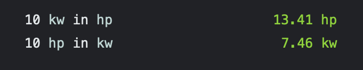

# Engine power Extension for LineSolv

## What is this extension for? :mag_right:

This extension allows you to easily transform engine power from kw to hp and vice versa

## Installation :floppy_disk:

Simply download the .js file to your LineSolv plugins directory.

## How to use it :wrench:
```
10 kw in hp
10 hp in kw
```

## Example :memo:

